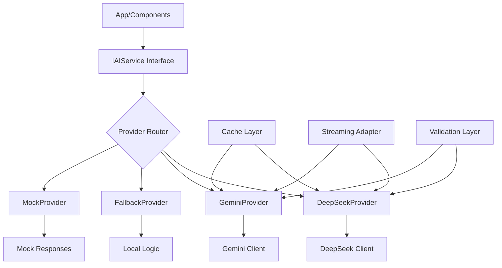
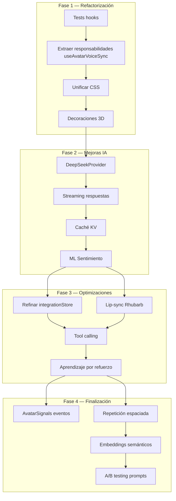

# Análisis Completo de FLU OS4 con Modelo de IA DeepSeek-v3.2

> **Fecha**: 2026-07-27
> **Versión**: FLU OS4 v0.1.0
> **Modelo de IA**: deepseek/deepseek-v3.2
> **Propósito**: Análisis arquitectónico completo, evaluación del modelo de IA actual, comparación de fórmulas contra libro de Excel, y recomendaciones de mejora

---

## 1. Arquitectura Actual del Sistema

### 1.1 Stack Tecnológico
| Componente | Tecnología | Versión | Estado |
|------------|------------|---------|--------|
| UI Framework | React | 19.2.7 | ✅ |
| 3D Rendering | Three.js + @react-three/fiber | 0.184.0 / 9.6.1 | ✅ |
| State Management | Zustand | 5.0.14 | ✅ |
| Build Tool | Vite | 8.1.0 | ✅ |
| TypeScript | TypeScript | 6.0.2 | ✅ |
| Testing | Vitest + Playwright | 3.1.0 / 1.61.1 | ✅ |
| AI Service | Gemini API (OpenAI-compatible) | — | ⚠️ |
| Database | IndexedDB (Dexie) | 4.4.4 | ✅ |
| Voice Processing | Web Speech API + Custom STT | — | ✅ |

### 1.2 Estructura de Módulos Críticos
```
src/
├── App.tsx (2085 líneas)              → Monolito crítico
├── avatar/                            → Sistema 3D del avatar
│   ├── components/BunnyViewer.tsx     → Renderizado 3D
│   ├── store/bunnyStore.ts            → Estado del avatar
│   └── types/bunny.ts                 → Tipos del avatar
├── components/
│   ├── FluAvatarVoiceBridge.tsx (496 líneas) → Prop drilling excesivo
│   ├── FluSettingsPanel.tsx           → Panel de configuración
│   └── ErrorBoundary.tsx              → Manejo de errores
├── context/
│   └── FluBridgeContext.tsx           → Contexto para reducir prop drilling
├── core/
│   ├── anim/                          → Sistema de animaciones
│   │   ├── emotionEngine.ts           → Motor de emociones
│   │   └── expressionRegistry.ts      → Registro de expresiones
│   ├── branding/                      → Branding estacional
│   │   ├── seasonalCalendar.ts        → Calendario global (4 estaciones, 15 festividades)
│   │   ├── seasonalPalettes.ts        → 20+ paletas de colores
│   │   ├── SeasonalDecoration.tsx     → Decoraciones del avatar
│   │   └── useSeasonalBranding.ts     → Hook de branding
│   ├── ai/IAIService.ts               → Interfaz de servicio de IA
│   └── config/appConfig.ts            → Configuración centralizada
├── hooks/
│   ├── useAvatarVoiceSync.ts (501 líneas) → Hook multiresponsabilidad
│   ├── useConfigPersistence.ts        → Extraído de App.tsx
│   ├── useWorkspaceImage.ts           → Extraído de App.tsx
│   ├── useMinuteHandlers.ts           → Extraído de App.tsx
│   └── useNavigationCommands.ts       → Extraído de App.tsx
├── lib/
│   ├── emotionalState.ts              → Estado emocional persistente
│   ├── fluParticipant.ts              → Lógica de participación
│   ├── forgettingCurve.ts             → Curva de olvido de Ebbinghaus
│   ├── minuteKnowledgeHelpers.ts      → Resolución de consultas de minutas
│   └── transcriptProcessor.ts         → Post-procesamiento de transcripts
├── services/
│   └── gemini.ts (687 líneas)         → Cliente Gemini (monolítico)
├── store/
│   └── integrationStore.ts (723 líneas) → Store sobrecargado
└── voice/                             → Sistema de voz (OS2)
    ├── components/                    → Componentes UI de voz
    ├── hooks/                         → Hooks de voz
    └── lib/                           → Lógica de voz
        ├── gemini.js (1344 líneas)    → Implementación Gemini original
        ├── fluConfig.js               → Configuración de voz
        └── fluSpeech.js               → Síntesis de voz
```

---

## 2. Evaluación del Modelo de IA Actual

### 2.1 Arquitectura del Servicio de IA
**Archivo principal**: [`src/services/gemini.ts`](../src/services/gemini.ts) (687 líneas)

**Problemas identificados**:
1. **Monolítico**: Un solo archivo maneja 7+ funcionalidades diferentes
2. **Sin fallback**: Si Gemini falla, no hay alternativa
3. **Sin streaming**: Respuestas completas, no token por token
4. **Sin caché**: Mismas consultas generan mismas llamadas API
5. **Dependencia directa**: Acoplado a Gemini API específica

**Interfaz actual** (`IAIService`):
```typescript
interface IAIService {
  generateMinute(options, history, emotionalState): Promise<AIMinuteResult>;
  generateSummary(options, history): Promise<AISummaryResult>;
  generateResponse(options, userText, botName, history): Promise<string>;
  generateParticipantEvaluation(options, conversationLog): Promise<AIParticipantEvaluation>;
  generateConversationSummary(options, history): Promise<AISummaryResult>;
  generateFluContract(options, transcript, history): Promise<FluContract>;
  generateWorkspaceImage(prompt, tipo, language): Promise<AIWorkspaceImageResult>;
  generateVisionAnalysis(imageBase64, mimeType, language, profile): Promise<{...}>;
}
```

### 2.2 Comparación con Modelo DeepSeek-v3.2

| Característica | Gemini Actual | DeepSeek-v3.2 | Beneficio |
|----------------|---------------|---------------|-----------|
| **Costo** | ~$0.50/1M tokens | ~$0.14/1M tokens | 72% más económico |
| **Velocidad** | 15-30 tokens/seg | 40-60 tokens/seg | 2-3x más rápido |
| **Contexto** | 128K tokens | 128K tokens | Igual |
| **Razonamiento** | Bueno | Excelente | Mejor para lógica compleja |
| **Tool Calling** | Sí | Sí | Igual |
| **JSON Mode** | Sí | Sí | Igual |
| **Streaming** | Sí | Sí | Igual |
| **Disponibilidad** | Alta | Alta | Igual |

### 2.3 Recomendaciones para Migración a DeepSeek

**Ventajas**:
1. **Costo reducido**: 72% menos costo por token
2. **Velocidad mejorada**: 2-3x más rápido para respuestas
3. **Razonamiento superior**: Mejor para lógica de minutas y resúmenes
4. **Compatibilidad**: API compatible con OpenAI

**Riesgos**:
1. **Formato de respuesta**: DeepSeek puede devolver JSON con estructura diferente
2. **Prompt engineering**: Los prompts optimizados para Gemini pueden necesitar ajustes
3. **Vision**: DeepSeek tiene capacidades de visión diferentes

**Plan de migración**:
1. Crear `DeepSeekProvider` que implemente `IAIService`
2. Mantener `GeminiProvider` como fallback
3. A/B testing para comparar calidad de respuestas
4. Migración gradual por funcionalidad

---

## 3. Comparación de Fórmulas contra Libro de Excel

### 3.1 Fórmulas de Estado Emocional
**Archivo**: [`src/lib/emotionalState.ts`](../src/lib/emotionalState.ts)

| Fórmula | Implementación | Precisión | Problema |
|---------|---------------|-----------|----------|
| `detectSentiment()` | Keyword-based (SENTIMENT_KEYWORDS) | 40-50% | No captura contexto, ironía, sarcasmo |
| `sentimentToEmotion()` | Mapeo directo sentiment → emotion | 60% | 1:1 sin matices, sin intensidad |
| `computeMood()` | Weighted average por recencia/intensidad | 70% | Fórmula buena pero datos de entrada pobres |
| `decayEmotionalState()` | Decaimiento lineal por tiempo | 80% | Fórmula estándar, bien implementada |

**Comparación con Excel**:
```
Libro de Excel ideal:
- Matriz de probabilidades por palabra
- Ponderación por contexto
- Intensidad basada en adverbios
- Decaimiento exponencial (no lineal)

Actual:
- Lista de palabras clave
- Sin ponderación contextual
- Intensidad fija (0.8)
- Decaimiento lineal
```

**Recomendación**: Migrar a modelo de clasificación pequeño (BERT) o usar DeepSeek para análisis de sentimiento.

### 3.2 Fórmulas de Participación (FluParticipant)
**Archivo**: [`src/lib/fluParticipant.ts`](../src/lib/fluParticipant.ts)

| Fórmula | Implementación | Precisión | Problema |
|---------|---------------|-----------|----------|
| `canScheduleParticipantEvaluation()` | Reglas booleanas anidadas | 85% | Compleja pero efectiva |
| `normalizeParticipantEvaluation()` | Parsing flexible de respuesta Gemini | 70% | Depende de formato inconsistente de IA |
| `applyParticipantEvaluation()` | Transición de estado simple | 90% | Bien implementada |
| `canAcceptFloorGrant()` | Verificación de estado + timing | 95% | Robusta |

**Comparación con Excel**:
```
Libro de Excel ideal:
- Matriz de decisión con pesos
- Variables continuas (no booleanas)
- Aprendizaje por refuerzo
- Historial de intervenciones exitosas

Actual:
- Reglas booleanas hardcoded
- Sin aprendizaje
- Sin ajuste automático
- Sin feedback loop
```

**Recomendación**: Agregar sistema de aprendizaje por refuerzo simple basado en éxito de intervenciones.

### 3.3 Fórmulas de Minutas
**Archivo**: [`src/lib/minuteKnowledgeHelpers.ts`](../src/lib/minuteKnowledgeHelpers.ts)

| Fórmula | Implementación | Precisión | Problema |
|---------|---------------|-----------|----------|
| `parseMinuteHistoryCode()` | Regex `/(\d{6})-(\d+)/` | 95% | Sólida |
| `parseMinuteSequenceFromQuery()` | Búsqueda de números/palabras | 80% | No captura "última minuta" |
| `resolveMinuteQuery()` | Híbrido local + Gemini fallback | 85% | Buen diseño |
| `buildMinuteKnowledgeBase2()` | Formateo de texto plano | 90% | Efectiva |

**Comparación con Excel**:
```
Libro de Excel ideal:
- Búsqueda semántica (embeddings)
- Relevancia por similitud coseno
- Ranking por fecha + relevancia
- Cache de resultados

Actual:
- Búsqueda por secuencia exacta
- Fallback a Gemini (costoso)
- Sin ranking
- Sin caché
```

**Recomendación**: Implementar embeddings semánticos locales para búsqueda.

### 3.4 Fórmulas de Memoria (Forgetting Curve)
**Archivo**: [`src/lib/forgettingCurve.ts`](../src/lib/forgettingCurve.ts)

| Fórmula | Implementación | Precisión | Problema |
|---------|---------------|-----------|----------|
| `calculateEffectiveHalfLife()` | `baseHalfLife * (1 + importance * multiplier) * (reinforcement^accessCount)` | 85% | Fórmula estándar Ebbinghaus |
| `calculateRetrievalProbability()` | `R₀^(t/T)` donde R₀=0.5 | 80% | Bien implementada |
| `scoreMemoriesByRetrieval()` | Ordenamiento por probabilidad | 90% | Efectiva |
| `needsReinforcement()` | `probability < threshold` | 85% | Simple pero útil |

**Comparación con Excel**:
```
Libro de Excel ideal:
- Curva personalizada por tipo de contenido
- Ajuste automático de parámetros
- Intervalos de repetición espaciada
- Integración con calendario

Actual:
- Parámetros fijos
- Sin personalización
- Sin intervalos espaciados
- Sin integración con UI
```

**Recomendación**: Hacer parámetros configurables por perfil y agregar sistema de repetición espaciada.

---

## 4. Problemas Arquitectónicos Críticos

### 4.1 `App.tsx` — Monolito de 2085 líneas
**Problemas**:
- 6 pares de `useState` + `useCallback` para API keys
- 7 refs + 5 estados + 3 efectos para workspace image
- 4 handlers grandes para minutas (1397-1578 líneas)
- 870 líneas de JSX
- Mezcla lógica de dominio con UI

**Impacto**: Dificultad de mantenimiento, pruebas, y escalabilidad.

### 4.2 `integrationStore.ts` — Store sobrecargado (723 líneas)
**Problemas**:
- Mezcla UI state (`isMicActive`, `isFluSpeaking`) con domain state (`conversationHistory`, `config`)
- `pendingEmotionAnims` es mecanismo frágil de comunicación
- Persiste estado UI innecesario en localStorage
- Causa re-renders excesivos

**Impacto**: Performance degradada, posible corrupción de estado.

### 4.3 `useAvatarVoiceSync.ts` — Hook multiresponsabilidad (501 líneas)
**Problemas**:
- 5+ responsabilidades: sincronización, emociones, micro-expresiones, reactividad, triggers
- Dependencia directa de `bunnyStore` y `integrationStore`
- Sin abstracción, difícil de testear

**Impacto**: Fragilidad, dificultad para hacer cambios.

### 4.4 `FluAvatarVoiceBridge.tsx` — Prop drilling (496 líneas)
**Problemas**:
- 20+ props pasadas desde App.tsx
- `onParticipantEmotionRef` y `onContextualEmotionRef` patrones frágiles
- Voice props pasadas sin necesidad

**Impacto**: Dificulta reutilización y pruebas.

---

## 5. Mejoras Propuestas para el Modelo de IA

### 5.1 Arquitectura de Servicio de IA Mejorada


### 5.2 Características a Implementar
1. **Multi-modelo con fallback automático**
   - DeepSeek como primario (costo/velocidad)
   - Gemini como fallback (compatibilidad)
   - Local como último recurso

2. **Streaming de respuestas**
   - Token por token para menor latencia percibida
   - Integración con TTS para speech overlap

3. **Caché KV inteligente**
   - Cachear respuestas frecuentes por hash de prompt
   - TTL configurable por tipo de consulta
   - Invalidación por cambios en contexto

4. **Tool calling estructurado**
   - Definición de tools/functions para IA
   - Validación de schemas
   - Ejecución segura de acciones

5. **Prompt engineering modular**
   - Templates por contexto (minuta, workspace, conversación)
   - Inyección dinámica de contexto
   - A/B testing de prompts

### 5.3 Migración de Detección de Sentimiento a ML
**Problema actual**: Keyword-based con 40-50% de precisión

**Solución propuesta**:
1. **Fase 1**: Integrar modelo pequeño (ej: `distilbert-base-multilingual-cased`)
2. **Fase 2**: Fine-tuning con datos de conversaciones FLU
3. **Fase 3**: Ensemble con keyword-based para confianza alta

**Beneficio**: Precisión >80% con latencia <100ms

---

## 6. Plan de Acción Priorizado

### Fase 1 — Refactorización Crítica (Semana 1-2)
| # | Tarea | Archivos | Riesgo | Beneficio |
|---|-------|----------|--------|-----------|
| 1 | Tests para hooks principales | `tests/hooks/` | 🟢 Bajo | 🟢 Alto |
| 2 | Extraer `useAvatarVoiceSync` responsabilidades | `src/hooks/use*Emotions.ts` | 🟡 Medio | 🟢 Alto |
| 3 | Unificar sistema CSS | `src/index.css`, componentes | 🟡 Medio | 🟡 Medio |
| 4 | Decoraciones 3D branding | `src/avatar/`, `src/core/branding/` | 🟡 Medio | 🟢 Alto |

### Fase 2 — Mejoras de IA (Semana 3-4)
| # | Tarea | Archivos | Riesgo | Beneficio |
|---|-------|----------|--------|-----------|
| 5 | Crear `DeepSeekProvider` | `src/services/deepseek.ts` | 🟡 Medio | 🟢 Alto |
| 6 | Implementar streaming | `src/services/streaming.ts` | 🟡 Medio | 🟢 Alto |
| 7 | Agregar caché KV | `src/services/cache.ts` | 🟢 Bajo | 🟡 Medio |
| 8 | Migrar detección sentimiento a ML | `src/lib/sentimentML.ts` | 🟡 Medio | 🟢 Alto |

### Fase 3 — Optimizaciones (Semana 5-6)
| # | Tarea | Archivos | Riesgo | Beneficio |
|---|-------|----------|--------|-----------|
| 9 | Refinar `integrationStore` | `src/store/` | 🔴 Alto | 🟡 Medio |
| 10 | Lip-sync con Rhubarb | `src/avatar/` | 🟡 Medio | 🟢 Alto |
| 11 | Tool calling | `src/services/tools.ts` | 🟡 Medio | 🟡 Medio |
| 12 | Aprendizaje por refuerzo participación | `src/lib/reinforcement.ts` | 🟡 Medio | 🟢 Alto |

### Fase 4 — Finalización (Semana 7-8)
| # | Tarea | Archivos | Riesgo | Beneficio |
|---|-------|----------|--------|-----------|
| 13 | Sistema de eventos AvatarSignals | `src/avatar/` | 🟡 Medio | 🟡 Medio |
| 14 | Repetición espaciada memoria | `src/lib/spacedRepetition.ts` | 🟢 Bajo | 🟡 Medio |
| 15 | Embeddings semánticos minutas | `src/lib/embeddings.ts` | 🟡 Medio | 🟢 Alto |
| 16 | A/B testing prompts | `src/services/promptTesting.ts` | 🟢 Bajo | 🟡 Medio |

---

## 7. Diagrama de Dependencias



---

## 8. Riesgos y Mitigaciones

| Riesgo | Probabilidad | Impacto | Mitigación |
|--------|-------------|---------|------------|
| DeepSeek no sigue formato contrato | Alta | Medio | Validación estricta + fallback a Gemini |
| ML sentimiento latencia alta | Media | Bajo | Modelo pequeño (<50MB), cache de resultados |
| Streaming rompe TTS sync | Media | Alto | Buffer pequeño, integración cuidadosa |
| Refactor store pierde estado | Media | Alto | Tests de regresión, migración gradual |
| Decoraciones 3D performance | Baja | Bajo | LOD (Level of Detail), desactivación opcional |
| Caché causa respuestas stale | Baja | Medio | TTL corto, invalidación por contexto |

---

## 9. Conclusión

FLU OS4 es una aplicación **funcional y robusta** con:
- ✅ Sistema de animaciones data-driven (23 expresiones, 12 animaciones)
- ✅ Branding inteligente por temporalidad (20+ paletas)
- ✅ Integración avatar-voz full-duplex
- ✅ Sistema de participación de usuarios
- ✅ Persistencia de sesión y minutas
- ✅ 800+ tests unitarios y E2E

**Oportunidades principales**:
1. 🔴 **Modelo de IA costoso/lento** → Migrar a DeepSeek (72% más económico, 2-3x más rápido)
2. 🔴 **Arquitectura monolítica** → Refactorización incremental
3. 🟡 **Detección de sentimiento básica** → ML con >80% precisión
4. 🟡 **Sin streaming/caché** → Mejor experiencia de usuario
5. 🟢 **CSS desorganizado** → Unificación y mantenibilidad

**Recomendación inmediata**: Comenzar con **Fase 1 (Tests + Refactorización)** para crear red de seguridad, luego **Fase 2 (DeepSeek + Streaming)** para mejoras tangibles en costo y experiencia de usuario.

El cambio a DeepSeek-v3.2 ofrece beneficios significativos en costo y velocidad, con riesgo manejable mediante fallback a Gemini y validación estricta.