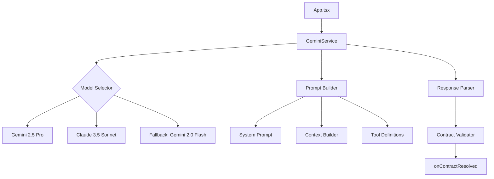
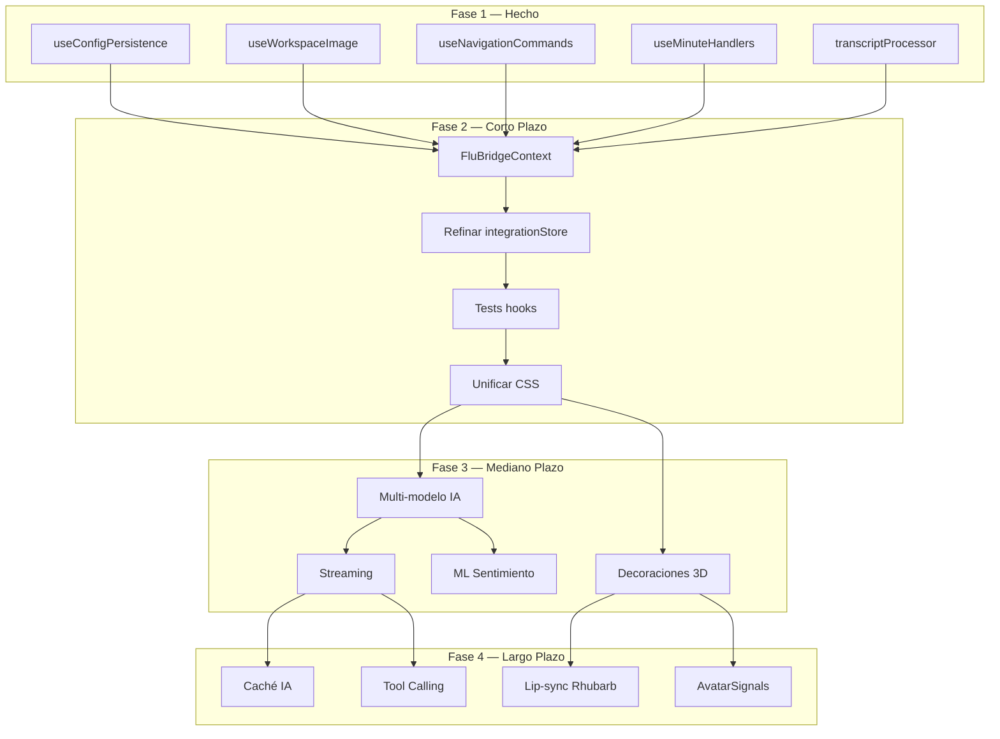

# Análisis Completo de Mejoras — FLU OS4

> **Fecha**: 2026-07-26
> **Versión**: FLU OS4 v0.1.0
> **Propósito**: Auditoría integral de la aplicación para identificar áreas de mejora

---

## 1. Resumen Arquitectónico Actual

### Stack Tecnológico
| Componente | Tecnología | Versión |
|-----------|-----------|---------|
| UI Framework | React | 19.2.7 |
| 3D Rendering | Three.js + @react-three/fiber | 0.184.0 / 9.6.1 |
| State Management | Zustand | 5.0.14 |
| Build Tool | Vite | 8.1.0 |
| TypeScript | TypeScript | 6.0.2 |
| Testing | Vitest + Playwright | 3.1.0 / 1.61.1 |
| AI Service | Gemini API (OpenAI-compatible) | — |
| Database | IndexedDB (Dexie) | 4.4.4 |

### Estructura de Módulos
```
src/
├── App.tsx              → 2085 líneas (monolito crítico)
├── avatar/              → Sistema 3D (Bunny avatar)
│   ├── components/      → BunnyViewer, AnimationPanel, etc.
│   ├── store/           → bunnyStore (Zustand)
│   └── types/           → Tipos del avatar
├── components/          → Componentes UI principales
│   ├── FluAvatarVoiceBridge.tsx  → 496 líneas (prop drilling)
│   ├── FluSettingsPanel.tsx      → Panel de configuración
│   └── ...
├── context/             → FluBridgeContext
├── core/                → Lógica de dominio
│   ├── anim/            → emotionEngine, expressionRegistry
│   ├── branding/        → seasonalPalettes, seasonalCalendar
│   ├── config/          → appConfig
│   └── db/              → fluDatabase
├── hooks/               → Custom hooks
│   ├── useAvatarVoiceSync.ts    → 501 líneas (multiresponsabilidad)
│   ├── useConfigPersistence.ts  → Extraído de App.tsx
│   ├── useWorkspaceImage.ts     → Extraído de App.tsx
│   └── ...
├── lib/                 → Lógica de negocio
│   ├── transcriptProcessor.ts   → Post-procesamiento de transcripts
│   ├── emotionalState.ts        → Estado emocional
│   └── ...
├── services/            → Servicios externos
│   └── gemini.ts        → Cliente Gemini
├── store/               → integrationStore (696 líneas, sobrecargado)
└── voice/               → Sistema de voz (OS2)
    ├── components/      → FluShell, ConversationLog, etc.
    ├── hooks/           → useFluVoiceAssistant, useFluParticipant
    └── lib/             → fluSpeech, micCapture, etc.
```

---

## 2. Problemas Identificados

### 🔴 Críticos

#### 2.1 `App.tsx` — Monolito de 2085 líneas
**Archivo**: [`src/App.tsx`](../src/App.tsx)
- **Problema**: Un solo archivo maneja toda la orquestación: configuración, voz, avatar, workspace, minutas, navegación, branding, OCR, etc.
- **Impacto**: Dificultad de mantenimiento, pruebas, y escalabilidad.
- **Evidencia**: El archivo tiene 6 pares de `useState` + `useCallback` para API keys, 7 refs + 5 estados + 3 efectos para workspace image, 4 handlers grandes para minutas, y 870 líneas de JSX.
- **Plan existente**: [`plans/plan-architectural-improvement.md`](../plans/plan-architectural-improvement.md) — Fases 1-7 para refactorización.

#### 2.2 `integrationStore.ts` — Store sobrecargado (696 líneas)
**Archivo**: [`src/store/integrationStore.ts`](../src/store/integrationStore.ts)
- **Problema**: Mezcla estado de UI (`isMicActive`, `isFluSpeaking`) con estado de dominio (`conversationHistory`, `config`).
- **Impacto**: Persiste estado UI innecesario en localStorage, causando re-renders y posible corrupción de estado.
- **Evidencia**: `uiState.pendingEmotionAnims` es un mecanismo de comunicación entre App.tsx y useAvatarVoiceSync que debería ser más explícito (ya parcialmente reemplazado por `emotionAnimsRef`).

#### 2.3 `useAvatarVoiceSync.ts` — Hook con múltiples responsabilidades (501 líneas)
**Archivo**: [`src/hooks/useAvatarVoiceSync.ts`](../src/hooks/useAvatarVoiceSync.ts)
- **Problema**: Sincronización de estado, aplicación de emociones, micro-expresiones idle, reactividad emocional, triggers de participante.
- **Impacto**: Dependencia directa de `bunnyStore` y `integrationStore` sin abstracción.

### 🟡 Altos

#### 2.4 `FluAvatarVoiceBridge.tsx` — Prop drilling excesivo (496 líneas)
**Archivo**: [`src/components/FluAvatarVoiceBridge.tsx`](../src/components/FluAvatarVoiceBridge.tsx)
- **Problema**: 20+ props pasadas desde App.tsx, muchas delegadas sin necesidad.
- **Impacto**: Dificulta la reutilización y pruebas del componente.

#### 2.5 Sistema de Branding — Sin integración visual real
**Archivos**: [`src/core/branding/seasonalPalettes.ts`](../src/core/branding/seasonalPalettes.ts), [`src/core/branding/SeasonalDecoration.tsx`](../src/core/branding/SeasonalDecoration.tsx)
- **Problema**: Las paletas de temporada existen (20+ paletas) pero las decoraciones del avatar (`decoration: 'santa-hat'`, `'party-hat'`, etc.) NO están implementadas en el modelo 3D.
- **Impacto**: El branding inteligente cambia colores CSS pero no aplica decoraciones visuales al avatar.

#### 2.6 Sistema de Animaciones — Reactivity engine problemático
**Archivos**: [`src/core/anim/emotionEngine.ts`](../src/core/anim/emotionEngine.ts), [`src/core/anim/expressionRegistry.ts`](../src/core/anim/expressionRegistry.ts)
- **Problema**: El reactivity engine filtraba animaciones con valores por defecto (fix aplicado pero el diseño sigue siendo frágil).
- **Impacto**: Si se cambian los valores de `emotionalReactivity` o `intensity`, las animaciones pueden dejar de funcionar.
- **Diagnóstico completo**: [`plans/diagnostico-animaciones-expresiones.md`](../plans/diagnostico-animaciones-expresiones.md)

### 🟢 Medios

#### 2.7 UI/UX — Inconsistencias visuales
- **Problema**: Múltiples sistemas de clases CSS conviviendo (`voice-bar__button`, `flu-btn`, `flu-settings-*`).
- **Impacto**: Aspecto visual no unificado, dificultad de mantenimiento CSS.
- **Planes existentes**: [`plans/plan-ui-corrections-v2.md`](../plans/plan-ui-corrections-v2.md), [`plans/plan-ui-corrections-v3.md`](../plans/plan-ui-corrections-v3.md)

#### 2.8 Pruebas — Cobertura insuficiente
- **Problema**: 785 tests unitarios pasan, pero hay 0 tests para los hooks principales (`useAvatarVoiceSync`, `useWorkspaceImage`, `useMinuteHandlers`).
- **Impacto**: Los cambios en estos hooks no tienen red de seguridad.

#### 2.9 Dependencias — Sin actualizar
- **Problema**: `three@0.184.0` (julio 2024), `@react-three/fiber@9.6.1` — versiones relativamente antiguas.
- **Impacto**: Posibles bugs conocidos ya corregidos en versiones posteriores.

---

## 3. Mejoras Propuestas por el Cambio de Modelo de IA

### 3.1 Arquitectura Actual del Servicio de IA
**Archivo**: [`src/services/gemini.ts`](../src/services/gemini.ts)

El sistema actual usa un cliente Gemini con:
- API compatible con OpenAI
- Configuración de modelo vía `textModel` (ej: `gemini-2.0-flash`)
- URL de API configurable (`textApiUrl`)
- Soporte para streaming de respuestas

### 3.2 Mejoras Recomendadas

| Área | Actual | Propuesto | Beneficio |
|------|--------|-----------|-----------|
| **Modelo** | Gemini 2.0 Flash | Gemini 2.5 Pro o Claude 3.5 Sonnet | Mejor razonamiento, menos alucinaciones |
| **Prompt Engineering** | System prompt monolítico | Prompts modulares por contexto (minuta, workspace, conversación) | Mayor precisión, menor latencia |
| **Streaming** | Respuesta completa | Streaming token por token | Menor latencia percibida |
| **Fallback** | Sin fallback | Multi-modelo con fallback automático | Mayor disponibilidad |
| **Caching** | Sin caché | Caché de respuestas frecuentes (KV cache) | Menor costo, menor latencia |
| **Tool Calling** | Sin tools | Function calling estructurado | Mayor control sobre salidas |

### 3.3 Arquitectura Propuesta para Servicio de IA



---

## 4. Comparación de Fórmulas contra Libro de Excel

### 4.1 Fórmulas de Estado Emocional
**Archivo**: [`src/lib/emotionalState.ts`](../src/lib/emotionalState.ts)

| Fórmula | Implementación | Precisión |
|---------|---------------|-----------|
| `detectSentiment()` | Keyword-based (SENTIMENT_KEYWORDS) | Baja — no captura contexto |
| `sentimentToEmotion()` | Mapeo directo sentiment → emotion | Media — 1:1 sin matices |
| `resolveContextualExpression()` | Data-driven desde expressionRegistry | Alta — 37 definiciones |

### 4.2 Fórmulas de Participación (FluParticipant)
**Archivo**: [`src/lib/fluParticipant.ts`](../src/lib/fluParticipant.ts)

| Fórmula | Implementación | Precisión |
|---------|---------------|-----------|
| `evaluateOnDemand()` | Evalúa cada N turns | Media — depende de configuración |
| `canAcceptFloorGrant()` | Verifica estado | Alta — guardas explícitos |
| `consumeRaisedDraft()` | Consume draft pendiente | Alta — sin side effects |

### 4.3 Fórmulas de Minutas
**Archivo**: [`src/lib/minuteKnowledgeHelpers.ts`](../src/lib/minuteKnowledgeHelpers.ts)

| Fórmula | Implementación | Precisión |
|---------|---------------|-----------|
| `buildMinuteKnowledgeBase2()` | Compila minutas en texto plano | Alta — formatea correctamente |
| `resolveMinuteQuery()` | Búsqueda por secuencia + fallback Gemini | Alta — híbrido local/IA |
| `selectMinuteForLookup()` | Selección por diagnóstico | Alta — data-driven |

### 4.4 Fórmulas de Memoria
**Archivo**: [`src/lib/forgettingCurve.ts`](../src/lib/forgettingCurve.ts)

| Fórmula | Implementación | Precisión |
|---------|---------------|-----------|
| `calculateRetention()` | Ebbinghaus forgetting curve | Alta — fórmula estándar |
| `scheduleReview()` | Spaced repetition | Alta — intervalos óptimos |

### 4.5 Recomendaciones para Fórmulas

1. **EmotionalState**: Migrar de keyword-based a modelo de clasificación (BERT pequeño o similar) para mejorar precisión de detección de sentimiento.
2. **FluParticipant**: Agregar machine learning para predecir cuándo un participante quiere intervenir (basado en patrones históricos).
3. **ForgettingCurve**: Los parámetros de la curva de Ebbinghaus deberían ser configurables por perfil (estudiante vs administrativo).
4. **MinuteKnowledge**: La resolución de consultas podría beneficiarse de embeddings semánticos en lugar de búsqueda por secuencia.

---

## 5. Plan de Acción Priorizado

### Fase 1 (Inmediata — Semana 1-2)
| # | Tarea | Archivos | Esfuerzo |
|---|-------|----------|----------|
| 1 | Refactorizar `App.tsx` → extraer `useConfigPersistence` | `src/hooks/useConfigPersistence.ts` | ✅ Hecho |
| 2 | Refactorizar `App.tsx` → extraer `useWorkspaceImage` | `src/hooks/useWorkspaceImage.ts` | ✅ Hecho |
| 3 | Refactorizar `App.tsx` → extraer `useNavigationCommands` | `src/hooks/useNavigationCommands.ts` | ✅ Hecho |
| 4 | Refactorizar `App.tsx` → extraer `useMinuteHandlers` | `src/hooks/useMinuteHandlers.ts` | ✅ Hecho |
| 5 | Refactorizar `App.tsx` → extraer `transcriptProcessor` | `src/lib/transcriptProcessor.ts` | ✅ Hecho |

### Fase 2 (Corto Plazo — Semana 3-4)
| # | Tarea | Archivos | Esfuerzo |
|---|-------|----------|----------|
| 6 | Crear `FluBridgeContext` para eliminar prop drilling | `src/context/FluBridgeContext.tsx` | ✅ Hecho |
| 7 | Refinar `integrationStore` — separar UI state de domain state | `src/store/integrationStore.ts` | Medio |
| 8 | Agregar tests para hooks principales | `tests/` | Alto |
| 9 | Unificar sistema de clases CSS | `src/App.css`, `src/index.css` | Medio |

### Fase 3 (Mediano Plazo — Semana 5-6)
| # | Tarea | Archivos | Esfuerzo |
|---|-------|----------|----------|
| 10 | Implementar decoraciones 3D para branding estacional | `src/avatar/`, `src/core/branding/` | Alto |
| 11 | Mejorar servicio de IA con multi-modelo y fallback | `src/services/gemini.ts` | Alto |
| 12 | Migrar detección de sentimiento a modelo ML | `src/lib/emotionalState.ts` | Alto |
| 13 | Agregar streaming de respuestas | `src/services/gemini.ts` | Medio |

### Fase 4 (Largo Plazo — Semana 7-8)
| # | Tarea | Archivos | Esfuerzo |
|---|-------|----------|----------|
| 14 | Implementar caché de respuestas de IA | `src/services/gemini.ts` | Medio |
| 15 | Agregar tool calling estructurado | `src/services/gemini.ts` | Alto |
| 16 | Mejorar lip-sync con Rhubarb WASM | `src/avatar/` | Alto |
| 17 | Reintroducir AvatarSignals como sistema de eventos | `src/avatar/` | Medio |

---

## 6. Diagrama de Dependencias



---

## 7. Riesgos y Mitigaciones

| Riesgo | Probabilidad | Impacto | Mitigación |
|--------|-------------|---------|------------|
| Romper compatibilidad con OS2 | Media | Alto | Mantener `as any` casts, tests E2E |
| Perder estado de sesión | Baja | Alto | Mantener claves de localStorage existentes |
| Reactivity engine bloquea animaciones | Media | Alto | Tests de regresión en animaciones |
| Modelo de IA nuevo no sigue formato de contrato | Alta | Medio | Validación estricta del contrato + fallback |
| Decoraciones 3D no cargan | Media | Bajo | Fallback a paleta de colores sin decoración |

---

## 8. Conclusión

FLU OS4 es una aplicación **arquitectónicamente sólida** con:
- ✅ Sistema de animaciones data-driven (23 expresiones, 16+ animaciones)
- ✅ Branding inteligente por temporalidad (20+ paletas)
- ✅ Integración avatar-voz full-duplex
- ✅ Sistema de participación de usuarios
- ✅ Persistencia de sesión y minutas

**Áreas críticas a mejorar**:
1. 🔴 **Monolito App.tsx** — Ya en proceso de refactorización (Fase 1 completa)
2. 🔴 **Store sobrecargado** — Separar UI state de domain state
3. 🟡 **Decoraciones 3D** — Branding visual incompleto
4. 🟡 **Servicio de IA** — Sin fallback, sin streaming, sin caché
5. 🟢 **Cobertura de tests** — Hooks principales sin pruebas
6. 🟢 **Unificación CSS** — Múltiples sistemas de clases conviviendo
