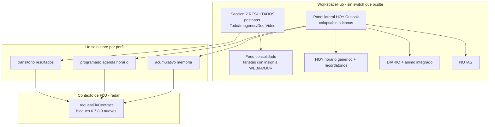

# Análisis y Plan de Ejecución — Pizarrón "Un Solo Objeto" (a partir de `explicacion-consolidada-pizarron.md`)

> **Fuente de verdad:** [`explicacion-consolidada-pizarron.md`](explicacion-consolidada-pizarron.md:1) — refleja las decisiones FINALES del usuario tras las correcciones.
> **Estado del código verificado:** la Fase 1 (pestañas en [`WorkspaceHub.tsx`](../src/components/WorkspaceHub.tsx:1)) YA está implementada. NINGUNO de los componentes del pizarrón consolidado existe aún (no hay `HoyPanel`, `ResultFeed`, `useNotes`, ni el campo `kind` en memoria).
> **Modo:** Architect — este documento es el plan a revisar; la implementación se hará en modo Code.

---

## 1. Qué establece el documento (resumen ejecutivo)

El pizarrón consolidado NO es "todo a la vista" por sí solo: es **todo legible por FLU**. La especificación fija:

1. **Layout de 2 columnas** que conviven (sin `switch` que oculte):
   - **Sección 2 · RESULTADOS**: pestañas `[Todo | Imágenes | Doc/Video]` + **feed consolidado** donde todas las respuestas (WEB/IA/OCR) aparecen **juntas**, cada una con su **insignia de color** de origen. La pestaña filtra por **TIPO**, nunca por origen.
   - **Panel lateral · HOY (Outlook)**: columna colapsable a iconos con 📅 HOY / 📓 DIARIO(+ánimo) / 📝 NOTAS. **MEMORIA = invisible** (no es sección).
2. **Recortes de alcance:** fuera hábitos/metas, agenda de contactos, materia gris, bienestar como sección aparte. Lista de compras → **listado de notas**.
3. **Diario con ánimo integrado** (una sola entrada; el ánimo es un campo, no un sistema aparte). Captura **dinámica**, sin preguntas hardcodeadas.
4. **Horario GENÉRICO** (no "IMSS"): `fluDb.horario` ya tiene campo `tipo` libre (verificado en [`fluDatabase.ts`](../src/core/db/fluDatabase.ts:402)).
5. **Digitalizar imagen de horario → puebla HOY** (datos estructurados en `fluDb.horario`, con confirmación previa), no solo OCR en Resultados.
6. **Guardar conversaciones = solo al cerrar** (resumen con `kind`); el transcripto crudo ya se guarda turno a turno (inmune a apagones).
7. **Radar de contexto (9 bloques):** bloques 1,2,5 ya se leen; 3 y 4 parciales; **6,7,8,9 NO se leen hoy** → son el hueco real a cerrar en [`requestFluContract`](../src/voice/hooks/useFluVoiceAssistant.js:1025).
8. **Memoria invisible = generalizar el patrón de minutas** con campo `kind: 'minuta'|'conversacion'|'diario'` — NO crear sistema paralelo.

---

## 2. Estado real del código (verificado)

| Pieza | Estado | Evidencia |
|-------|--------|-----------|
| `WorkspaceHub` con pestañas (Fase 1) | ✅ Implementado | `switch (activeTab)` en [`WorkspaceHub.tsx`](../src/components/WorkspaceHub.tsx:592) |
| `HoyPanel.tsx` | ❌ No existe | — |
| `ResultFeed.tsx` | ❌ No existe | — |
| `useNotes.ts` | ❌ No existe | — |
| `src/types/workspaceTabs.ts` | ❌ No existe | solo `bridge.ts` y `documentContracts.ts` en `src/types` |
| Campo `kind` en memoria | ❌ No existe | `MinuteRecord` sin `kind` |
| Horario genérico (`tipo` libre) | ✅ Ya existe | [`fluDatabase.ts`](../src/core/db/fluDatabase.ts:402) |
| `useDiary` / `useMood` / `useHorario` / `useShoppingList` | ✅ Existen | `src/hooks/*` |
| Inyección de contexto FLU | ⚠️ Parcial | [`useFluVoiceAssistant.js:1025`](../src/voice/hooks/useFluVoiceAssistant.js:1025) |

**Conclusión:** la implementación del pizarrón consolidado **no ha comenzado**. Este plan la descompone en pasos accionables y verificables.

---

## 3. Arquitectura objetivo

---

## 4. Pasos de implementación (orden lógico y verificable)

### Paso 1 — Store de NOTAS (`useNotes`) sobre patrón `useShoppingList`
- **Crear** `src/core/notes/notesService.ts` (patrón de `shoppingService`): tabla Dexie `fluDb.notes` con `id, label, done, personId, createdAt`.
- **Crear** `src/hooks/useNotes.ts` (patrón de [`useShoppingList.ts`](../src/hooks/useShoppingList.ts:1)): `refresh/add/toggle/rename/remove`.
- **Modificar** [`fluDatabase.ts`](../src/core/db/fluDatabase.ts:537): registrar tabla `notes` (nueva versión Dexie, no destructiva).
- **Test:** `tests/notesService.test.ts` + `tests/useNotes.test.ts` (si el patrón de shopping tiene tests, replicarlos).

### Paso 2 — Panel lateral `HoyPanel` (presentacional controlado)
- **Crear** `src/components/HoyPanel.tsx`: bloques `
` colapsables, cada etiqueta desde `FLU_CONFIG` con `pickLabel` (Rule #1).
  - 📅 **HOY**: próxima clase (`proximaClase`) + clases del día (`clasesDeHoy`) + botón "Ver horario completo" que expande `HorarioPizarron`.
  - 📓 **DIARIO (+ánimo)**: última entrada (`useDiary`) con su campo de ánimo (`useMood`), una sola entrada.
  - 📝 **NOTAS**: listado de notas (`useNotes`).
- Recibe todo por props desde `App.tsx` (patrón de `AgendaHub`). Sin fetching propio.

### Paso 3 — Feed de resultados unificado `ResultFeed` con insignias
- **Crear** `src/components/ResultFeed.tsx`: consolida tarjetas WEB/IA/OCR en una sola lista.
- Cada tarjeta lleva **insignia de color de origen** (🟢 WEB, 🔵 IA, ⚪ OCR).
- Filtro superior por **tipo** (Todo | Imágenes | Doc/Video) — nunca por origen.
- Reutilizar paneles existentes (`DocumentResultPanel`, `AppAnalysisPanel`, `GenerationProgressPanel`, imagen generada) como tarjetas del feed.

### Paso 4 — Restructurar `WorkspaceHub` a layout de 2 columnas
- Reemplazar el `switch (activeTab)` por layout de columnas: columna principal = `ResultFeed`; columna lateral = `HoyPanel`.
- Mantener barra de comandos (Sección 1) y sección de cargas (Sección 3).
- **No** eliminar aún las pestañas internas de Ajustes; solo el pizarrón deja de fragmentar.
- Conservar `HorarioImportConfirm` y su lógica de digitalización (reubicarla en el panel HOY).

### Paso 5 — Radar de contexto: bloques 6,7,8,9 en `requestFluContract`
- En [`useFluVoiceAssistant.js:1025`](../src/voice/hooks/useFluVoiceAssistant.js:1025) inyectar los bloques faltantes, cada uno **dinámico** desde su fuente (Dexie) y `''` si no hay datos (Rule #1), resúmenes top-N para respetar `CONTEXT_HISTORY_LIMIT`:
  - **Bloque 6 · Resultados** (última consulta + feed) — FALTA.
  - **Bloque 7 · DIARIO (+ánimo)** (última entrada) — FALTA.
  - **Bloque 8 · NOTAS** (pendientes) — FALTA.
  - **Bloque 9 · Horario del día (HOY)** (genérico) — FALTA.
- Ampliar la firma de `requestFluContract` en [`gemini.js:1079`](../src/voice/lib/gemini.js:1079) con los nuevos parámetros.

### Paso 6 — Generalizar la memoria con campo `kind`
- Añadir `kind: 'minuta'|'conversacion'|'diario'` al registro de conocimiento (patrón `MinuteSummarySnapshot`).
- Ampliar [`buildMinuteKnowledgeBase2`](../src/lib/minuteKnowledgeHelpers.ts:223) y la consulta para cubrir diario y conversaciones, no solo minutas.
- Guardar el resumen de conversación **una sola vez al cerrar** la app (reutilizar `handleGenerateSummary` + `addMinute` con `kind`).

### Paso 7 — CSS
- Añadir estilos en `src/App.css` para el layout de 2 columnas, el panel "Hoy" colapsable, el feed unificado y las insignias de origen. Reutilizar tokens/colores existentes; sin valores mágicos.

### Paso 8 — Pruebas
- Crear/actualizar tests de render para `HoyPanel`, `ResultFeed` y el nuevo layout de `WorkspaceHub`.
- Mantener verdes los tests existentes de horario (`horarioService`, `horarioPizarron`, `useHorario`, `workspaceContractHorario`, `horarioImportConfirm`).
- `npx tsc --noEmit` limpio y `npm test` verde.

---

## 5. Riesgos y mitigación

| Riesgo | Mitigación |
|--------|-----------|
| Romper el flujo de digitalización de horario ya implementado | Conservar `HorarioImportConfirm` y su lógica; solo reubicarlo en el panel HOY |
| Regresión de los paneles de Ajustes | No tocar los paneles de Ajustes; solo el pizarrón deja de fragmentar |
| Contexto de FLU demasiado grande | Bloques = resúmenes cortos top-N; `''` si no hay datos |
| Migración destructiva de Dexie | Campo `kind` opcional y nueva tabla `notes` → sin migración destructiva |
| Romper selectores E2E de paneles | Reutilizar paneles presentacionales sin cambios; conservar selectores `.document-analysis__*`, `.generation-panel__*` |

---

## 6. Criterio de "hecho"

- El pizarrón muestra **a la vez** resultados (feed con insignias) y el panel lateral HOY/DIARIO/NOTAS — sin `switch` que oculte regiones.
- La digitalización de una imagen de horario puebla el HOY (bloque 9) con confirmación previa del usuario.
- FLU puede responder "¿qué tengo mañana?" y "¿qué anoté ayer?" desde su contexto (bloques 6-9).
- `npx tsc --noEmit` limpio y `npm test` verde.
