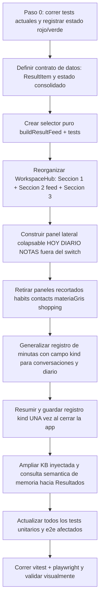

# Análisis de Riesgos — Ejecución Limpia del Pizarrón Consolidado

> **Propósito:** analizar a fondo, contra el código REAL, dónde se puede atorar la implementación
> del pizarrón consolidado, para que la ejecución salga limpia sin fallas. Este documento NO es
> diseño nuevo — es una **lista de puntos de fallo concretos** con su mitigación, para que el modo
> Code no tropiece.
>
> Complementa a [`explicacion-consolidada-pizarron.md`](explicacion-consolidada-pizarron.md).
> Léelo junto con ese documento antes de tocar código.

---

## 0. El riesgo #1 que ya existe HOY (antes de tocar nada)

El componente que hay que transformar — [`WorkspaceHub.tsx`](../src/components/WorkspaceHub.tsx:1) —
**ya está desincronizado de sus propios tests unitarios**. Esto es una bomba de tiempo: si Code
empieza a refactorizar sobre una base que ya falla, no sabrá si rompió algo o si ya estaba roto.

| Hecho en el código actual | Test que lo contradice |
|---|---|
| [`computeAvailableTabs`](../src/components/WorkspaceHub.tsx:90) devuelve **TODAS** las pestañas siempre (comentario "All tabs are always visible per user request") | [`tests/workspaceHub.test.ts:47`](../tests/workspaceHub.test.ts:47) espera `['buscar','archivos']` cuando está vacío |
| `computeAutoSwitchTarget` enruta imagen → `'respuesta'` (no hay pestaña `'imagen'` en el `switch`) | [`tests/workspaceHub.test.ts:241`](../tests/workspaceHub.test.ts:241) espera `'imagen'` como último recurso |

**Mitigación obligatoria (paso 0):** antes de CUALQUIER refactor, correr `npx vitest run tests/workspaceHub.test.ts`
y registrar el estado real (rojo/verde). Documentar qué tests ya fallan. Si Code refactoriza con tests
rojos preexistentes, debe **reescribir los tests al nuevo contrato** en el mismo commit que cambia el
componente — nunca dejar el componente nuevo con tests viejos.

---

## 1. Riesgo: transformar el `switch (activeTab)` sin romper el flujo de voz

### Dónde está el atoro

[`WorkspaceHub.tsx`](../src/components/WorkspaceHub.tsx:498) usa `switch (activeTab)` en `renderContent()`
con 7 casos (`buscar`, `respuesta`, `horario`, `documento`, `app`, `generacion`, `archivos`). El estado
de cada "pestaña" vive **disperso en props agrupadas** (`image`, `document`, `app`, `generation`,
`horario`, `agenda`, `upload`), cableadas desde [`App.tsx:3741`](../src/App.tsx:3741).

El diseño consolidado pide:
- **Sección 1** barra de comandos (buscar WEB / IA / transcripción)
- **Sección 2** resultados como pestañas **Todo | Imágenes | Doc/Video** con feed consolidado + insignia de origen
- **Sección 3** cargas
- **Panel lateral** HOY / DIARIO / NOTAS (la MEMORIA es INVISIBLE — ver §5bis: la pestaña de minutas ya la
  implementa y se extiende a conversaciones/diario)

**Puntos de atoro concretos:**

1. **El `switch` no se borra, se re-encuadra.** El `switch` actual separa por *origen* (documento vs app vs
   generación vs respuesta). El nuevo separa por *tipo* (Todo/Imágenes/Doc-Video) y **mezcla orígenes** en un
   feed. Si Code simplemente "añade el panel" y deja el `switch` de orígenes, tendremos el mismo problema de
   fragmentación que el usuario quiere eliminar. **El `switch` debe reorganizarse por tipo, no por origen.**

2. **El auto-switch roba el foco.** [`computeAutoSwitchTarget`](../src/components/WorkspaceHub.tsx:106) y el
   `useEffect` de [`WorkspaceHub.tsx:459`](../src/components/WorkspaceHub.tsx:459) cambian `activeTab` cuando
   llega un resultado. En el modelo consolidado, "llegar un resultado" ya no debe **cambiar de pestaña** —
   debe **añadir una tarjeta al feed** de la Sección 2. Si se conserva el auto-switch tal cual, la pantalla
   "saltará" entre pestañas y parecerá fragmentada otra vez.

3. **`activeWorkspaceTab` persistido.** [`App.tsx:1075`](../src/App.tsx:1075) y
   [`useSessionPersistence`](../src/hooks/useSessionPersistence.ts:1) persisten la pestaña activa. Con el
   nuevo modelo, la "pestaña activa" de resultados (Todo/Imágenes/Doc-Video) y la "sección del panel"
   (HOY/DIARIO/NOTAS) son **dos estados distintos** que hoy comparten un solo slot. Hay que separarlos
   o el panel y los resultados se pisarán.

**Mitigación:**
- Definir el nuevo contrato de estado como **un solo objeto** `{ resultados: { tipoActivo, feed[] }, panel: { seccionActiva } }`.
- Reescribir `computeAvailableTabs`/`computeAutoSwitchTarget` (o eliminarlos) al nuevo modelo de feed, y
  **actualizar sus tests en el mismo commit**.
- El auto-switch se convierte en **auto-append al feed**, no en cambio de pestaña.

---

## 2. Riesgo: el feed consolidado con insignia de origen (el corazón del diseño)

### Dónde está el atoro

Hoy los resultados viven en **lugares separados**: `latestResponse` (texto IA), `workspaceArtifact`
(contenido/puntos_clave), `image.imageUrl` (imagen generada), `document.artifact` (OCR), `app.artifact`,
`generation.result`. No existe un **array unificado de resultados** con `{ origen, tipo, contenido }`.

El diseño pide un **feed consolidado** donde cada tarjeta lleva su insignia: 🟢 WEB · 🔵 IA · ⚪ OCR.

**Puntos de atoro concretos:**

1. **No hay un tipo `ResultItem` unificado.** Cada fuente tiene su propia forma. Code tendrá que crear un
   **adaptador** que normalice `latestResponse`/`workspaceArtifact`/`image`/`document`/`app`/`generation`
   a un `ResultItem[]`. Sin adaptador, el feed será un `if/else` gigante de render por fuente — exactamente
   la fragmentación que se quiere evitar.

2. **El origen no se conoce hoy.** El comentario en [`WorkspaceHub.tsx:521`](../src/components/WorkspaceHub.tsx:521)
   dice "Removed origen badge per user request — web results now live only in Buscar tab". Es decir, **la
   insignia de origen se eliminó** y hoy no hay dato de origen en el artifact. Code tendrá que **reintroducir
   el origen** (web/ia/ocr) en cada fuente o derivarlo del tipo de artifact. Riesgo: derivarlo mal (p. ej.
   marcar todo lo de `workspaceArtifact` como IA cuando puede ser OCR de un documento).

3. **La pestaña "Imágenes" y "Doc/Video" filtran por tipo.** El feed consolidado muestra todo; la pestaña
   filtra. Si el filtro se hace sobre el array normalizado, es trivial. Si se hace sobre los props sueltos,
   se rompe.

**Mitigación:**
- Crear un tipo `ResultItem { id, origen: 'web'|'ia'|'ocr', tipo: 'texto'|'imagen'|'doc'|'video', contenido, fecha }`
  y un **selector puro** `buildResultFeed(...)` que normalice todas las fuentes. Testear ese selector.
- La insignia de color se deriva de `item.origen` (nunca hardcodeada por tipo).
- Las pestañas Todo/Imágenes/Doc-Video filtran `feed.filter(i => i.tipo === X)`.

---

## 3. Riesgo: el panel lateral (HOY / DIARIO / NOTAS / MEMORIA) y los recortes

### Dónde está el atoro

Hoy el panel vive dentro de la pestaña `'horario'` vía [`AgendaHub`](../src/components/AgendaHub.tsx:1),
que renderiza: `RemindersPanel`, `TemporalItemsPanel`, `DiaryPanel`, `MoodPanel`, `HabitsPanel`,
`ContactsPanel`, `ShoppingPanel`, `MateriaGrisPanel`. Todo está cableado en
[`App.tsx:3791`](../src/App.tsx:3791) como `agenda={{ contacts, diary, mood, habits, reminders, temporals, shopping, materiaGris }}`.

El diseño recorta: ❌ hábitos/metas, ❌ contactos, ❌ materia gris, ❌ bienestar como sección (se pliega al
diario), y cambia lista de compras → **listado de notas**.

**Puntos de atoro concretos:**

1. **`AgendaHubProps` y `WorkspaceHubProps.agenda` son interfaces enormes** con todos los grupos. Si Code
   "quita" paneles solo del render pero deja los props cableados, quedará **código muerto** y el `switch` de
   `App.tsx` seguirá pasando `habits`/`contacts`/`materiaGris`/`shopping` que nadie usa. Riesgo de confusión
   y de que un lint/type-check falle por props sin usar.

2. **El "listado de notas" no existe como hook.** Hoy hay `useShoppingList` (con `toggle`, `clearChecked`,
   `uncheckAll` — semántica de compras). El diseño pide NOTAS (sin check de compra, sin "clearChecked").
   Code tendrá que decidir: ¿reutilizar `useShoppingList` renombrado, o crear `useNotes`? Si reutiliza el
   hook de compras con semántica de notas, quedará código con nombres engañosos.

3. **El diario + ánimo integrado.** Hoy `useDiary` y `useMood` son **dos hooks/tablas separadas**
   (`diaryEntries` y `moodCheckIns`). El diseño pide que el ánimo sea un **campo de la entrada del diario**
   para que "¿cuándo lloré?" encuentre ánimo bajo + texto triste en el mismo registro. Esto implica **migrar
   datos** o **unir en consulta**. Riesgo alto de romper datos existentes del perfil.

4. **El panel debe ser visible SIEMPRE (no dentro de una pestaña).** Hoy `AgendaHub` solo se ve en la pestaña
   `'horario'`. Sacarlo a un panel lateral fijo/colapsable cambia el layout de `WorkspaceHub` y de
   `App.css`. Riesgo de romper el layout del `PanelFrame` que lo envuelve.

**Mitigación:**
- **No borrar hooks ni tablas** de golpe. Primero reorganizar el **render** (nuevo panel con HOY/DIARIO/NOTAS/
  MEMORIA), y en un commit separado **retirar** los props/paneles recortados y sus tests.
- Para NOTAS: crear `useNotes` nuevo (o renombrar `useShoppingList` con migración de tabla) — decidir y
  documentar antes de codear.
- Para diario+ánimo: decidir el modelo de datos (campo `mood` en `diaryEntries` con migración, vs consulta
  cruzada). **No mezclar ambos** a medias.
- El panel lateral se renderiza **fuera** del `switch` de resultados, como columna hermana.

---

## 4. Riesgo: "todo leído por FLU" — inyección de contexto sin hardcode

### Dónde está el atoro

El principio (Sección 8 del doc principal) exige que cada región (HOY/DIARIO/NOTAS/MEMORIA/resultados)
exponga un **bloque de contexto** que FLU lea. Hoy **solo la conversación** se inyecta
(`conversationHistory` → `dialogueHistoryRef` → Gemini). El precedente correcto es el bloque `agenda` de
[`fluConfig.js:391`](../src/voice/lib/fluConfig.js:391), que ya compila pendientes de minutas y los inyecta.

**Puntos de atoro concretos:**

1. **El pipeline de contexto está en la capa de voz**, no en React. La inyección ocurre en
   [`useFluVoiceAssistant.js`](../src/voice/hooks/useFluVoiceAssistant.js:1) (`getConversationContext`,
   `injectDialogueEntry`). Los datos del panel viven en **hooks de React** (`useHorario`, `useDiary`, etc.).
   Code tendrá que **puentear** los datos de React hacia el contexto de voz. Si no existe ese puente, FLU
   seguirá sin "ver" el panel aunque la UI lo muestre.

2. **Límite de contexto.** `CONTEXT_HISTORY_LIMIT = FLU_CONFIG.limits.contextHistoryMax` (12). Añadir
   bloques de HOY/DIARIO/NOTAS **infla el prompt** y puede empujar fuera de contexto a la
   conversación real. Riesgo de que FLU "olvide" lo que se acaba de decir. La MEMORIA (minutas +
   conversaciones + diario) entra por la KB de minutas ya existente (ver §5bis), no como un bloque más.

3. **"Resumen vivo" ≠ hardcode.** El bloque debe construirse dinámicamente desde Dexie. Si Code escribe
   frases fijas ("Hoy tienes Matemáticas") viola la Rule #1. El resumen debe generarse de los datos reales
   y **omitirse si no hay datos**.

4. **Timing.** ¿Cuándo se inyecta? ¿Al inicio de sesión (`injectOnStartup` del bloque `agenda`), o en cada
   turno? Si se inyecta en cada turno, costo y latencia suben. Si solo al inicio, la info queda vieja.

**Mitigación:**
- Reutilizar el **patrón del bloque `agenda`** de `fluConfig.js` como plantilla para los nuevos bloques
  (HOY/DIARIO/NOTAS), con su mismo `enabled`/`maxItems`/`injectOnStartup`. La MEMORIA no es un bloque
  visible: se consulta por dentro vía el pipeline de minutas (ver §5bis).
- Construir cada bloque con un **selector puro** que lea de los hooks/Dexie y devuelva texto o `null`
  (si no hay datos). Testear que con datos vacíos devuelve `null` (no texto hardcodeado).
- Respetar el límite de contexto: los bloques deben ser **resúmenes cortos** (top-N), no volcados completos.
- Definir el **puente** de datos React→voz (p. ej. un store/ref compartido que la capa de voz lea al armar
  contexto), igual que hoy lee `conversationHistory`.

---

## 5. Riesgo: la base de conocimiento unificada ("¿cuándo lloré?")

### Dónde está el atoro

La consulta cruza `diaryEntries` + `moodCheckIns` + conversaciones auto-guardadas. Hoy:

- `useDiary` → `fluDb.diaryEntries`
- `useMood` → `fluDb.moodCheckIns`
- Conversaciones → persistencia de conversación (IndexedDB), **no indexadas como conocimiento**
- Minutas → `useMinuteKnowledge` (`minuteRecords`)

**Puntos de atoro concretos:**

1. **"Guardar todo al cerrar" no existe.** Hoy las conversaciones se persisten pero **no se resumen ni se
   indexan** como minutas. El diseño pide convertir cada conversación en una "minuta automática" del perfil
   al cerrar. Esto requiere un **hook de cierre** que resuma la conversación y la guarde. Riesgo: resumir
   requiere llamada LLM (costo/latencia) y hay que decidir cuándo (cada tema vs cerrar app — pregunta abierta
   #2 del doc principal).

2. **Consulta cruzada entre tablas.** "¿cuándo lloré?" debe buscar en `diaryEntries.texto`,
   `moodCheckIns.animo` y conversaciones. Sin un **índice/consulta unificada**, FLU no puede responder de
   forma fiable. Riesgo de respuestas incompletas o lentas.

3. **Perfil.** Todo debe ser por perfil activo. Si la consulta no filtra por perfil, mezcla datos de usuarios.

**Mitigación (ver §5bis para el detalle del mecanismo a extender):**
- **NO crear un `knowledgeService` paralelo.** Reutilizar el pipeline de minutas (persistir → KB → consultar
  → responder) y **generalizar el registro** con un campo `kind: 'minuta' | 'conversacion' | 'diario'`.
- El auto-guardado de conversaciones reutiliza el patrón `MinuteSummarySnapshot` de
  [`useMinuteKnowledge.ts:19`](../src/hooks/useMinuteKnowledge.ts:19). Disparador YA decidido: **solo al
  cerrar la app** (decisión #2 del doc principal).
- Filtrar SIEMPRE por `profileId`/`userId` (los hooks ya reciben `participants`).

---

## 5bis. HALLAZGO CLAVE: la pestaña de minutas YA es la "memoria invisible" — hay que EXTENDERLA, no crearla

> **Contexto del hallazgo:** el usuario pidió analizar la pestaña principal de minutas para detectar qué le
> falta para servir como memoria invisible del pizarrón (que las conversaciones/diario también se guarden y
> consulten como minutas). **Conclusión: la pestaña de minutas YA implementa el patrón "memoria invisible →
> respuesta a Resultados".** No hay que construir una memoria desde cero — hay que **generalizar el mecanismo
> de minutas** para que cubra también conversaciones y diario. Este es el cambio de enfoque más importante
> del plan.

### Lo que YA existe (el precedente a reutilizar, NO reinventar)

El flujo de minutas hoy es exactamente el patrón que el usuario describió para la memoria invisible:

| Paso | Código real | Qué hace |
|------|-------------|----------|
| **Persistir** | [`useMinuteKnowledge.addMinute`](../src/hooks/useMinuteKnowledge.ts:210) | Guarda `MinuteSummarySnapshot` en `fluDb.minutes` por perfil, con `historyCode` `YYMMDD-NN` |
| **Leer (KB)** | [`App.tsx:1478`](../src/App.tsx:1478) `getMinuteKnowledgeBase` → [`buildMinuteKnowledgeBase2`](../src/lib/minuteKnowledgeHelpers.ts:223) | Inyecta TODAS las minutas como texto KB en el contexto de Gemini (FLU "ve" la memoria por dentro) |
| **Consultar** | [`App.tsx:1510`](../src/App.tsx:1510) `resolveMinuteLookup` → [`resolveMinuteQuery`](../src/lib/minuteKnowledgeHelpers.ts:409) | Resuelve consultas numeradas ("minuta 2") de forma local/determinista |
| **Responder** | [`App.tsx:1691`](../src/App.tsx:1691) `onContractResolved` → [`selectMinuteForLookup`](../src/lib/minuteKnowledgeHelpers.ts:260) | Puebla el draft, resalta el historial y **lleva la respuesta a Resultados** (Sección 2) |

**Esto confirma la decisión de diseño #3:** la memoria es invisible — FLU la consulta por dentro y la
respuesta llega a Resultados. El panel NO necesita una sección MEMORIA visible; el historial de minutas
ya es el precedente de cómo se ve una consulta de memoria resuelta.

### El GAP: qué le falta para cubrir conversaciones + diario

El mecanismo actual **solo entiende minutas estructuradas** (`MinuteSummarySnapshot`). Para ser la memoria
invisible del pizarrón debe cubrir también conversaciones y diario. Los huecos concretos:

| # | Hueco | Dónde está hoy | Riesgo si no se cubre |
|---|-------|----------------|----------------------|
| **G1** | **Solo guarda minutas, no conversaciones.** Las conversaciones se persisten como historial crudo, pero **no se resumen ni se indexan** como registros de conocimiento | persistencia de conversación (IndexedDB) | "¿de qué hablamos el martes?" no tiene respuesta consultable |
| **G2** | **Solo guarda minutas, no diario.** El diario vive en `fluDb.diaryEntries` vía [`useDiary`](../src/hooks/useDiary.ts:1), una tabla SEPARADA que NO entra en `minuteKnowledge.minutes` | [`useDiary`](../src/hooks/useDiary.ts:1) | "¿cuándo lloré?" no encuentra el diario porque no está en la KB de minutas |
| **G3** | **La consulta solo entiende números.** [`resolveMinuteQuery`](../src/lib/minuteKnowledgeHelpers.ts:409) devuelve `{mode:'gemini'}` para CUALQUIER consulta no numerada. "¿cuándo lloré?" cae a Gemini SIN grounding local | [`resolveMinuteQuery`](../src/lib/minuteKnowledgeHelpers.ts:409) | Las consultas semánticas de memoria no se anclan a los datos reales del perfil |
| **G4** | **La KB inyectada solo cubre minutas.** [`buildMinuteKnowledgeBase2`](../src/lib/minuteKnowledgeHelpers.ts:223) recibe `minuteKnowledge.minutes` y nada más | [`App.tsx:1478`](../src/App.tsx:1478) | FLU no "ve" el diario ni las conversaciones al armar su contexto |
| **G5** | **`selectMinuteForLookup` solo aplica a `minute-lookup-hit`** con `historyCode` exacto | [`selectMinuteForLookup`](../src/lib/minuteKnowledgeHelpers.ts:260) | No hay ruta para que un acierto de diario/conversación pueble Resultados |

### Mitigación (extender el mecanismo, no crear otro)

1. **Unificar el "registro de conocimiento" con un campo `kind`.** El `MinuteSummarySnapshot` ya es el
   molde. Añadir un discriminador `kind: 'minuta' | 'conversacion' | 'diario'` al registro persistido, para
   que una sola tabla/consulta (`fluDb.minutes` o una tabla `knowledgeRecords` nueva) contenga las tres
   naturalezas acumulativas. **No crear tres sistemas paralelos** — es el mismo riesgo de fragmentación que
   el usuario quiere eliminar.
2. **Auto-guardar conversaciones como registros `kind:'conversacion'`** al cerrar la app (decisión #2),
   reutilizando `addMinute`/`MinuteSummarySnapshot` con el resumen de la conversación.
3. **Indexar el diario como registros `kind:'diario'`** (o exponer `diaryEntries` a la misma consulta de KB),
   con el campo de ánimo integrado (decisión de diario+ánimo de la Sección 4 del doc principal).
4. **Ampliar `resolveMinuteQuery`** para que, además de números, detecte consultas de memoria semántica y
   devuelva un contrato que **ancle a Gemini el bloque KB correcto** (minutas + diario + conversaciones del
   perfil), en vez de `{mode:'gemini'}` a ciegas.
5. **Ampliar `buildMinuteKnowledgeBase2`** (o su equivalente) para que reciba también diario y conversaciones
   y los inyecte como KB, respetando el límite de contexto (top-N por tipo).
6. **Ampliar `selectMinuteForLookup`** para que maneje aciertos de `kind` diario/conversación y los lleve a
   Resultados igual que hoy lleva la minuta.

**Regla de oro:** reutilizar el pipeline existente (persistir → KB → consultar → responder) y **generalizar
el tipo de registro**, en vez de añadir un segundo pipeline de memoria. Cada paso termina con tests verdes.

---

## 6. Riesgo: Rule #1 NO HARDCODE (etiquetas y textos)

### Dónde está el atoro

Todas las etiquetas deben venir de `FLU_CONFIG` con fallback vía `pickLabel` (patrón en
[`WorkspaceHub.tsx:245`](../src/components/WorkspaceHub.tsx:245)). El usuario ya corrigió dos veces el
hardcode ("¿Cómo te sientes hoy?", botón "✍ Escribir entrada").

**Puntos de atoro concretos:**
- Nuevas secciones del panel (HOY/DIARIO/NOTAS — la MEMORIA es invisible, sin etiqueta de sección) y nuevas
  pestañas (Todo/Imágenes/Doc-Video) necesitan **etiquetas nuevas en `FLU_CONFIG.ui`** (o reutilizar las
  existentes). Si Code escribe strings literales en el JSX, viola la regla.
- El "resumen vivo" de FLU (Sección 4) no debe contener frases fijas.

**Mitigación:**
- Añadir las etiquetas nuevas a `FLU_CONFIG.ui.workspace` (y `panel`) con claves es/en, y usar `pickLabel`.
- Existe [`tests/hardcodeGuard.test.ts`](../tests/hardcodeGuard.test.ts) — revisar qué protege y mantenerlo verde.

---

## 7. Riesgo: la superficie de tests que se rompe

Este es el atoro más predecible. Los tests actuales asumen la estructura de pestañas por origen:

| Test | Qué asume | Qué pasa al consolidar |
|---|---|---|
| [`tests/workspaceHub.test.ts`](../tests/workspaceHub.test.ts:1) | `computeAvailableTabs`/`computeAutoSwitchTarget` con pestañas por origen | **Ya está desincronizado** (ver §0). Hay que reescribirlo al nuevo contrato de feed |
| [`tests/e2e/pizarron-funcionalidades.spec.ts`](../tests/e2e/pizarron-funcionalidades.spec.ts:1) | `switchWorkspaceTab` con `.workspace-hub__tab[data-tab=...]`; pestañas `respuesta`/`buscar`/`archivos`/`generacion` | Selectores y flujos cambian |
| [`tests/e2e/workspace-hub-visual.spec.ts`](../tests/e2e/workspace-hub-visual.spec.ts:1) | nav `aria-label="Pizarrón unificado"`, pestaña `archivos` por defecto, auto-switch a `horario` | Cambia el layout y el auto-switch |
| [`tests/e2e/verify-pizarron-ux.spec.ts`](../tests/e2e/verify-pizarron-ux.spec.ts:1) | estructura vieja `.frame-content--workspace details.flu-card` (pre-WorkspaceHub) | Ya obsoleto; reescribir o eliminar |
| [`tests/workspaceContractHorario.test.ts`](../tests/workspaceContractHorario.test.ts:1), [`tests/horarioPizarron.test.ts`](../tests/horarioPizarron.test.ts:1) | contrato horario | Revisar si el horario sigue en el panel HOY |
| [`tests/habitsService.test.ts`](../tests/habitsService.test.ts:1), [`tests/contactsService.test.ts`](../tests/contactsService.test.ts:1), [`tests/materiaGrisService.test.ts`](../tests/materiaGrisService.test.ts:1), [`tests/shoppingList.test.ts`](../tests/shoppingList.test.ts:1), [`tests/shoppingService.test.ts`](../tests/shoppingService.test.ts:1), [`tests/moodService.test.ts`](../tests/moodService.test.ts:1), [`tests/diaryService.test.ts`](../tests/diaryService.test.ts:1) | features recortadas | Si se retiran los servicios, estos tests se eliminan; si se conservan (p. ej. mood/diary para el diario), se mantienen |

**Mitigación (regla de oro para ejecución limpia):**
- **Cada commit que cambie un componente, actualiza sus tests en el mismo commit.** Nunca dejar rojo.
- **Los tests de features recortadas** (habits/contacts/materiaGris/shopping) se eliminan **solo cuando** se
  retira el servicio/panel, en el mismo commit.
- Correr `npx vitest run` y `npx playwright test` (los specs relevantes) **antes de declarar terminado**.

---

## 8. Riesgo: el layout y el CSS

### Dónde está el atoro

El diseño es de **3 secciones + panel lateral** en una sola pantalla. Hoy `WorkspaceHub` es una sola columna
de pestañas dentro de un `PanelFrame` (que es expandible/colapsable). El CSS de workspace está en
[`App.css`](../src/App.css:1) (clases `workspace-hub__*`, `frame-content--workspace`, etc.).

**Puntos de atoro concretos:**
- El `PanelFrame` actual es **expandible** (botón para agrandar). Un panel lateral fijo + 3 secciones puede
  no caber en el frame colapsado. Riesgo de scroll/desborde.
- El panel lateral (HOY/DIARIO/NOTAS — la MEMORIA es invisible, ver §5bis) necesita su propio contenedor
  CSS; si se mete dentro del `switch` de resultados, no será "lateral".
- Responsividad: en pantallas pequeñas el panel lateral debe colapsar (riel de iconos estilo Outlook).

**Mitigación:**
- Definir el layout en CSS **antes** de cablear datos: un grid `[resultados | panel]` con la barra de
  comandos arriba y cargas abajo.
- Reutilizar clases existentes donde aplique; añadir clases nuevas `workspace-consolidated__*` sin romper las
  viejas hasta migrar los tests visuales.

---

## 9. Riesgo: decisiones abiertas que bloquean el código — YA RESUELTAS

Las 3 preguntas abiertas que antes bloqueaban el código quedaron **resueltas** con el usuario:

1. **Panel lateral = riel colapsable** (estilo Outlook): columna lateral con riel de iconos
   HOY / DIARIO / NOTAS que colapsa a iconos. Define el layout CSS y el estado `seccionActiva`.
2. **Guardar conversaciones = SOLO al cerrar la app** — PERO aclarado: esto aplica SOLO al **resumen**
   (registro de memoria consultable `kind`), NO al transcripto crudo. El transcripto crudo YA se guarda
   incrementalmente turno a turno en IndexedDB vía `useConversationPersistence` (inmune a apagones).
   El resumen se genera UNA vez al cerrar; un cierre abrupto pierde solo el resumen, nunca el transcripto.
3. **La memoria es INVISIBLE**: FLU la consulta por dentro y la respuesta llega a Resultados (Sección 2).
   El panel NO tiene sección MEMORIA visible. Este patrón YA lo implementa la pestaña de minutas (ver §5bis):
   FLU lee la KB internamente y la respuesta aterriza en el workspace/Resultados.

**Aclaración clave del guardado "al vuelo" (decisión del usuario):**
- **NO** se agrega lógica nueva durante la conversación (se descartó resumir en cada silencio por ser pesado).
- El transcripto crudo ya sobrevive a apagones porque `useConversationPersistence` lo guarda por turno.
- El resumen de memoria se intenta **una sola vez al cerrar** (señal de cierre de la app). Si el cierre es
  abrupto (apagón del cel), se pierde solo el resumen de esa sesión; el transcripto crudo queda intacto y
  FLU puede releerlo. El usuario aceptó explícitamente este trade-off por simplicidad y ligereza.

**Mitigación:** ya no hay preguntas abiertas de diseño que bloqueen. El único riesgo restante es que Code
**extienda el mecanismo de minutas** (con un campo `kind`) en vez de crear un sistema paralelo — ver §5bis.

---

## 10. Orden de ejecución recomendado (para no atorarse)

**Regla transversal:** cada paso termina con **tests verdes**. No avanzar al siguiente con rojo.

**Nota del paso H (guardado "al vuelo"):** el transcripto crudo NO se guarda aquí — ya lo hace
`useConversationPersistence` turno a turno (inmune a apagones). El paso H solo genera el **resumen** de la
sesión como registro `kind` (conversacion/diario) una sola vez al cerrar, reutilizando el pipeline de
`handleGenerateSummary` + `addMinute`. No se agrega lógica de resumen durante la conversación (ver §9).

---

## Resumen ejecutivo (los atoros que más probablemente rompen la ejecución)

1. **Base ya roja:** `workspaceHub.test.ts` está desincronizado del código actual → arreglar/registrar primero.
2. **El `switch` por origen** debe reorganizarse por tipo, no solo "añadir panel".
3. **El auto-switch roba el foco** → debe volverse auto-append al feed.
4. **No existe `ResultItem` unificado** ni dato de origen → crear adaptador + selector puro.
5. **El panel vive dentro de una pestaña** y los props `agenda` son enormes → sacarlo a columna lateral
   colapsable (HOY/DIARIO/NOTAS) y retirar lo recortado en commits separados.
6. **FLU no "ve" el panel** → puentear datos React→voz y construir bloques de contexto dinámicos (patrón
   `agenda` de `fluConfig.js`), respetando el límite de contexto y la Rule #1. El **inventario definitivo**
   de lo que FLU DEBE leer (9 bloques, con fuente real, punto de inyección y estado HOY) está en el
   **"radar de FLU"** de la §8 del
   [`explicacion-consolidada-pizarron.md`](explicacion-consolidada-pizarron.md): los bloques 6 (Resultados),
   7 (DIARIO), 8 (NOTAS) y 9 (Horario del día) son los que hoy NO se leen y hay que cerrar. El bloque 9 es
   un **horario genérico** (escolar / carnet médico / laboral…), NO un "carnet IMSS" hardcodeado, y se
   alimenta también por **digitalización**: subir una imagen de horario la convierte en datos de HOY
   (ver §8 del explicacion-consolidada-pizarron.md).
7. **La memoria invisible NO se crea desde cero**: la pestaña de minutas YA implementa el patrón
   (persistir → KB → consultar → responder a Resultados). El gap es que solo cubre minutas estructuradas;
   hay que **generalizarla con un campo `kind`** ('minuta'|'conversacion'|'diario') para que conversaciones
   y diario también se guarden y consulten como memoria (ver §5bis, gaps G1–G5).
8. **El guardado "al vuelo" NO agrega lógica durante la conversación**: el transcripto crudo ya se guarda
   turno a turno (`useConversationPersistence`, inmune a apagones). Solo se genera el **resumen** de memoria
   una vez al cerrar la app, reutilizando `handleGenerateSummary` + `addMinute` con `kind`. Un apagón abrupto
   pierde solo el resumen de esa sesión, nunca el transcripto (trade-off aceptado por el usuario; ver §9).
