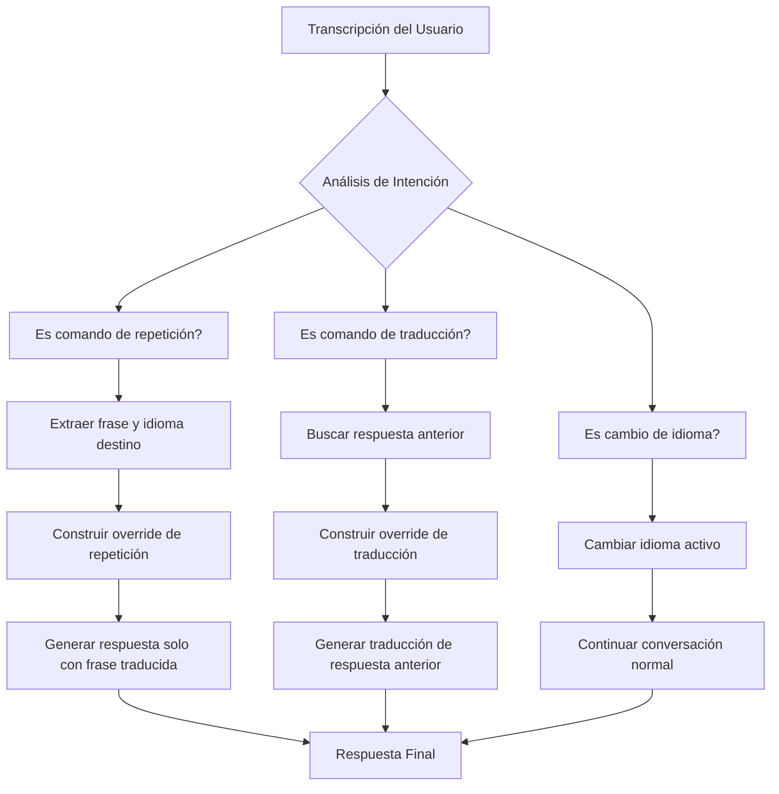

# ANÁLISIS: Problema de Sobre-Interpretación en Comandos "di en [idioma]"

## Diagnóstico del Problema

### Situación Actual
El sistema FLU está sobre-interpretando solicitudes de "di en [idioma]" como preguntas conversacionales reales en lugar de solicitudes de repetición.

**Ejemplos problemáticos:**

1. **Solicitud**: "Okay Flow di en chino Hola cómo estás"
   - **Respuesta actual**: `你好，我很好，谢谢！` ("Hola, estoy muy bien, ¡gracias!")
   - **Respuesta esperada**: `你好，你好吗？` o `嗨，你好吗？` ("Hola, ¿cómo estás?")

2. **Solicitud**: "Okay flu vi en chino papá"
   - **Respuesta actual**: `好的，爸爸。` ("De acuerdo, papá.")
   - **Respuesta esperada**: `爸爸` o `papá` (simplemente "papá")

### Análisis Técnico

#### 1. Detección de Intención de Traducción
El sistema actual tiene una función `detectTranslationIntent()` en `src/voice/lib/gemini.js` que detecta patrones como:
- "dilo en español" → detectado como intención de traducción
- "traduce a español lo que hablaste" → detectado como intención de traducción

**Problema**: La función NO distingue entre:
- **Modo traducción**: "traduce a [idioma] lo que hablaste" (traducir respuesta anterior)
- **Modo repetición**: "di en [idioma] [frase]" (repetir frase proporcionada)

#### 2. Configuración de Patrones
En `src/voice/lib/fluConfig.js`, la configuración `translationIntent.markers` incluye:
```javascript
sayIn: ['dilo en', 'di eso en', 'di el contenido en', 'di esta respuesta en', 'di esto en', 'say it in', 'say that in', 'write it in']
```

**Problema**: Los patrones "dilo en", "di eso en" asumen que hay una "respuesta anterior" que traducir, pero cuando el usuario proporciona una frase explícita después del comando, el sistema debería tratarla como repetición, no como traducción de respuesta anterior.

#### 3. Flujo de Procesamiento
En `generateFluContract()`:
1. Se detecta intención de traducción
2. Se busca la última respuesta del asistente (`findLastAssistantResponse`)
3. Se construye un bloque de override que ordena traducir esa respuesta anterior
4. El modelo recibe instrucciones para traducir la respuesta anterior

**Problema**: Cuando el usuario dice "di en chino Hola cómo estás", el sistema:
- Detecta intención de traducción (por "di en")
- Busca respuesta anterior (puede encontrar cualquier cosa o nada)
- Ordena traducir esa respuesta anterior en lugar de repetir "Hola cómo estás" en chino

## Propuesta de Solución

### Objetivo
Distinguir claramente entre dos modos de operación:
1. **Modo Traducción**: Traducir la respuesta anterior del asistente a otro idioma
2. **Modo Repetición/Eco**: Repetir una frase proporcionada por el usuario en otro idioma

### Algoritmo de Detección Mejorado

#### Paso 1: Análisis de Patrones
Debemos crear una nueva función `detectRepetitionIntent()` que identifique:
- Patrones de repetición: "di en [idioma] [frase]", "vi en [idioma] [frase]", "say in [language] [phrase]"
- Extraer la frase a repetir (todo lo que sigue después del marcador de idioma)

#### Paso 2: Distinción de Intenciones
Modificar `detectTranslationIntent()` para que:
1. Primero verifique si es un comando de repetición
2. Si es repetición, extraiga la frase y el idioma destino
3. Si es traducción, mantenga el comportamiento actual (buscar respuesta anterior)

#### Paso 3: Nuevo Tipo de Intención
Crear un nuevo tipo de intención `repetitionIntent` con estructura:
```javascript
{
  detected: true,
  type: 'repetition', // 'translation' o 'repetition'
  targetLanguage: 'zh',
  phrase: 'Hola cómo estás',
  sourceLanguage: 'es' // detectado automáticamente
}
```

#### Paso 4: Bloque de Override para Repetición
Crear `buildRepetitionOverrideBlock()` que genere instrucciones como:
```
CRÍTICO — SOLICITUD DE REPETICIÓN EN IDIOMA DESTINO.
El usuario te pidió que digas la frase siguiente en [idioma destino].
Frase a decir: "[frase]"
Tu respuesta_voz DEBE ser EXACTAMENTE la traducción de esta frase al [idioma destino], sin añadir texto conversacional, sin preguntas, sin comentarios.
```

### Arquitectura de la Solución



### Archivos a Modificar

#### 1. `src/voice/lib/fluConfig.js`
- Agregar nuevos marcadores para repetición:
  ```javascript
  repetitionIntent: {
    markers: {
      sayPhrase: ['di en', 'di la frase', 'say in', 'repeat in', 'vi en'],
      // Nota: 'vi' es variante de 'di' en algunos acentos
    },
    // Reutilizar languageAliases existente
  }
  ```

#### 2. `src/voice/lib/gemini.js`
- Crear función `detectRepetitionIntent(transcript)`
- Modificar `detectTranslationIntent()` para excluir casos de repetición
- Crear función `buildRepetitionOverrideBlock({ targetLanguage, phrase, language })`
- Modificar `generateFluContract()` para manejar ambos tipos de intención

#### 3. `tests/translationIntent.test.ts`
- Agregar tests para repetición vs traducción
- Verificar extracción correcta de frases
- Validar que no haya regresiones

#### 4. `tests/translationAntiEcho.test.ts`
- Agregar tests para el nuevo flujo de repetición
- Verificar que las respuestas sean solo la frase traducida

### Consideraciones de Experiencia de Usuario

#### 1. Claridad en la Respuesta
- **Repetición**: Solo la frase traducida, sin adornos
- **Traducción**: Solo la traducción de la respuesta anterior, sin comentarios
- **Cambio de idioma**: Confirmación breve del cambio

#### 2. Manejo de Errores
- Si no se detecta idioma destino: usar idioma por defecto (es)
- Si la frase está vacía: pedir clarificación
- Si el idioma destino no es soportado: informar al usuario

#### 3. Compatibilidad con Versiones Anteriores
- Mantener funcionalidad existente de traducción
- No romper comandos actuales como "habla en [idioma]"
- Preservar el sistema anti-eco para traducciones

### Plan de Implementación

#### Fase 1: Análisis y Diseño (1-2 días)
1. Documentar casos de uso específicos
2. Diseñar algoritmo de extracción de frases
3. Definir API para nueva intención

#### Fase 2: Implementación Core (2-3 días)
1. Implementar `detectRepetitionIntent()`
2. Crear `buildRepetitionOverrideBlock()`
3. Integrar en `generateFluContract()`

#### Fase 3: Pruebas y Validación (1-2 días)
1. Crear tests unitarios
2. Validar con ejemplos reales
3. Verificar no regresiones

#### Fase 4: Refinamiento y Despliegue (1 día)
1. Ajustar basado en feedback
2. Actualizar documentación
3. Desplegar cambios

### Métricas de Éxito

1. **Precisión de detección**: 95%+ de comandos clasificados correctamente
2. **Calidad de respuesta**: 100% de respuestas sin texto conversacional adicional
3. **Tiempo de respuesta**: Sin impacto significativo en latencia
4. **Satisfacción del usuario**: Mejora en experiencia de uso de comandos de repetición

### Riesgos y Mitigaciones

#### Riesgo 1: Confusión entre modos
- **Mitigación**: Lógica de detección clara con prioridad para repetición cuando hay frase explícita

#### Riesgo 2: Extracción incorrecta de frases
- **Mitigación**: Algoritmo robusto que maneje puntuación, pausas, y variaciones

#### Riesgo 3: Impacto en performance
- **Mitigación**: Optimizar procesamiento de regex y mantener caché de configuraciones

### Conclusión

El problema de sobre-interpretación surge de una clasificación binaria (traducción vs no traducción) que no considera el tercer caso: repetición de frase proporcionada. La solución propuesta introduce una nueva categoría de intención con su propio flujo de procesamiento, manteniendo compatibilidad con la funcionalidad existente mientras mejora significativamente la experiencia del usuario para comandos de repetición.