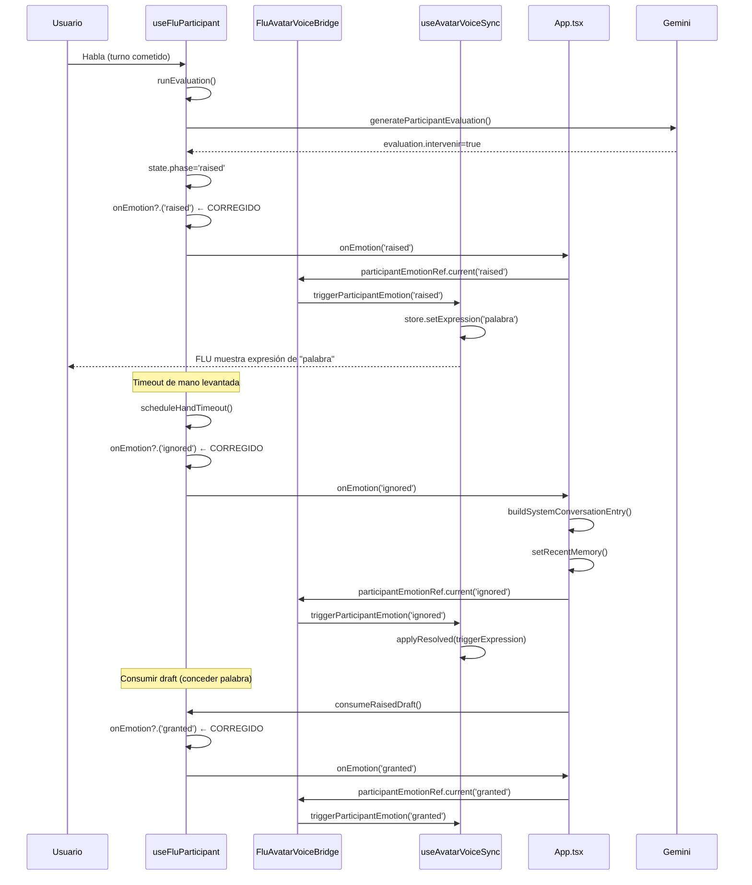

# Diagnóstico: Participación FLU — OS4 vs OS3

## Resumen Ejecutivo

Se identificaron **3 omisiones críticas** y **2 diferencias arquitectónicas** entre OS4 y OS3 que afectan directamente el funcionamiento de la participación de FLU (avatar 3D, chip superior, emociones, animaciones).

---

## OMISIÓN #1 (CRÍTICA): `onEmotion` callback faltante en `useFluParticipant.js`

### Archivo afectado
[`src/voice/hooks/useFluParticipant.js`](../src/voice/hooks/useFluParticipant.js:48)

### Síntoma
- FLU no reacciona cuando un participante levanta la mano
- El chip superior no cambia a rojo/estado de participación
- FLU no muestra expresión de "palabra" cuando se le concede la palabra
- FLU no reacciona cuando el participante es ignorado (timeout)

### Causa raíz
El archivo [`useFluParticipant.js`](../src/voice/hooks/useFluParticipant.js:48) es un **port directo de OS2** que **NUNCA fue actualizado** para incluir el callback `onEmotion`. Comparado con [`D-3-FLU-OS3/src/hooks/useFluParticipant.ts`](../../D-3-FLU-OS3/src/hooks/useFluParticipant.ts:45):

| Aspecto | OS3 (TypeScript) | OS4 (JavaScript) |
|---------|------------------|------------------|
| `onEmotion` en función | ✅ Línea 70: `onEmotion` como parámetro | ❌ **NO EXISTE** — línea 48-60 |
| `ignoredFiredRef` | ✅ Línea 82: `useRef(false)` para dedup | ❌ **NO EXISTE** |
| `onEmotion?.('ignored')` en timeout | ✅ Línea 121 | ❌ **NO EXISTE** en línea 118 |
| `onEmotion?.('raised')` al levantar mano | ✅ Línea 182 | ❌ **NO EXISTE** en línea 220 |
| `onEmotion?.('granted')` al consumir draft | ✅ Línea 260 | ❌ **NO EXISTE** en línea 330 |
| Reset `ignoredFiredRef` en `dismissRaisedHandPublic` | ✅ Línea 245 | ❌ **NO EXISTE** en línea 306-314 |
| Reset `ignoredFiredRef` en `consumeRaisedDraftPublic` | ✅ Línea 256 | ❌ **NO EXISTE** en línea 318-332 |
| Reset `ignoredFiredRef` en `resetParticipant` | ✅ Línea 235 | ❌ **NO EXISTE** en línea 288-302 |

### Impacto
El `App.tsx` de OS4 **SÍ pasa `onEmotion`** al hook (línea 256-287), exactamente igual que OS3 (línea 418-449). Pero `useFluParticipant.js` **ignora el parámetro** porque no está en la firma de la función. El callback se pierde silenciosamente.

### Flujo roto
```
App.tsx: onEmotion=(event) => { participantEmotionRef.current?.(event); ... }
  → useFluParticipant({ ..., onEmotion })  ← parámetro IGNORADO
    → scheduleHandTimeout: NO llama onEmotion?.('ignored')
    → runEvaluation: NO llama onEmotion?.('raised')
    → consumeRaisedDraftPublic: NO llama onEmotion?.('granted')
      → participantEmotionRef.current NUNCA se llama
        → triggerParticipantEmotion NUNCA se ejecuta
          → FLU no cambia expresión, chip no cambia
```

---

## OMISIÓN #2 (MEDIA): `syncAvatarToState` SPEAKING — falta `else` branch

### Archivo afectado
[`src/hooks/useAvatarVoiceSync.ts`](../src/hooks/useAvatarVoiceSync.ts:178)

### Síntoma
- Cuando FLU habla sin animaciones de emoción pendientes, la expresión podría resolverse incorrectamente
- Posible causa del "congelamiento" de FLU al hablar

### Causa raíz
En [`D-3-FLU-OS3/src/hooks/useAvatarVoiceSync.ts`](../../D-3-FLU-OS3/src/hooks/useAvatarVoiceSync.ts:178-212), el handler SPEAKING tiene una estructura `if (speakingAnims) { ... } else { ... }`:

```typescript
// OS3 (líneas 178-212)
if (state === 'SPEAKING') {
    const expression = toggleIndex === 0 ? 'hablando' : 'hablando2';
    const speakingAnims = EXPRESSION_MAP[expression];
    if (speakingAnims) {           // ← TIENE else branch
        if (emotionAnims && emotionAnims.length > 0) { ... }
        else { store.setExpression(expression); }
    } else {                       // ← OS3 TIENE este else
        store.setExpression(expression);
    }
    return;
}
```

En [`src/hooks/useAvatarVoiceSync.ts`](../src/hooks/useAvatarVoiceSync.ts:178-204), OS4 usa DATA-DRIVEN con `SPEAKING_ALTERNATIVES` y **NO tiene el `else` branch**:

```typescript
// OS4 (líneas 178-204)
if (state === 'SPEAKING') {
    const alt = SPEAKING_ALTERNATIVES[toggleIndex];
    if (emotionAnims && emotionAnims.length > 0) { ... }
    // Sin emoción: DATA-DRIVEN
    store.setExpression(alt.expression);  // ← Si emotionAnims es undefined pero alt.anims está vacío...
    return;
}
// Si no hay return (porque emotionAnims.length === 0 pero alt.anims está vacío),
// FALL THROUGH al código de non-toggle states (líneas 217-228)
// que usa resolved.expression del EmotionEngine — expresión INCORRECTA
```

### Riesgo
Si `SPEAKING_ALTERNATIVES[toggleIndex]` tiene `anims: []` (vacío), `store.setExpression(alt.expression)` se ejecuta pero no hay animaciones. El código **no retorna** y cae al bloque de non-toggle states (líneas 217-228) que aplica `resolved.expression` del EmotionEngine — potencialmente una expresión diferente a la de speaking.

---

## OMISIÓN #3 (BAJA): DATA-DRIVEN vs DIRECT en `triggerParticipantEmotion`

### Archivo afectado
[`src/hooks/useAvatarVoiceSync.ts`](../src/hooks/useAvatarVoiceSync.ts:278)

### Síntoma
- No es un bug funcional, pero cambia el comportamiento de las expresiones de participante

### Diferencia
| Aspecto | OS3 | OS4 |
|---------|-----|-----|
| `triggerParticipantEmotion('raised')` | DIRECT: `'palabra'` / `'Palabra2'` (hardcode) | DATA-DRIVEN: `PARTICIPANT_ALTERNATIVES` del registry |
| `syncAvatarToState('LISTENING')` | DIRECT: `'atencion'` / `'atencion2'` (hardcode) | DATA-DRIVEN: `LISTENING_ALTERNATIVES` del registry |
| `syncAvatarToState('SPEAKING')` | DIRECT: `'hablando'` / `'hablando2'` + `EXPRESSION_MAP` | DATA-DRIVEN: `SPEAKING_ALTERNATIVES` del registry |

OS4 usa el `expressionRegistry` para resolver expresiones, lo cual es **mejor arquitectónicamente** (más configurable), pero introduce dependencia en que el registry esté correctamente poblado.

---

## DIFERENCIA ARQUITECTÓNICA #1: Caching en `generateFluContract`

### Archivo afectado
[`src/services/gemini.ts`](../src/services/gemini.ts:620-625, 841-843)

### Detalle
OS4 tiene un sistema de caché para `generateFluContract` que **NO existe en OS3**:

```typescript
// OS4 (líneas 620-625)
const cacheKey = buildCacheKey(transcript, history.length, options.language || 'es');
const cached = getCachedResponse(cacheKey);
if (cached) { return cached as FluContract; }

// ... al final (líneas 841-843)
setCachedResponse(cacheKey, contract);
```

Esto es una **mejora** de OS4 sobre OS3, pero introduce el riesgo de que respuestas cacheadas no reflejen cambios en configuración o personalidad.

---

## DIFERENCIA ARQUITECTÓNICA #2: Proxy vs Directo

### Detalle
OS4 usa un proxy Vite (`geminiProxy.ts`) para las llamadas de voz (`requestFluContract`, `requestParticipantEvaluation`, `requestConversationSummary`), mientras que OS3 llama a Gemini directamente desde el browser.

Esto es correcto porque OS4 heredó el asistente de voz de OS2 que usaba Express backend. El proxy ya fue corregido para pasar el modelo desde `localStorage`.

---

## Resumen de Correcciones Necesarias

| # | Prioridad | Archivo | Corrección |
|---|-----------|---------|------------|
| 1 | 🔴 CRÍTICA | [`src/voice/hooks/useFluParticipant.js`](../src/voice/hooks/useFluParticipant.js:48) | Añadir `onEmotion` callback, `ignoredFiredRef`, y todas las llamadas a `onEmotion?.()` |
| 2 | 🟡 MEDIA | [`src/hooks/useAvatarVoiceSync.ts`](../src/hooks/useAvatarVoiceSync.ts:178) | Añadir `else` branch en SPEAKING handler para evitar fallthrough |
| 3 | 🟢 BAJA | [`src/hooks/useAvatarVoiceSync.ts`](../src/hooks/useAvatarVoiceSync.ts:278) | Verificar que `PARTICIPANT_ALTERNATIVES` en `expressionRegistry` tenga las expresiones correctas |

---

## Diagrama de Flujo de Participación (Corregido)



---

## Conclusión

La **omisión #1** es la causa raíz de que FLU no reaccione a la participación. El `useFluParticipant.js` necesita ser actualizado para incluir el callback `onEmotion` y el `ignoredFiredRef`, exactamente como está en OS3. La corrección es directa: añadir el parámetro, las llamadas, y los resets.
