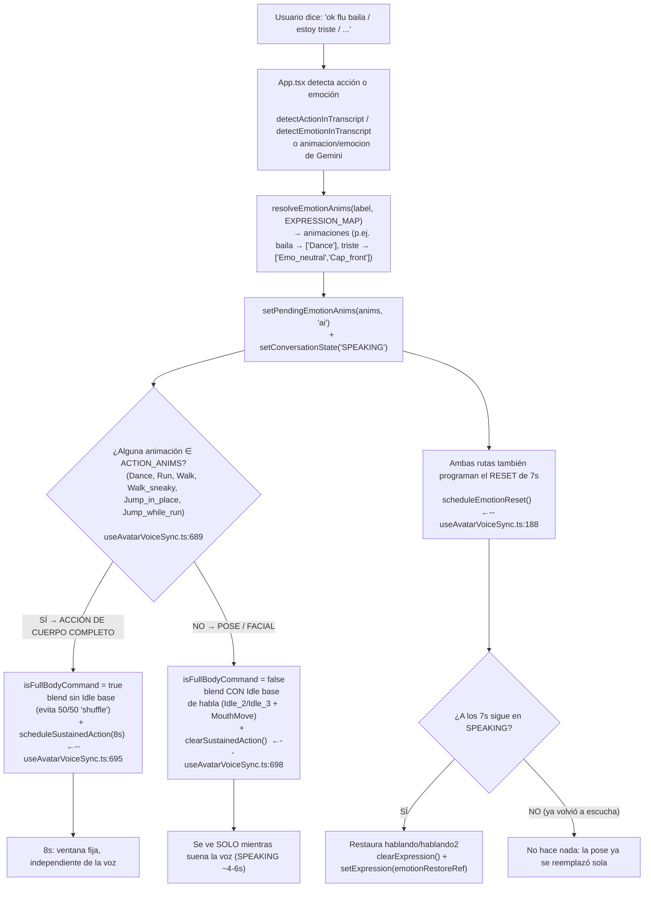
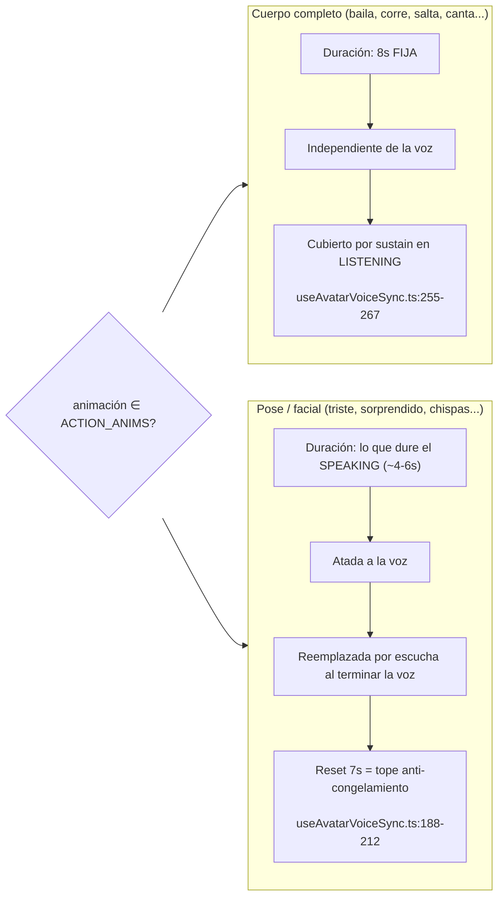

# Diagrama: Matiz honesto sobre los tiempos (emoción genérica)

> Generado para visualizar el comportamiento de [`useAvatarVoiceSync.ts`](../src/hooks/useAvatarVoiceSync.ts).
> Los diagramas son Mermaid — abre este archivo en VS Code y usa el visor de diagramas (Ctrl+Shift+V / Preview) para renderizarlos.

---

## 1. Árbol de decisión: cómo se clasifica una emoción

---

## 2. Línea de tiempo — ACCIÓN DE CUERPO COMPLETO (baila → Dance)

Garantía de ~8s aunque la voz sea corta: el sostenimiento cubre el LISTENING.

```mermaid
gantt
    title Comando "baila" (Dance) — cuerpo completo
    dateFormat X
    axisFormat %s s

    section Estados de conversación
        SPEAKING (voz TTS ~2s)          :a1, 0, 2s
        LISTENING (espera usuario)      :a2, after a1, 6s

    section Animación en pantalla
        Dance + MouthMove (SPEAKING)    :dance1, 0, 2s
        Dance re-aplicada (LISTENING)   :dance2, after a1, 6s
        Restaura blend de escucha (Idle_2) :done, after dance2, 0s

    section Timers internos
        scheduleSustainedAction 8s      :sust, 0, 8s
        scheduleEmotionReset 7s (no-op si no SPEAKING) :reset, 0, 7s
```

> **Cómo se logra**: en LISTENING, [`syncAvatarToState`](../src/hooks/useAvatarVoiceSync.ts:255) ve `sustainedActionRef` vigente y re-aplica `blendAnimation(Dance)` mientras `Date.now() < until` (8s). La voz corta (~2s) NO corta la acción: esta sobrevive ~6s en LISTENING.

---

## 3. Línea de tiempo — POSE / FACIAL (triste → Emo_neutral + Cap_front)

Se ve durante todo el SPEAKING (voz ~4-6s). No hay acción de cuerpo que sostener; el reset de 7s solo evita cara pegada.

```mermaid
gantt
    title Emoción "triste" — pose/facial
    dateFormat X
    axisFormat %s s

    section Estados de conversación
        SPEAKING (voz TTS ~5s)          :a1, 0, 5s
        LISTENING (espera usuario)      :a2, after a1, 5s

    section Animación en pantalla
        Idle_2/3 + Emo_neutral + Cap_front + MouthMove :pose, 0, 5s
        Escucha natural (atencion → Idle_2) :listen, after a1, 5s

    section Timers internos
        scheduleEmotionReset 7s (dispara SOLO si sigue SPEAKING) :reset, 0, 7s
        scheduleSustainedAction         :none, 0, 0s
```

> **Caso B (voz LARGA, >7s)**: si el TTS sigue sonando a los 7s, el reset de [`scheduleEmotionReset`](../src/hooks/useAvatarVoiceSync.ts:188) restaura `hablando/hablando2` a mitad de turno → la cara no queda clavada en la pose mientras la voz continúa.

---

## 4. Comparación lado a lado

---

## 5. Números validados (spec [`validate-emocion-generica.spec.ts`](../tests/e2e/validate-emocion-generica.spec.ts), pageErrors 0)

| Emoción | Categoría | Blend en SPEAKING | Reset 7s → |
|---|---|---|---|
| baila | Cuerpo completo | `[Dance, MouthMove]` | 7456ms → hablando |
| enojado | Cuerpo completo | `[Walk, Emo_blink, Cap_back, MouthMove]` | 7379ms → hablando2 |
| yes! | Cuerpo completo | `[Jump_in_place, MouthMove]` | 7409ms → hablando |
| triste | Pose/facial | `[Idle_3, Emo_neutral, Cap_front, MouthMove]` | 7323ms → hablando2 |
| sorprendido | Pose/facial | `[Idle_2, Emo_neutral, Cap_back, MouthMove]` | 7456ms → hablando |
| se_me_chispotio | Pose/facial | `[Idle_3, Emo_blink, MouthMove]` | 7368ms → hablando2 |

**Sostenimiento 8s (baila):** durante SPEAKING `[Dance, MouthMove]` → tras LISTENING `[Dance]` (+7s) → "Acción sostenida terminada (8s)" → restaura `setExpression(atencion)` `[Idle_2]`.
