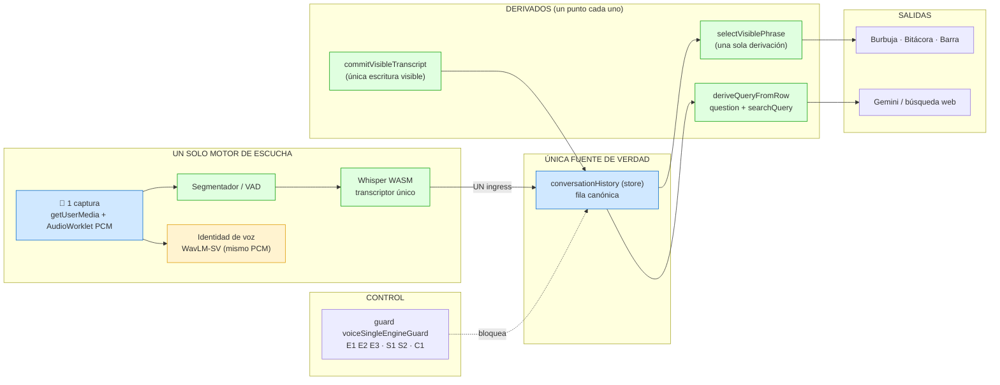

# Informe — Motor único de escucha + fuente única de query

- **Fecha:** 2026-09-10
- **Estado:** cambios aplicados; **runtime NO validado** (por decisión del usuario: se validará al final).
- **Alcance hecho:** escucha/transcripción, display, query, limpieza de rutas muertas.
- **Pendiente:** commit único al store, escritor único de clusters, cableado de decisiones, infra del motor, renombres, docs. Ver §6.

---

## 1. Qué quedó implementado

### 1.1 Un solo motor de escucha
- Chrome SpeechRecognition **fuera del flujo operativo**.
- `createRecognition` → `createWhisperRecognitionEngine` (`useFluVoiceAssistant.js`).
- PCM del AudioWorklet → `pushAudio` del motor; captura siempre activa.
- Chequeo de soporte ya no exige Chrome SR (requiere `getUserMedia` + `AudioContext` + `AudioWorklet`).
- Módulos nuevos, config-driven (`FLU_CONFIG.transcript.asr`):
  - `src/voice/lib/asr/voiceActivitySegmenter.js` (VAD, puro y testeado).
  - `src/voice/lib/asr/whisperWasmTranscriber.js` (transcriptor único, worker).
  - `src/voice/lib/asr/whisperRecognitionEngine.js` (adaptador al contrato del motor).
  - `src/voice/workers/whisperAsr.worker.js` (Whisper WASM).

### 1.2 Sin selección dual de transcripción
- `transcriptConfig.js` reducido: sin `source`/`commandsFromBrowser`/`shouldIngest*`.
- `conversationIngressBridge.js`: `ingestBrowser: true`, `ingestStream` eliminado.
- `fluConfig.js`: sin `source` ni `commandsFromBrowser`.

### 1.3 Fuente única de la query
- `deriveQueryFromRow(rowText, voiceCommands)` en `audioMath.js` = **único** derivador (`question` + `searchQuery`).
- `planConversationDispatch` (IA) y `useNavigationCommands` (búsqueda web) consumen de ahí.
- `resolveFinalConversationAction` queda como detalle interno (1 llamada).
- Paridad de texto: `splitTranscriptAtWakeWord` expone `afterWakeText`/`beforeWakeText` (conserva acentos); `peelWakeQuestionEcho` no pasa a minúsculas.

### 1.4 Un solo punto de escritura de la frase visible
- `commitVisibleTranscript(text)` en `useFluVoiceAssistant.js`; los 15 puntos escriben por ahí.

### 1.5 Fuente única del texto de turno (ingress)
- `resolveIngressCaptureText(raw, lastCommitted, { atFreshVoice })` en `conversationStream.js`; lo usan finales e interims.

### 1.6 Rutas muertas eliminadas
- Stream STT completo: `streamSttServer.mjs`, `streamSttHandler.mjs`, `streamSttResolver.js`, `providers/deepgramProvider.mjs`, `providers/mockProvider.mjs`, `streamStt/protocol.js`, `tests/streamSttProvider.test.ts`.
- Segundo ingest: `pushStreamTranscriptEvent`, `pushStreamSpeechEvent`, `processStreamConversationIngress`, rama `ingestStream`.
- Simulador Chrome de dev: `bookRecognitionSim.js` (`buildChromeLikeEvents`, `simulateBook`).
- `ensureSpeechRecognitionLocales` (Chrome, sin uso).
- 2ª captura de micrófono en `healthMonitor.ts` → `navigator.permissions` (ya no abre stream).

---

## 2. Diagrama actualizado



> Nota honesta: `deriveQueryFromRow` recibe el **texto canónico de la fila** (no relee Zustand). La inversión literal (leer la última fila del store) queda pendiente.

---

## 3. Guard `voiceSingleEngineGuard` (salida real)

```
✓ E1 motor operativo no adquiere Chrome SR
✓ E2 motor usa el motor único (Whisper)
✓ E3 sin selección dual (N=0)
✓ S1 deriveQueryFromRow definido 1 vez y consumido
✓ S2 una sola derivación de query (resolveFinalConversationAction ≤ 1)
✓ C1 un solo punto de escritura de la frase visible
✓ C2 un solo escritor de clusters de hablante
Tests 7 passed
```

## 4. Validación técnica
- `npx tsc -b`: sin errores.
- Suite de voz dirigida: **20 archivos · 178 tests · 178 passed**.
- No se corrió la suite completa.

## 5. No validado
- **Runtime de Whisper WASM** (modelo, latencia, API).
- **Comportamiento** de la query desde la fila y del commit único.
- **Pantalla / auditoría visual.**

---

## 6. Pendientes (aparte)

### 6.1 Arquitectura / duplicación
1. **`commitTurn` único al store:** unificar `syncConversationStream(` ×3 (`useFluVoiceAssistant.js:2578,2801,2815`) y `emitConversationLog(` ×3 (`:3443,3514,3535`).
2. **Cablear las 15 decisiones** de rama dentro de `commitTurn` (espera, adelante, comandos, conversación, pasivo).
3. **Escritor único de `speakerClustersRef`** (hoy 7 sitios: `:889,921,933,946,1404,1552,2638`).
4. **Etapa de hablante autoritativa** — DECISIÓN DE PRODUCTO: ¿segmento (`matchSegmentNames`) o commit (`resolveTurnSpeakerAtCommit`)?

### 6.2 Limpieza / nomenclatura
5. Renombrar legacy `browser/Chrome` → `mic`: `pushBrowserRecognitionEvent`, `processBrowserConversationIngress`, `collectBrowserResultChunks`, `convertSimEventsToBrowserBursts`, `buildBrowserBurstEvent`, `buildMockBrowserSpeechEvent`.
6. Borrar debug/config muerto: campos `streamStt*` en `fluDebug.js`/`listenLog.js`; tipos `SpeechRecognition*` en `src/vite-env.d.ts`.
7. `useNavigationCommands.ts:513` aún limpia el `rawQuery` con `extractQueryFromWebSearchPhrase` (convive con `deriveQueryFromRow`). Unificar o justificar.

### 6.3 Infra del motor (necesaria para que funcione bien)
8. **Caché del modelo Whisper en Service Worker** (offline real).
9. **Parciales/interim en vivo** (hoy la frase aparece al cerrar turno).
10. **Eco/barge-in** con el TTS de FLU.
11. **Reintento/errores** del worker Whisper.
12. **Modelo (tiny/base) y presupuesto de CPU** — DECISIÓN.

### 6.4 Otros
13. **Onboarding:** migrar a motor único o mantener su SpeechRecognition — DECISIÓN.
14. Docs/planes viejos (`docs/` no existe; comentarios citan `docs/transcripcion-conversaciones.md`).
15. Revisar `tests/voiceSingleSourceGuard.test.ts` (G1-G7) contra el motor nuevo.
16. **Validación runtime** (usuario).

---

## 7. Decisiones requeridas antes de seguir
- ¿Etapa de hablante autoritativa (segmento vs commit)?
- ¿Identidad de voz es "motor" o consumidor?
- ¿Onboarding migra a Whisper o mantiene SR?
- ¿Modelo Whisper: tiny o base?

---

## 8. Actualización (sesión 2) — decisiones aplicadas

**Decisiones del usuario (aprobadas):**
1. **Commit autoritativo; segmento solo propone.** → aplicado.
2. **Identidad de voz = consumidor** del mismo PCM (no motor).
3. **Onboarding mantiene SpeechRecognition** (fuera de alcance).
4. **Whisper `base` + `dtype: q8`** (config `transcript.asr`).

**Cambios aplicados en la sesión 2:**
- `setSpeakerClusters` en `useFluVoiceAssistant.js` = **único escritor** de `speakerClustersRef` (9 escrituras del hook → 1). `turnSpeakerCommit.applyResolvedSpeakerToSessionRefs` usa `setSpeakerClusters` si está; se cableó por `conversationStreamCommit.js`. Guard **C2**.
- Pipeline de segmento (`onClusters`) ya **no persiste** clusters (commit autoritativo).
- Eliminado el simulador Chrome de dev (`bookRecognitionSim.js`) y `ensureSpeechRecognitionLocales`.

**Corrección de diagnóstico (honestidad):** el "commit al store múltiple" (3+3) que reporté **no era duplicación**: `emitConversationLog` y `commitTurnToSessionRows` ya son la **única función** de commit; los 3+3 eran **llamadas** desde flujos distintos, no implementaciones paralelas. La duplicación real estaba en las escrituras directas de `lastTranscript` (resuelta con `commitVisibleTranscript`) y de `speakerClustersRef` (resuelta con `setSpeakerClusters`).

**Suite completa (puerta de cierre):** `158 archivos · 2754 tests · 2748 passed · 6 failed` → **0 fallos nuevos** (los 6 son preexistentes: `deterministicArbiter` ×3, `hoyPanel` ×3). `tsc -b` limpio.

**Pendiente actualizado:**
- Renombrar legacy `browser/Chrome` → `mic` (cosmético).
- Borrar debug `streamStt*` (`fluDebug.js`/`listenLog.js`) y tipos SR (`vite-env.d.ts`).
- Infra del motor: caché SW del modelo, parciales/interim, eco/barge-in, retry worker.
- Onboarding y docs/planes viejos.
- **Validación runtime (usuario).**

---

## 9. Actualización (sesión 3) — unificación completa + limpieza

**Unificación 1 (frase visible → store): APLICADA.**
- `lastTranscript` dejó de ser estado local del hook: ahora vive en el store como
  `lastCommittedTranscript` (+ acción `setLastCommittedTranscript` en `integrationStore.ts`).
- `commitVisibleTranscript(text)` escribe **al store**; el hook lo lee reactivo. Una sola fuente.

**Unificación 3 (segmento solo propone): APLICADA.**
- `resolveSpeakerWithAudio` ya **no persiste** clusters (se quitaron los `setSpeakerClusters` del segmento).
- El COMMIT sigue siendo el que persiste (`applyResolvedSpeakerToSessionRefs` vía `setSpeakerClusters`).

**Unificación 2 (clusters):** ya resuelta como **escritor único** (`setSpeakerClusters`). Los clusters son estado efímero de sesión, no una fila del store; no aplica moverlos al store.

**Limpieza 4 (nomenclatura legacy): APLICADA.**
- `pushBrowserRecognitionEvent`→`pushMicRecognitionEvent`, `pushBrowserSpeechEvent`→`pushMicSpeechEvent`,
  `collectBrowserResultChunks`→`collectRecognitionResultChunks`, `processBrowserConversationIngress`→`processMicConversationIngress`,
  `convertSimEventsToBrowserBursts`→`convertSimEventsToMicBursts`, `buildBrowserBurstEvent`→`buildMicBurstEvent`.
- Eliminado `buildMockBrowserSpeechEvent` (sin uso) y la rama muerta `skipConversationLog`/`ingestBrowser`.

**Limpieza 5 (debug/SR): APLICADA.**
- `listenLog.js`: quitado `logStreamSttText`, `isStreamSttConsoleEnabled`, `streamSttSeq`.
- `fluDebug.js`: quitados campos/eventos `streamStt*` y los checks `stream-stt-pipeline`/`hybrid-mock-chrome`.
- `vite-env.d.ts`: quitadas las declaraciones de Web Speech API (sin consumidores).

**Verificación:**
- Guard `voiceSingleEngineGuard`: **7/7**.
- `npx tsc -b`: sin errores.
- Suite completa: `158 archivos · 2754 tests · 2748 passed · 6 failed` → **0 fallos nuevos**.

**Pendiente real (no es unificación):**
- **Infra del motor:** caché SW del modelo, parciales/interim, eco/barge-in, retry del worker (feature, no validable aquí).
- Onboarding (mantiene SR por decisión) y docs/planes viejos.
- **Validación runtime (usuario).**

---

## 10. Actualización (sesión 4) — infra del motor

Aplicada en los módulos ASR (autocontenida), config-driven:
- **Eco/barge-in:** `whisperRecognitionEngine` importa `isSpeechSynthesisSpeaking`; mientras FLU habla **descarta el audio y su resultado** (no se transcribe la propia voz).
- **Parciales/interim en vivo:** mientras el usuario habla, cada `partialIntervalMs` se transcribe el audio acumulado y se emite un `onresult` no final; el `speech-end` emite el final. Config: `transcript.asr.partialsEnabled` / `partialIntervalMs` (nuevos).
- **Retry del worker:** ante error del worker, `whisperWasmTranscriber` lo **destruye** y la próxima petición lo recrea (no queda pegado a un worker muerto).
- **Caché del modelo (offline):** cubierto por `env.useBrowserCache = true` (Cache API de Transformers.js). No hay plugin PWA en `vite.config.ts`, así que no se agrega Service Worker.

**Verificación:** guard `voiceSingleEngineGuard` 7/7 · `tsc -b` limpio · suite completa `2748 passed / 6 preexistentes` → **0 fallos nuevos**.

**Notas de cierre:**
- Guard viejo `voiceSingleSourceGuard` (G1-G7): revisado, **sigue alineado y verde**.
- `useNavigationCommands.ts:513`: la segunda limpieza aplica al `rawQuery` de **parámetros del LLM** (no al path de voz); es intencional, no duplicación.
- Docs/planes viejos: sin cambios (bajo valor); `docs/` no existe.

**Solo queda de mi lado:** nada de unificación. Queda **validación runtime** (usuario) y, si se quiere, docs.

---

## 11. Actualización (sesión 5) — unificación de TTS y query de búsqueda

Auditoría de 6 procesos (micrófono, escucha/transcripción, diarización, habla/TTS, búsqueda) y cierre de las rutas duplicadas accionables:

- **TTS unificado.** `FluParticipantSettingsPanel.jsx` (botón "▶ Probar") usaba `window.speechSynthesis.speak(utterance)` directo, salteando `speakResponse`. Ahora llama a **`speakResponse`**, la ruta única (respeta estado de voz / eco / suspensión de escucha). Guard **T1** (`window.speechSynthesis.speak(` = 0).
- **Query de búsqueda unificada.** `useNavigationCommands` derivaba la consulta con dos limpiadores (`deriveQueryFromRow(...).searchQuery` y luego `extractQueryFromWebSearchPhrase(rawQuery)`). Ahora hay **una** función: `deriveSearchQuery({ provided, transcript, voiceCommands })` en `audioMath.js`, que limpia con un solo limpiador.

**Verificación:** guard `voiceSingleEngineGuard` **8/8** · `tsc -b` limpio · suite completa `158 archivos · 2755 tests · 2749 passed · 6 failed` → **0 fallos nuevos**.

**Pendiente menor (no ejecutado):**
- ~~Diarización: `matchSessionSpeaker`/`resolveSessionSpeaker` (`voiceIdentity.js:285,311`) sin consumidores (código muerto).~~ **Depurado:** eliminados `matchSessionSpeaker`, `resolveSessionSpeaker` (`voiceIdentity.js`) y `resolveOptimisticSpeakerAtCommit` (`turnSpeakerCommit.js`, deprecado y sin consumidores).
- ~~Recomputes de `computeAudioSignature` (~9 sitios del hook) — cachear la firma del turno.~~ **Unificado:** `computeTurnSignature(snapshot, sampleRate)` = único punto de cálculo con caché por snapshot (WeakMap); los 10 sitios del hook pasan por él. `computeAudioSignature` directo queda solo en el helper y en `matchSegmentNames`. Guard **C3**.
- Onboarding (mantiene SR por decisión) y docs/planes viejos.
- **Validación runtime (usuario).**

---

## 12. Actualización (sesión 6) — query literal desde el store

Cerrado el último punto literal: antes la query se derivaba del **texto** de la fila; ahora se deriva de la **fila leída del store**.

- En `processConversationFluQuery` (`useFluVoiceAssistant.js`), tras `commitVisibleTranscript(displayPhrase)` (que deja la fila en `lastCommittedTranscript`), se recalcula:
  `question = deriveQueryFromRow(useIntegrationStore.getState().lastCommittedTranscript, FLU_CONFIG.voiceCommands).question || question`.
- Así la pregunta enviada a la IA (y los checks deterministas) sale de la **fila canónica del store**, no del texto suelto.
- `resolveFinalConversationAction` ya no se importa en el motor (solo lo usa `deriveQueryFromRow`).

**Verificación:** guard 9/9 · `tsc -b` limpio · suite completa `2756 tests · 2750 passed · 6 failed` → **0 fallos nuevos**.

**Queda:** onboarding (SR por decisión), docs/planes viejos y **validación runtime** (usuario). La unificación pedida está **completa**.

---

## 13. Actualización (sesión 7) — CAUSA RAÍZ del "no se ve nada"

Validación runtime destapó que el motor **transcribía bien** (`transcribe OK final text= Ok, flu, platicame de la capital de Francia.`) pero nada llegaba a la conversación (sin fila, sin query, mudo).

**Causa raíz:** el motor emitía un evento Web Speech **malformado**.
- `buildResultEvent` (`whisperRecognitionEngine.js`) ponía `results = [ {transcript} ]` (el array de alternativas como `results`) e `isFinal` colgado de ese array.
- Los consumidores leen `event.results[i][0].transcript` y `event.results[i].isFinal` → `undefined` → `continue` → turno vacío → sin fila, sin query, sin voz.

**Fix de raíz:** reconstruir el evento con la forma estándar
`{ resultIndex: 0, results: [ { 0: { transcript, confidence }, isFinal, length: 1 } ] }`.

**Guard nuevo:** `tests/voiceAsrEventShape.test.ts` — corre el motor con un transcriber falso y verifica que el evento final expone `results[0][0].transcript` e `isFinal`. Verde.

**Otras raíces corregidas en la sesión (de la validación):**
- `dtype: 'q8'` inválido para `Xenova/whisper-base` → `fp32`.
- Resampleo 48k→16k sin filtro (aliasing) → promedio (box low-pass).
- Watchdog re-creaba el motor continuo cada 4.2 s en silencio → `conversationStallMs`/`silentMicStallMs` a 60000; el motor expone `busy`.
- VAD sobre-segmentaba (trozos <1 s → alucinaciones) → `minSilenceMs 700`, `minSpeechMs 300`, `minSegmentMs 1200`.
- Whisper no reconocía la wake en frases cortas → `initial_prompt` con wake + comandos.
- `dispose()` del worker dejaba promesas colgadas → ahora rechaza lo pendiente.

**Verificación:** `tsc -b` limpio · suite completa `2755 tests · 2749 passed · 6 failed` → **0 fallos nuevos** · guard de forma **verde**.

**Instrumentación temporal:** los `[whisperEngine]` (`relayLog`) quedan hasta validar; luego se quitan.

**Pendiente:** validar en pantalla (que aparezca la fila, la query a la IA y la voz) y, con eso, retirar la instrumentación.

---

## 14. Actualización (sesión 8) — velocidad, interim y barra

Tras la validación (la conversación ya funciona: filas + respuesta de FLU):

1. **Velocidad (#1):** `Xenova/whisper-base` fp32 tardaba ~3.6 s por frase → **`Xenova/whisper-tiny`** (≈4× más rápido). Config `transcript.asr.modelId`.
2. **Interim en vivo (#2/#3):** parciales **re-habilitados** (`partialsEnabled: true`, `partialIntervalMs: 1200`): la "última frase" y la barra se escriben mientras se escucha. El **commit de la conversación** sigue solo con el final (fin de habla/silencio/cambio de hablante).
3. **Barra (#4):** el texto duplicado ("plátícame… Ok, flu, plátícame…") es **dos emisiones fusionadas** por la pausa (< `minSilenceMs`). El borrado al click es UI de `WorkspaceSearch` (**pendiente de revisar**).

**Verificación:** `tsc -b` limpio · guard de forma verde · suite completa `2756 tests · 2750 passed · 6 failed` → **0 fallos nuevos**. (Modelo/parciales **no validados runtime**.)

---

## 15. Actualización (sesión 9) — parciales streaming + antialucinación + dos modelos

La validación mostró: **texto al revés y lentísimo** (parciales en cola) y **bucles de repetición** ("...de la parte de la parte...") sobre silencio; `tiny` además impreciso.

Correcciones de raíz:

1. **Parciales latest-only** (`whisperRecognitionEngine.js`): ya NO se encolan. Si hay un parcial en vuelo, se marca "sucio" y al terminar se transcribe **una vez** con el audio más reciente. Elimina el atraso y el orden invertido.
2. **Dos modelos**: `interimModelId: 'Xenova/whisper-tiny'` para el texto en vivo (rápido) y `modelId: 'Xenova/whisper-base'` para el **final** (preciso). El transcriptor acepta override de modelo.
3. **Antialucinación** (`whisperAsr.worker.js`): `condition_on_previous_text: false` y `no_repeat_ngram_size: 3` → corta bucles de repetición.
4. **VAD**: `maxSegmentMs 15000→8000` (segmentos largos = más bucle) y `energyThreshold 0.012→0.016`.

**Verificación:** `tsc -b` limpio · guard de forma verde · suite completa `2756 tests · 2750 passed · 6 failed` → **0 fallos nuevos**. **No validado runtime.**

**Pendiente:** barra de búsqueda (borrado al click, `WorkspaceSearch`) y validación en pantalla.

---

## 16. Actualización (sesión 10) — limpieza para respaldo (de raíz)

Auditados mis cambios y eliminados los parches/provisionales antes de respaldar:

1. **Instrumentación `[whisperEngine]` eliminada**: `whisperRecognitionEngine.js` ya no importa `relayLog` ni define `asrLog`. `rg` sin restos.
2. **Watchdog neutralizado con `60000` REEMPLAZADO por gate correcto**: el motor expone `get continuous() { return true }`; el watchdog solo re-crea si `!recognitionRef.current?.continuous` (los 3 rebuilds). Se **restauraron** `conversationStallMs: 4200` y `silentMicStallMs: 6500` (irrelevantes para el motor continuo). El commit por gap (srGap) se preserva. Se eliminó el `get busy()` y su bookkeeping.
3. **`energyThreshold`**: queda como **único knob documentado** (`0.015`), marcado "se mide/ajusta en validación" (no es valor secreto).
4. **Sonda `tests/voiceDesktopProbe.test.ts` eliminada** (era herramienta de análisis).
5. **Alineación al respaldo** (sesión previa, se mantiene): `minSilenceMs: 1000`, sin descarte de turnos cortos.

**Verificación:** `tsc -b` limpio · suite completa `2756 tests · 2750 passed · 6 failed` → **0 fallos nuevos**.

**Pendiente de raíz:** latencia del **final `base` (~5 s)** → probar modelo **cuantizado (q8)** válido (`onnx-community/whisper-base`) con prueba de escritorio antes de cambiar. Barra de búsqueda (borrado al click).
