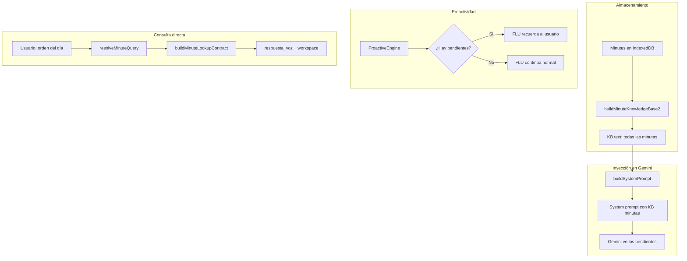
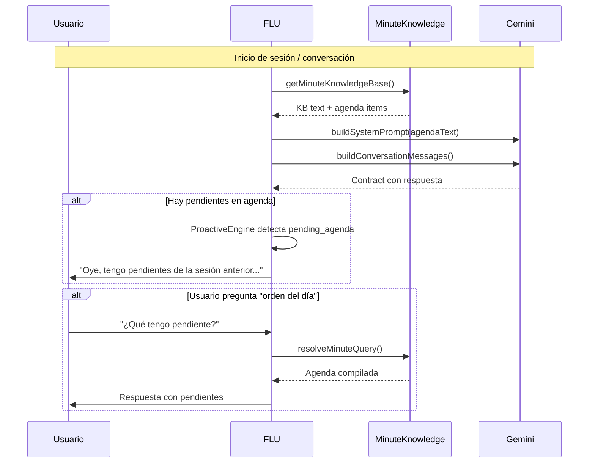

# Plan: Agenda y Orden del Día — Integración Natural

## Principio Rector

FLU **ya sabe** leer minutas, mantener contexto y ser proactivo. No necesitamos un calendario, ni un scheduler, ni una UI compleja. Solo necesitamos que FLU **compile naturalmente** los pendientes de todas las minutas guardadas y los inyecte en su contexto al iniciar una conversación o cuando se le pregunte.

El diseño es **data-driven**: todo se configura desde [`FLU_CONFIG`](src/voice/lib/fluConfig.js), nada hardcodeado.

---

## Arquitectura



---

## Cambios Necesarios

### 1. [`src/lib/dailyAgenda.ts`](src/lib/dailyAgenda.ts) — NUEVO

Función pura que compila una "orden del día" a partir de todas las minutas guardadas.

```typescript
export interface DailyAgendaItem {
    minuteId: string;
    title: string;
    pendingItems: string[];
    nextSteps: string[];
    sourceDate: string; // historyCode
}

export function buildDailyAgenda(records: any[]): DailyAgendaItem[]
```

- Toma todas las minutas
- Extrae `pendientes` y `siguientes_pasos` de cada una
- Filtra las que tienen al menos un pendiente o siguiente paso
- Ordena por fecha (historyCode) descendente
- Retorna array de items

### 2. [`src/lib/proactiveEngine.ts`](src/lib/proactiveEngine.ts:23) — MODIFICAR

Añadir trigger `pending_agenda`:

```typescript
export type ProactiveTrigger =
    | 'long_silence'
    | 'decision_made'
    | 'unresolved_topic'
    | 'new_participant'
    | 'session_time'
    | 'topic_completion'
    | 'follow_up_needed'
    | 'pending_agenda';  // ← NUEVO
```

Nuevo evaluador en `evaluateProactiveTriggers()`:

```typescript
// 8. Pending agenda items from previous sessions
if (context.hasPendingAgenda) {
    candidates.push({
        trigger: 'pending_agenda',
        priority: 0.65,
        suggestionText: 'There are pending items from previous sessions. Offer to review them or ask if the user wants to continue with any.',
        suggestedEmotion: 'interesado',
    });
}
```

Añadir campo a [`ProactiveContext`](src/lib/proactiveEngine.ts:32):

```typescript
export interface ProactiveContext {
    // ... existing fields ...
    hasPendingAgenda: boolean;  // ← NUEVO
}
```

### 3. [`src/voice/lib/gemini.js`](src/voice/lib/gemini.js:312) — MODIFICAR

En `buildSystemPrompt()`, añadir inyección de agenda cuando `knowledgeMode === 'minutes'`:

```javascript
// Agenda injection: pending items from all minutes
const agendaBlock = (knowledgeMode === 'minutes' && agendaText)
    ? [isEnglish
        ? `DAILY AGENDA — These are pending items from previous sessions. Keep them in mind and offer to follow up naturally when appropriate:\n${agendaText}`
        : `AGENDA DEL DÍA — Estos son los pendientes de sesiones anteriores. Tenlos presentes y ofrece dar seguimiento de forma natural cuando sea oportuno:\n${agendaText}`
    ]
    : [];
```

Añadir `agendaText` como parámetro opcional a `buildSystemPrompt()`.

### 4. [`src/voice/lib/fluConfig.js`](src/voice/lib/fluConfig.js:355) — MODIFICAR

Añadir configuración para la agenda en `FLU_CONFIG`:

```javascript
agenda: {
    enabled: true,
    maxItems: 5,
    minImportance: 0.3,
    injectOnStartup: true,
    proactiveReminder: true,
},
```

### 5. [`src/App.tsx`](src/App.tsx:357) — MODIFICAR

En el callback `getMinuteKnowledgeBase`, además de `buildMinuteKnowledgeBase2`, construir también la agenda:

```typescript
getMinuteKnowledgeBase: () => {
    const kb = buildMinuteKnowledgeBase2(minuteKnowledge.minutes);
    // La agenda se inyecta aparte, no en la KB
    return kb;
},
```

Y pasar `agendaText` al `buildSystemPrompt` cuando se construye el system prompt.

### 6. [`src/voice/lib/gemini.js`](src/voice/lib/gemini.js:425) — MODIFICAR

En `buildUserPrompt()`, añadir sección de agenda cuando hay pendientes:

```javascript
// Agenda items for context
const agendaSection = agendaItems.length > 0
    ? `${isEnglish ? 'Pending items from previous sessions' : 'Pendientes de sesiones anteriores'}:\n${agendaItems}`
    : '';
```

---

## Flujo Completo



---

## Resumen de Archivos a Modificar/Crear

| Archivo | Acción | Descripción |
|---------|--------|-------------|
| [`src/lib/dailyAgenda.ts`](src/lib/dailyAgenda.ts) | **CREAR** | Función `buildDailyAgenda()` que compila pendientes de todas las minutas |
| [`src/lib/proactiveEngine.ts`](src/lib/proactiveEngine.ts:23) | MODIFICAR | Añadir trigger `pending_agenda` + campo `hasPendingAgenda` |
| [`src/voice/lib/gemini.js`](src/voice/lib/gemini.js:312) | MODIFICAR | Añadir parámetro `agendaText` a `buildSystemPrompt()` |
| [`src/voice/lib/gemini.js`](src/voice/lib/gemini.js:425) | MODIFICAR | Añadir sección de agenda a `buildUserPrompt()` |
| [`src/voice/lib/fluConfig.js`](src/voice/lib/fluConfig.js:355) | MODIFICAR | Añadir sección `agenda` en `FLU_CONFIG` |
| [`src/App.tsx`](src/App.tsx:357) | MODIFICAR | Pasar `agendaText` al construir prompts |

**Total: 1 archivo nuevo, 5 modificaciones — sin parches, sin UI nueva, sin calendario.**
