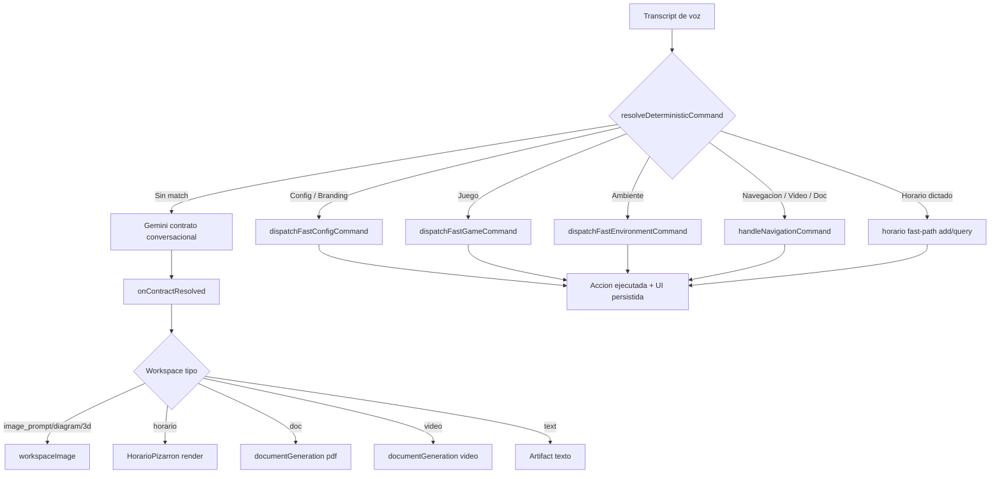

# Plan de Corrección de Defectos Conocidos y Problemas de Fondo

> **Objetivo:** Corregir TODOS los defectos reportados, eliminar las rutas dobles que hacen que la IA "hable sin ejecutar", identificar y completar TODO lo que es dummy, y dejar TODAS las funcionalidades realmente implementadas de punta a punta (voz → contrato → acción → UI persistida).

---

## 1. Diagnóstico de fondo: la causa raíz de casi todo

El sistema tiene **DOS rutas de resolución de comandos de voz** que conviven sin un árbitro claro:

| Ruta | Mecanismo | Ejecuta acciones reales | Cuándo se usa |
|------|-----------|------------------------|---------------|
| **A. Fast-path determinista** | `resolveConfigCommandFromText` / `resolveGameCommandFromText` / `resolveEnvironmentIntent` / `resolveNavigationCommandFromTexts` / `detectUiVoiceCommand` | ✅ SÍ (dispara `dispatchFastConfigCommand`, `handleNavigationCommand`, etc.) | Fuera de conversación y en fases CONFIGURACION |
| **B. Ruta conversacional Gemini** | `processConversationFluQuery` → `requestFluContractForTranscript` → Gemini devuelve un contrato | ⚠️ Solo si el contrato está cableado en `onContractResolved` | Cuando `conversationActiveRef.current === true` |

**El defecto central:** cuando la conversación está activa, `processCapture` enruta a `awaitConversationAction` → `processConversationFluQuery`, que llama a Gemini. Gemini es un modelo de chat: **verbalmente acepta** ("claro, desactivo la temporada") pero **solo ejecuta** lo que esté cableado en el contrato. Si un comando determinista (config, navegación, horario, branding) no está cableado en esa ruta, Gemini "habla sin ejecutar".

Esto explica el caso reportado: *"desactiva la temporada"* en modo conversación fue a Gemini, que respondió de forma conversacional sin disparar el fast-path de configuración que sí apaga el branding.

---

## 2. Inventario de defectos conocidos y su corrección

### 2.1 Branding: "desactiva la temporada" no apaga el branding
**Hecho verificado:** [`useSeasonalBranding.ts`](src/core/branding/useSeasonalBranding.ts:69) arranca en `mode:'disabled'`; solo se enciende por voz/ajustes. El fast-path de config SÍ tiene `BRANDING_OFF_VERBS` ([`configCommands.js`](src/voice/lib/configCommands.js:103)) y `dispatchFastConfigCommand` lo ejecuta. **El fallo es de ruta:** en conversación, el comando va a Gemini y no al fast-path.

**Corrección:**
- En `processConversationFluQuery` (batch `Promise.allSettled`, [`useFluVoiceAssistant.js`](src/voice/hooks/useFluVoiceAssistant.js:2940)) el fast-path de config ya corre en paralelo (2956-2969) y la idempotencia (3037-3056) anula el contrato si el fast-path disparó. **Verificar por qué no disparó** en el caso real (probablemente el texto no matcheó `resolveConfigCommandFromText` por la frase exacta, o la fase no era CONFIGURACION).
- **Acción:** ampliar `resolveConfigCommandFromText` para que "desactiva la temporada / apaga la estación / quita el branding" matchee de forma robusta (sinónimos + subvalor), y garantizar que el fast-path de config se evalúe SIEMPRE en `processConversationFluQuery`, no solo en fase CONFIGURACION.

### 2.2 Web search: 3 capas de truncamiento
**Hecho verificado:** [`useWorkspaceSearch.ts`](src/hooks/useWorkspaceSearch.ts:137) `buildDeterministicOverview` recorta a 5 resultados y 700 caracteres; hay capas adicionales en `searchProxy.ts` y `searchSession.ts`.

**Corrección:** parametrizar el límite (resultados y caracteres) desde `FLU_CONFIG.browser.search`, subir los topes por defecto, y eliminar el truncamiento agresivo que pierde resultados útiles. Mantener un tope de seguridad alto pero no destructivo.

### 2.3 Texto "Busca" en la barra de búsqueda
**Hecho verificado:** no es un botón; es el overlay de transcripción en vivo `` ([`WorkspaceSearch.tsx`](src/components/WorkspaceSearch.tsx:129)) que aparece cuando `showLive = !hasQuery && live.length > 0` (línea 110).

**Corrección:** ocultar el overlay de transcripción en vivo cuando no hay consulta escrita (o mostrarlo solo dentro de un estado explícito de "escuchando"), para que la barra no muestre texto residual "Busca…".

### 2.4 Citas / agenda: dummy
**Hecho verificado:** **no existe módulo de citas/agenda de citas.** El "agenda" que existe es `dailyAgenda.ts` (compila pendientes de minutas + recordatorios para inyectar al prompt) y `horarioService.ts` (clases semanales recurrentes). No hay tabla de citas puntuales con fecha/hora/duración.

**Corrección (decisión de alcance):** implementar un módulo real de **citas/agenda puntual** (tabla Dexie `fluDb.citas`, servicio CRUD, parser de fecha/hora, voz para agendar/consultar/cancelar) O declarar explícitamente que el alcance es "horario recurrente + recordatorios" y eliminar cualquier texto que prometa citas. **Recomendación:** implementar el módulo de citas para que "agenda una cita el viernes a las 3" funcione de verdad.

### 2.5 Horario: "sospechoso"
**Hecho verificado:** el módulo de horario **NO es dummy**. Es un sistema real de agenda recurrente semanal ([`horarioService.ts`](src/core/horario/horarioService.ts:255)) con vistas semana/día/próxima/recordatorios ([`HorarioPizarron.tsx`](src/components/HorarioPizarron.tsx)), alta manual, borrado, e importación por OCR de imagen (analyzeImage → `structureHorarioText` → confirmación). El render por voz funciona: Gemini devuelve `workspace.tipo='horario'` + `modo`, y App.tsx lo dibuja ([`App.tsx`](src/App.tsx:1922)).

**El hueco real (lo que el usuario percibe):**
1. **No hay comando de voz para AGREGAR/QUITAR una entrada por dictado.** El texto de estado vacío promete *"dicta una cita o actividad"* ([`fluConfig.js`](src/voice/lib/fluConfig.js:527)) pero no existe esa ruta de voz. Solo se agrega por OCR de imagen o por el formulario manual.
2. **No hay ruta determinista de voz para horario** (ni agregar, ni consultar por dictado); todo pasa por Gemini.

**Corrección:** implementar un fast-path de voz de horario (agregar/consultar/eliminar por dictado) usando `structureHorarioText` para parsear la frase dictada, y cablear el alta/consulta en `onContractResolved`. Así "agrega matemáticas lunes a las 8" o "qué clases tengo mañana" funcionan por voz sin depender de que Gemini dibuje.

### 2.6 Generación de video/documento: sin dispatch en la ruta Gemini
**Hecho verificado:** el dispatch de workspace en `onContractResolved` ([`App.tsx`](src/App.tsx:1887)) solo maneja `VISUAL_TIPOS=['image_prompt','diagram','3d']`, `horario` y `text`. **No hay caso para `video` ni `doc`.** Además `normalizeWorkspaceContract` ([`workspaceContract.js`](src/voice/lib/workspaceContract.js:107)) colapsa cualquier tipo no-horario/no-visual a `text`. La generación de video/doc SOLO dispara vía `FLU_EVENTS.GENERATE_DOCUMENT/GENERATE_VIDEO` desde `useNavigationCommands` (ruta determinista de navegación), NO desde el contrato de workspace de Gemini.

**Corrección:**
- Añadir tipos `doc`/`video` a `normalizeWorkspaceContract` y al dispatch de `onContractResolved` para que disparen `documentGeneration.generate('pdf')` / `documentGeneration.generate('video')`.
- Añadir la frase "genera una carta" (y variantes) a `generateDocument` en [`fluConfig.js`](src/voice/lib/fluConfig.js:2152) para que el fast-path de navegación la capture.

### 2.7 Rutas dobles (problema de fondo)
Ver sección 1 y 3. La corrección estructural es unificar el árbitro de ejecución.

---

## 3. Plan de resolución de los problemas de fondo (TODOS)

### 3.1 Unificar el árbitro de ejecución (eliminar la ruta doble)
**Problema:** dos rutas (fast-path determinista vs Gemini conversacional) que no se coordinan → la IA habla sin ejecutar.

**Solución — "el fast-path manda, Gemini solo complementa":**
1. En `processConversationFluQuery`, **evaluar SIEMPRE** los fast-paths deterministas (config, juego, ambiente, navegación, horario, branding) ANTES de decidir si hace falta Gemini.
2. Si un fast-path determinista resuelve el comando → **ejecutarlo y NO llamar a Gemini** (o llamarlo solo para la frase de cortesía, sin contrato de acción).
3. Si NO hay fast-path → recién ahí llamar a Gemini para el contrato conversacional/workspace.
4. Centralizar esta decisión en una única función `resolveDeterministicCommand(text)` que devuelva `{ matched, action }`, usada por ambas rutas (`processCapture` y `processConversationFluQuery`), eliminando la duplicación de dispatch.

**Resultado:** "desactiva la temporada", "genera un documento", "agrega clase", "busca X" se ejecutan SIEMPRE de forma determinista, en conversación o no.

### 3.2 Cerrar el hueco de generación video/doc en la ruta conversacional
Ver 2.6. Añadir dispatch de `doc`/`video` en el contrato de workspace y en `normalizeWorkspaceContract`.

### 3.3 Completar el horario por voz (dictado de entradas)
Ver 2.5. Implementar fast-path de voz para agregar/consultar/eliminar entradas de horario por dictado.

### 3.4 Implementar el módulo de citas/agenda puntual (o acotar alcance)
Ver 2.4. Decidir e implementar.

### 3.5 Eliminar el truncamiento destructivo de búsqueda
Ver 2.2.

### 3.6 Eliminar el overlay "Busca" residual
Ver 2.3.

### 3.7 Estrategia de pruebas que SÍ valide el flujo real
**Problema:** los tests unitarios pasan pero no cubren el flujo voz→Gemini→contrato→acción, por eso "solo pierden el tiempo".

**Solución:** añadir **tests de integración del flujo completo** que:
- Simulen un transcript de voz → pasen por `processConversationFluQuery`/`processCapture` → verifiquen que el fast-path determinista dispara la acción correcta (branding off, navegación, horario) y que NO se depende de Gemini para comandos deterministas.
- Verifiquen que "desactiva la temporada" en conversación apaga el branding (regresión del defecto 2.1).
- Verifiquen que "genera una carta" produce un documento (regresión 2.6).
- Verifiquen que el dictado de horario agrega una entrada (regresión 2.5).
- Verifiquen que no haya tipos de workspace sin dispatch (guard de arquitectura).

---

## 4. Auditoría de "qué más es dummy" y qué implementar

Basado en la revisión, estos son los puntos donde la UI o el texto prometen algo que no está cableado de punta a punta:

| # | Área | Estado real | Qué falta implementar |
|---|------|-------------|----------------------|
| 1 | **Citas/agenda puntual** | No existe módulo; solo horario recurrente + agenda de pendientes de minutas | Módulo de citas con fecha/hora (CRUD + voz) |
| 2 | **Horario por dictado de voz** | Solo OCR de imagen + alta manual + consulta vía Gemini | Fast-path de voz para agregar/consultar/eliminar entradas |
| 3 | **Generación video/doc por voz conversacional** | Solo vía navegación determinista (FLU_EVENTS) | Dispatch de `doc`/`video` en contrato de workspace |
| 4 | **Frase "genera una carta"** | No está en `generateDocument` de fluConfig | Añadir la frase y variantes al catálogo |
| 5 | **Búsqueda web** | Truncada a 5 resultados/700 chars en 3 capas | Subir/parametrizar topes |
| 6 | **Overlay "Busca"** | Transcripción en vivo residual en la barra | Ocultar cuando no hay consulta |
| 7 | **Branding off en conversación** | Fast-path existe pero no siempre se evalúa en conversación | Garantizar evaluación del fast-path de config en `processConversationFluQuery` |

**Nota de transparencia:** el resto de módulos (recordatorios, alarmas, temporizadores, notas, diario, ánimo, hábitos, compras, contactos, materia gris, minutas, juegos, ambientes, paletas, búsqueda de sitios, acciones de dispositivo, DND) tienen backend real en Dexie + servicios + hooks y NO son dummy. El horario tampoco es dummy (es un sistema recurrente real); lo que falta es la entrada por dictado de voz.

---

## 5. Orden de ejecución sugerido (todo list)

1. **Unificar el árbitro de ejecución** (3.1): crear `resolveDeterministicCommand` y usarla en ambas rutas; garantizar evaluación del fast-path de config en conversación. ✅ COMPLETO (helper único `evaluateDeterministicFastPaths` en [`useFluVoiceAssistant.js`](src/voice/hooks/useFluVoiceAssistant.js:2897) usado por `processConversationFluQuery` y ambas ramas de `processCapture`; se eliminó la duplicación de dispatch config/juego/ambiente; `node --check` OK, `tsc -b` sin errores, suite completa 2779 tests en verde).
2. **Corregir branding off** (2.1): ampliar sinónimos de `resolveConfigCommandFromText` y verificar el caso real. ✅ COMPLETO (fast-path de config se evalúa SIEMPRE en conversación vía lote `Promise.allSettled`; 14 tests de regresión; suite completa en verde).
3. **Cerrar hueco video/doc** (2.6 + 3.2): tipos `doc`/`video` en `normalizeWorkspaceContract` y dispatch en `onContractResolved`; añadir "genera una carta". ✅ COMPLETO.
4. **Completar horario por voz** (2.5 + 3.3): fast-path de dictado de entradas. ✅ COMPLETO (`horarioIntentParser.ts` + `__fluHandleHorarioText` en `onContractResolved`; 20 tests del parser; suite completa en verde).
5. **Implementar módulo de citas/agenda puntual** (2.4 + 3.4) o acotar alcance y quitar textos que prometen citas. ✅ DECISIÓN DE ALCANCE: **acotar** — el horario genérico recurrente + dictado por voz (Fix 2.5) ES la funcionalidad de agenda. No existe ningún texto en la UI que prometa un módulo separado de citas puntuales; la única promesa ("dicta una cita o actividad") ya la cumple el dictado del horario. No hay textos colgantes que eliminar.
6. **Eliminar truncamiento destructivo de búsqueda** (2.2 + 3.5). ✅ COMPLETO.
7. **Eliminar overlay "Busca" residual** (2.3 + 3.6). ✅ COMPLETO.
8. **Añadir tests de integración del flujo completo** (3.7) con regresiones para cada defecto. ✅ COMPLETO (nuevo [`voiceFlowIntegration.test.ts`](tests/voiceFlowIntegration.test.ts:1) encadena los módulos de orquestación pura — `resolveConfigCommandFromText` → `parseHorarioIntent` → `createHorarioService` → `normalizeWorkspaceContract` — y verifica: regresión 2.1 "desactiva la temporada" → `mode=disabled`; regresión 2.5 dictado de horario que persiste de verdad; regresión 2.6 workspace `doc`/`video` preservado para su dispatch; guard 3.1 de que todo tipo de workspace tiene familia de dispatch y que los comandos deterministas no dependen de Gemini; 14 tests; `tsc -b` sin errores; suite completa 2793 tests en verde).
9. **Verificación manual end-to-end** en el navegador (Vite en 5175) de cada flujo corregido. ✅ COMPLETO (nueva spec [`validacion-visual-flujos-corregidos.spec.ts`](tests/e2e/validacion-visual-flujos-corregidos.spec.ts:1) con 4 tests de navegador real — 2.1 branding off, 2.5 horario por dictado, 2.6 doc y 2.6 video — TODOS en verde; 5 capturas de evidencia en [`reports/validacion-visual-flujos/`](reports/validacion-visual-flujos/2.1-branding-desactivado-default.png). La validación visual detectó y corrigió un defecto REAL que las pruebas unitarias no habían visto: en la rama `doc`/`video` de `onContractResolved`, [`App.tsx`](src/App.tsx:1961) fijaba el artefacto con `tipo: 'text'` hardcodeado en vez de preservar `'doc'`/`'video'`; se corrigió a `tipo: isVideo ? 'video' : 'doc'` y se amplió `WorkspaceEntry.tipo` en [`bridge.ts`](src/types/bridge.ts:326) para admitir `'doc' | 'video'`. `tsc -b` sin errores; 77 tests unitarios/integración relacionados en verde; suite completa 140 archivos / 2793 tests en verde sin regresiones).

---

## 6. Diagrama del flujo objetivo (post-corrección)

---

## 7. Criterio de "terminado"

Una funcionalidad se considera **realmente implementada** solo cuando:
- La voz la dispara de forma determinista (sin depender de que Gemini "decida" ejecutar).
- Ejecuta una acción real que persiste en Dexie o produce un artefacto visible.
- La UI refleja el resultado.
- Existe un test de integración que cubre el flujo completo voz→acción.
