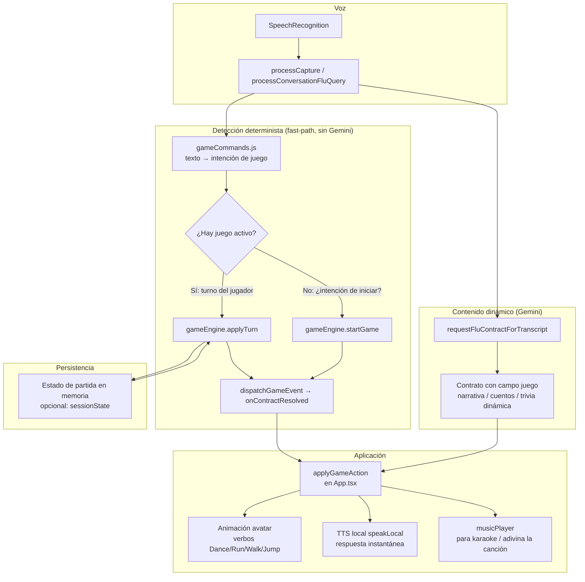

# 🎮 Plan: Juegos y Entretenimiento para FLU OS4

**Fecha:** 2026-08-26
**Estado:** PROPUESTA (opción C — plan detallado antes de tocar código)
**Alcance:** Capa de juegos/entretenimiento interactivo por voz para que un niño juegue con FLU, reutilizando el patrón de doble vía existente (fast-path determinista + Gemini para contenido dinámico).
**Precedente:** solicitud "Si un niño quiere jugar con Flu… piedra papel o tijera" → análisis confirmó que **no existe** ningún motor de juegos hoy (0 código de `piedra|papel|tijera|trivia|adivinanza|karaoke` en `src/`). Este plan lo construye.

---

## Principio rector

FLU ya tiene toda la infraestructura para que un niño juegue: reconocimiento de voz, **fast-path determinista** para acciones instantáneas, catálogo de configuración data-driven, animaciones del avatar (`Dance`/`Run`/`Walk`/`Jump`), TTS local y música con pistas libres de derechos.

**No necesitamos un motor de física, ni UI compleja, ni servicios nuevos.** Solo necesitamos:
1. Un **motor de juegos determinista con estado** (funciones puras, 100% testeables, sin I/O).
2. Un **catálogo de intenciones de juego por voz** que se conecte al pipeline en los mismos puntos donde ya se conecta la configuración.
3. Un **campo `juego` en el contrato** para que Gemini pueda *narrar* cuando el contenido es dinámico (cuentacuentos).

El diseño es **data-driven**: cada juego se declara en un catálogo; nada hardcodeado en los hooks.

---

## Arquitectura



**Regla de oro:** el juego **funciona offline** si es determinista (Simón dice, adivinanzas, veo veo…). Solo los que necesitan contenido nuevo (cuentacuentos, trivia dinámica) esperan a Gemini — y aun así el *turno* lo arbitra el motor local.

---

## Catálogo completo de juegos propuestos

### Leyenda
- **Motor:** `L` = determinista local (offline, sin API) · `G` = usa Gemini (dinámico)
- **Esfuerzo:** ★ = bajo · ★★ = medio · ★★★ = alto
- **Valor:** de 1 a 5 estrellas

### Grupo A — Deterministas, offline, sin API (recomendados primero)

| # | Juego | Motor | Esfuerzo | Valor | Cómo funciona | Reutiliza |
|---|-------|:-----:|:--------:|:-----:|---------------|-----------|
| 1 | **Simón dice / retos de movimiento** | L | ★ | ★★★★★ | FLU ordena "Simón dice: salta/corre/baila" y el niño **refleja el verbo** diciéndolo; FLU valida por reconocimiento | verbos de [`transcriptProcessor.ts`](src/lib/transcriptProcessor.ts:24), TTS, fast-path |
| 2 | **Adivinanzas** | L | ★ | ★★★★ | Banco local de 30-50 adivinanzas; FLU la lee, el niño responde, el motor valida por palabras clave | TTS |
| 3 | **Veo veo** | L | ★ | ★★★★ | FLU elige un objeto local y da la letra ("algo que empieza por la…"); el niño adivina, el motor valida | TTS |
| 4 | **Adivina el número** | L | ★ | ★★★★ | FLU piensa un número (1-20) y da "frío/caliente"; el niño adivina, el motor arbitra | TTS, `resolveNumberValue` de [`configCommands.js`](src/voice/lib/configCommands.js:327) |
| 5 | **Cálculo mental** | L | ★ | ★★★ | FLU plantea "¿cuánto es 3+4?" (genera operaciones deterministas con rango por edad) | TTS, `resolveNumberValue` |
| 6 | **Palabras encadenadas** | L | ★★ | ★★★ | FLU dice una palabra, el niño debe decir otra que empiece con la última letra (con banco de validación) | TTS |
| 7 | **¿Quién soy? / adivina el animal** | L | ★★ | ★★★★ | FLU da pistas progresivas de un animal/objeto; el niño adivina | TTS, banco local |
| 8 | **Ahorcado** | L | ★★ | ★★★ | Banco de palabras; FLU muestra avance y letras; el niño dice letras/palabra | TTS |
| 9 | **Memoria de secuencias (Simón expandido)** | L | ★★ | ★★★★ | FLU emite una secuencia creciente de verbos/colores ("salta, corre, baila") y el niño la repite; el motor verifica en orden | verbos, reconocimiento |
| 10 | **Trabalenguas / repite después de mí** | L | ★ | ★★★ | FLU lee un trabalenguas del banco y el niño intenta repetirlo (diversión, no scoring estricto) | TTS |
| 11 | **Trivia de datos curiosos** | L | ★★ | ★★★ | Banco de preguntas con opciones/verdadero-falso; FLU valida | TTS |
| 12 | **Ordena la secuencia** | L | ★ | ★★★ | "¿Qué va primero: lavarse los dientes o dormir?" — rutinas cotidianas | TTS, banco local |
| 13 | **Adivina la canción** | L | ★★ | ★★★★ | FLU reproduce los primeros segundos de una pista libre y el niño adivina el título | [`musicPlayer.ts`](src/services/musicPlayer.ts:170) + `FLU_PLAYLIST` |

### Grupo B — Usan Gemini (dinámicos, requieren API)

| # | Juego | Motor | Esfuerzo | Valor | Cómo funciona | Reutiliza |
|---|-------|:-----:|:--------:|:-----:|---------------|-----------|
| 14 | **Cuentacuentos** | G | ★★★ | ★★★★★ | Gemini genera un cuento corto con **escenas etiquetadas** (`animación: Dance|Run|Walk|Jump`, `emoción`); FLU narra con TTS y el avatar anima por escena | Gemini + TTS + animaciones |
| 15 | **Cuento colaborativo** | G | ★★ | ★★★★ | Turno a turno: FLU dice una frase y el niño la continúa; Gemini hilvana la historia | Gemini + TTS |
| 16 | **Trivia / preguntas dinámicas** | G | ★★ | ★★★ | Preguntas libres generadas según edad/tema; el motor local valida la respuesta | Gemini + `resolveSelectValue` |

### Grupo C — Educativos (deterministas, offline)

| # | Juego | Motor | Esfuerzo | Valor | Cómo funciona | Reutiliza |
|---|-------|:-----:|:--------:|:-----:|---------------|-----------|
| 17 | **Repite y traduce** | L | ★ | ★★★★ | FLU dice una palabra en inglés, el niño la repite y dice su significado en español; FLU valida | TTS, bilingüe (es/en ya existe) |
| 18 | **Cuenta conmigo** | L | ★ | ★★★ | FLU pide contar objetos/días; refuerzo de números | `resolveNumberValue` |
| 19 | **Abecedario / letras** | L | ★ | ★★★ | "¿Qué letra sigue? ¿Con qué letra empieza…?" | TTS, banco local |

### Grupo D — Especiales (identidad y calma)

| # | Juego | Motor | Esfuerzo | Valor | Cómo funciona | Reutiliza |
|---|-------|:-----:|:--------:|:-----:|---------------|-----------|
| 20 | **Lotería** | L | ★★ | ★★★★★ | FLU **lee cartas de lotería** (identidad mexicana, encaja perfecto); el niño reconoce y marca | TTS, banco local de cartas |
| 21 | **Reto de calma / respiración guiada** | L | ★ | ★★★★ | FLU guía inhalar/exhalar con ritmo y animación suave; ideal para regular al niño | TTS, animaciones |

### Grupo E — Excluidos de esta propuesta (requieren visión/cámara)

| Juego | Por qué se excluye |
|---|---|
| **Piedra, papel o tijera** | Sin cámara **no es viable** (ni por gestos —FLU no ve la mano— ni fiable por voz). **Con cámara SÍ lo sería** (reconocimiento de gestos tipo MediaPipe Hands + motor de las 9 combinaciones), pero es un **subsistema de visión nuevo** + cámara siempre activa + privacidad (niño frente a cámara) → fase futura opcional, fuera de este plan |

---

## Análisis de viabilidad real (sin visión)

**Criterio:** FLU solo puede validar por **voz** (SpeechRecognition) + motores puros. **No hay cámara en esta propuesta**: la app no tiene pipeline de visión para juegos (solo `getUserMedia` para el micrófono).

**Respuesta directa — ¿es viable piedra, papel o tijera con la cámara?** **SÍ, con cámara es viable**: se reconocerían los gestos de la mano con un subsistema de visión (p. ej. MediaPipe Hands) y el motor local compararía las 9 combinaciones. **Pero eso es un subsistema de visión nuevo** (cámara siempre activa + privacidad: un niño frente a cámara) y **no forma parte de esta propuesta sin visión**. Por eso **piedra, papel o tijera queda FUERA de la matriz de viables** — solo se plantearía como fase futura opcional con cámara.

La clasificación honesta por juego:

### Alta viabilidad (funcionan bien hoy, sin visión)

| Juego | Por qué funciona |
|---|---|
| **Adivinanzas** | La respuesta es un sustantivo de un banco conocido; validación por keywords normalizadas (insensible a acentos) |
| **Adivina el número** | Vocabulario restringido (1-20); ya existe `resolveNumberValue` en [`configCommands.js`](src/voice/lib/configCommands.js:327) |
| **Cálculo mental** | La respuesta es un número; misma resolución que arriba |
| **Ordena la secuencia** | Elección binaria ("¿qué va primero, A o B?"); validación trivial y muy fiable |
| **Simón dice (verbal)** | El niño repite el verbo; "salta/corre/baila" son palabras multisilábicas reconocibles |
| **¿Quién soy? / adivina el animal** | Pistas progresivas + sustantivo del banco; igual que adivinanzas |
| **Ahorcado (por letras)** | Vocabulario restringido (A-Z); el niño dice "la letra a" |
| **Lotería** | FLU lee la carta y el niño solo confirma ("¡lotería!"); no hay que reconocer palabras libres |
| **Cuentacuentos / cuento colaborativo** | FLU narra con TTS + animación; no hay que validar nada |
| **Adivina la canción (opción múltiple)** | "¿La Bamba o Las Mañanitas?" → elección binaria sobre pistas de `FLU_PLAYLIST` |
| **Karaoke sing-along** | FLU pone la pista + letra + boca animada; no valida el canto del niño |
| **Reto de calma / respiración** | Sin validación; FLU solo guía |
| **Cuenta conmigo / Abecedario** | Actividad educativa con validación mínima |
| **Trivia (binaria)** | Verdadero/falso o opción múltiple numerada |

### Media viabilidad (funcionan con diseño cuidadoso)

| Juego | Por qué / cómo |
|---|---|
| **Veo veo** | FLU no ve la habitación → el objeto sale de un **banco local** (variante "adivina el objeto secreto"). Viable si la validación usa keywords amplias + sinónimos |
| **Memoria de secuencias** | Validar el **orden** de 2-5 verbos es fuzzy: el reconocedor puede perder palabras. Diseñar con best-effort (validar el subconjunto que sí se capturó) |
| **Repite y traduce** | Solo viable si la traducción se elige de un banco pequeño (opción múltiple); libre es poco fiable |
| **Palabras encadenadas** | Validar "empieza por X" de una **palabra libre** es frágil; pensarlo como actividad sin scoring estricto |
| **Trabalenguas** | Diversión sin scoring: FLU no puede evaluar la dicción del niño |

### Viables solo con visión/cámara (fase futura opcional — fuera de esta propuesta)

| Juego | Por qué requiere cámara |
|---|---|
| **Piedra, papel o tijera (por gestos)** | Necesita cámara + reconocimiento de gestos (MediaPipe Hands o similar). No existe en la app; es un subsistema nuevo + cámara siempre activa + privacidad (niño frente a cámara). Implementable como fase futura, no ahora |
| **Cualquier validación de acción física** | FLU no puede ver si el niño realmente saltó/corrió/bailó; solo validación verbal o espejo |

**Conclusión honesta:** los juegos que "funcionan bien" hoy son los de **vocabulario restringido o sin validación**. **Piedra, papel o tijera NO es viable sin cámara** (ni por gestos —FLU no ve la mano— ni fiable por voz), y **CON cámara SÍ es viable** pero como inversión nueva de visión → queda **fuera de la matriz** y se trataría como fase futura opcional.

---

## Ranking: didáctico + divertido + en familia

Criterio: combina valor educativo, diversión real y que **varios jugadores puedan participar** (no solo un niño contra FLU). El modo familia es viable técnicamente porque la app ya tiene detección de hablantes (perfiles de voz / diarización) y [`detectIntroducedName()`](src/voice/lib/audioMath.js:1294): FLU puede dirigirse a cada miembro por su nombre y llevar **puntaje por jugador**. Requiere modo conversación activo y que cada jugador se presente una vez al empezar.

### Top 3 familiares (los mejores para jugar todos juntos)

| Juego | Por qué es didáctico | Por qué es divertido | Cómo se juega en familia |
|---|---|---|---|
| **Lotería** | vocabulario, lectura, cultura mexicana | emoción de "¡Lotería!" y cargar el tablero | FLU lee cartas, cada miembro marca su tablero; gana quien llene primero. **El más familiar de todos** |
| **Adivinanzas** | deducción, vocabulario, pensamiento crítico | el reto de "¿qué es?" y las pistas | rondas: cada miembro adivina en su turno; puntaje acumulado |
| **Adivina la canción (opción múltiple)** | cultura musical y memoria | reconocer la melodía y cantar juntos | FLU da pistas + opciones sobre `FLU_PLAYLIST`; la familia canta al adivinar |

### Siguiente nivel (muy buenos, con turnos)

| Juego | Nota familiar |
|---|---|
| **Simón dice (verbal)** | FLU da el verbo y todos hacen la acción (sin validación física); a los pequeños les encanta |
| **¿Quién soy? (animal)** | cada miembro adivina en su turno con pistas progresivas |
| **Adivina el número** | por turnos o equipos; entrena lógica de mayor/menor |
| **Cálculo mental** | competitivo por turnos con puntaje por jugador |
| **Ahorcado (por letras)** | turnos para proponer letras; refuerza el abecedario |
| **Cuentacuentos colaborativo** | cada miembro agrega una frase; FLU narra y anima por escena |

### Buenos, pero más individuales o de calma

| Juego | Nota |
|---|---|
| **Ordena la secuencia** | didáctico, ideal para los más pequeños |
| **Trivia binaria** | familiar si los temas son variados |
| **Karaoke** | divertido en grupo, poco didáctico |
| **Cuenta conmigo / Abecedario** | solo para los más pequeños |
| **Reto de calma / respiración** | no es un juego, es regulación; perfecto para cerrar la sesión |

---

## Matriz de juegos viables

Ordenada por **familia** (descendente) y luego por **diversión**. ⭐ = mínimo, ⭐⭐⭐⭐⭐ = máximo. **† = viabilidad media** (requiere diseño cuidadoso, ver sección de viabilidad). **Piedra, papel o tijera queda excluido**: no es viable sin cámara (ver "Viables solo con visión/cámara").

| Juego | 👨‍👩‍👧 Familia | 🧒 Individual | 🎂 Niños | 🎉 Diversión | Nota |
|---|---|---|---|---|---|
| **Lotería** | ★★★★★ | ★★★ | 5+ | ★★★★★ | El más familiar; FLU lee cartas y cada quien marca su tablero |
| **Simón dice (verbal)** | ★★★★★ | ★★★★ | 3+ | ★★★★★ | Todos hacen la acción; a los pequeños les encanta |
| **Adivina la canción** | ★★★★★ | ★★★ | 5+ | ★★★★★ | Opción múltiple sobre `FLU_PLAYLIST` + cantar juntos |
| **Cuentacuentos colaborativo** | ★★★★ | ★★★★ | 3+ | ★★★★★ | Cada quien agrega una frase; FLU narra y anima |
| **Adivinanzas** | ★★★★ | ★★★★ | 6+ | ★★★★ | Rondas con puntaje; deducción y vocabulario |
| **¿Quién soy? (animal)** | ★★★★ | ★★★★ | 6+ | ★★★★ | Pistas progresivas |
| **Cálculo mental** | ★★★★ | ★★★★ | 7+ | ★★★★ | Competitivo por turnos |
| **Ahorcado (letras)** | ★★★★ | ★★★★ | 6+ | ★★★★ | Turnos para proponer letras (A-Z) |
| **Trivia (binaria)** | ★★★★ | ★★★★ | 7+ | ★★★★ | Verdadero/falso u opción múltiple |
| **Karaoke** | ★★★★ | ★★★ | 5+ | ★★★★ | Sing-along con letra y boca animada |
| † **Veo veo** | ★★★★ | ★★★★ | 4+ | ★★★★ | Banco local (no ve la habitación); keywords amplias |
| † **Palabras encadenadas** | ★★★★ | ★★★ | 7+ | ★★★★ | Sin scoring estricto ("empieza por X" es frágil) |
| † **Trabalenguas** | ★★★ | ★★★ | 6+ | ★★★★ | Diversión sin scoring (no evalúa dicción) |
| **Adivina el número** | ★★★ | ★★★★ | 5+ | ★★★ | Lógica de mayor/menor; usa `resolveNumberValue` |
| † **Memoria de secuencias** | ★★★ | ★★★★ | 5+ | ★★★ | Validación best-effort del orden |
| **Reto de calma / respiración** | ★★★ | ★★★★ | 4+ | ★★ | Regulación, no juego; ideal para cerrar |
| **Cuenta conmigo / Abecedario** | ★★ | ★★★★ | 2+ | ★★★ | Solo niños pequeños |
| **Ordena la secuencia** | ★★ | ★★★ | 4+ | ★★ | Para los más pequeños |
| † **Repite y traduce** | ★★ | ★★★ | 6+ | ★★ | Solo fiable con opción múltiple |

---

## Cambios necesarios

### 1. [`src/core/games/types.ts`](src/core/games/types.ts) — NUEVO

Tipos puros compartidos por todos los juegos.

```typescript
export type GameId =
    | 'simon_dice' | 'adivinanzas' | 'veo_veo' | 'adivina_numero'
    | 'calculo_mental' | 'palabras_encadenadas'
    | 'quien_soy' | 'ahorcado' | 'memoria_secuencias' | 'trabalenguas'
    | 'trivia' | 'ordena_secuencia' | 'adivina_cancion' | 'cuentacuentos'
    | 'cuento_colaborativo' | 'repite_traduce' | 'cuenta_conmigo'
    | 'abecedario' | 'loteria' | 'respiracion';

export interface GameTurnResult {
    prompt: string;          // lo que FLU dice
    valid: boolean;          // si el turno del jugador fue correcto
    gameOver: boolean;
    score: number;
    nextPrompt?: string;     // si hay que seguir
    animation?: 'Dance' | 'Run' | 'Walk' | 'Jump_in_place' | 'Idle';
    emotion?: string;
    error?: string;          // mensaje amigable si el turno no se entendió
}

export interface GameSession {
    id: GameId;
    state: Record<string, unknown>; // estado específico del juego (serializable)
    score: number;
    round: number;
}
```

### 2. [`src/core/games/gameEngine.ts`](src/core/games/gameEngine.ts) — NUEVO

Máquina de estados genérica, **funciones puras sin I/O** (estilo de [`audioMath.js`](src/voice/lib/audioMath.js:1)).

```typescript
export interface GameEngine {
    id: GameId;
    start(options?: Record<string, unknown>): GameTurnResult;
    turn(session: GameSession, text: string): { session: GameSession; result: GameTurnResult };
    isGameCommand(text: string): boolean;   // detecta "sigo jugando", "salir del juego"
}
```

- `start()` → primer prompt (ej. "Simón dice: salta").
- `turn()` → valida la respuesta del jugador, avanza estado, devuelve siguiente prompt.
- **Idempotente y serializable**: el estado es un objeto plano para poder persistirlo en `sessionState`.

### 3. [`src/core/games/gameCatalog.ts`](src/core/games/gameCatalog.ts) — NUEVO

Catálogo data-driven de intenciones de juego (estilo de [`voiceConfigCatalog.ts`](src/core/config/voiceConfigCatalog.ts:80) y de los `NOUN_PAIRS` de [`configCommands.js`](src/voice/lib/configCommands.js:94)).

```typescript
export interface GameIntentEntry {
    id: GameId;
    aliases: string[];              // 'juguemos a simón dice', 'simón dice', 'a jugar simón'
    engine: () => GameEngine;
    requiresApi?: boolean;          // true = cuentacuentos/trivia dinámica
}

export function matchGameIntent(text: string): GameIntentEntry | null;
```

Frase ejemplo que debe resolver: *"ok flu, vamos a jugar a las adivinanzas"* → `{ id: 'adivinanzas', accion: 'start' }`.

### 4. [`src/core/games/<juego>.ts`](src/core/games/) — NUEVO (uno por juego)

Cada juego implementa `GameEngine`. Ejemplos de la lógica pura:

- **Adivinanzas** ([`riddles.ts`](src/core/games/riddles.ts)): banco `{ pregunta, respuesta[], pista }` + validación por keywords normalizadas (`stripDiacritics` de [`audioMath.js`](src/voice/lib/audioMath.js:16)).
- **Simón dice** ([`simonDice.ts`](src/core/games/simonDice.ts)): secuencia aleatoria de verbos del avatar; el niño la repite.
- **Veo veo** ([`veoVeo.ts`](src/core/games/veoVeo.ts)): banco `{ nombre, letra, categoria }`; pista = primera letra.
- **Lotería** ([`loteria.ts`](src/core/games/loteria.ts)): banco de cartas tradicionales (El gallo, La dama, El catrín…).
- **Cuentacuentos** ([`storyteller.ts`](src/core/games/storyteller.ts)): define el **contrato de cuento** que Gemini debe devolver (ver punto 6) y el desglose por escenas.

### 5. [`src/voice/lib/gameCommands.js`](src/voice/lib/gameCommands.js) — NUEVO (fast-path)

Resolución determinista texto → evento de juego, en el mismo estilo de [`resolveConfigCommandFromText`](src/voice/lib/configCommands.js:650).

```javascript
export function resolveGameCommandFromText(text) {
    // 1. ¿Hay partida activa? → turno del jugador (validar respuesta)
    // 2. ¿Intención de iniciar? → matchGameIntent(text) → start
    // 3. ¿Salir? → endGame
    // 4. Nada → null (no es un juego)
}
```

### 6. Contrato — campo `juego` — MODIFICAR

- En [`normalizeConfiguracion`](src/voice/lib/configCommands.js:684) añadir un `normalizeJuego(raw)` hermano que sanitice el campo `juego` del contrato (objeto/JSON string/`null` → contrato estricto).
- Estructura del campo:

```typescript
interface GameContract {
    gameId: GameId;
    action: 'start' | 'turn' | 'end' | 'narrate';
    playerText?: string;   // respuesta del jugador (turn)
    narrative?: {          // solo para cuentacuentos / cuento colaborativo
        scenes: Array<{ texto: string; animacion?: string; emocion?: string }>;
    };
}
```

- El modelo **no debe** arbitrAR el resultado de juegos deterministas: el motor local es la fuente de verdad. Gemini solo narra (contenido dinámico) o confirma verbalmente.

### 7. [`src/App.tsx`](src/App.tsx) — MODIFICAR

- Nueva función [`applyGameAction(contract, context)`](src/App.tsx:251) (junto a `applyConfigAction`):
  - `start`/`turn` → `gameEngine.turn()` → obtiene `GameTurnResult` → `speakLocal(prompt)` + animación del avatar (vía `setAvatarState`/`onEmotion`).
  - `musica` (karaoke / adivina la canción) → delegar a [`playSong`](src/services/musicPlayer.ts:238).
  - `narrate` (cuentacuentos) → recorrer `scenes` con TTS + animación por escena.
- En [`onContractResolved`](src/App.tsx:895), despachar `juego` antes que `configuracion` (mismo slot, sin rutas dobles).

### 8. [`src/voice/hooks/useFluVoiceAssistant.js`](src/voice/hooks/useFluVoiceAssistant.js) — MODIFICAR

- En [`processCapture`](src/voice/hooks/useFluVoiceAssistant.js:3290) y [`processConversationFluQuery`](src/voice/hooks/useFluVoiceAssistant.js:2814), añadir al fast-path existente una rama `resolveGameCommandFromText(capturedTranscript)` despachada **fire-and-forget antes de `requestFluContractForTranscript`** (mismo patrón idempotente: si el fast-path resolvió el turno, el `juego` tardío de Gemini lleva `null`).
- Guardar `gameSessionRef` (partida activa) y pasarla a `resolveGameCommandFromText` para arbitrar turnos.

### 9. [`src/voice/lib/fluConfig.js`](src/voice/lib/fluConfig.js) — MODIFICAR

Nuevo bloque `FLU_CONFIG.games` (data-driven, nada hardcodeado):

```javascript
games: {
    enabled: true,
    defaultRounds: 3,
    simonDice: { verbos: ['Dance', 'Run', 'Walk', 'Jump_in_place'], longMax: 5 },
    adivinaNumero: { min: 1, max: 20, pistasMax: 5 },
    calculoMental: { maxSuma: 10, operaciones: ['+', '-'] },
    loteria: { cartasPorRonda: 3 },
    cuentacuentos: { escenasMax: 4 },
}
```

### 10. [`tests/games.test.ts`](tests/games.test.ts) — NUEVO (y tests por juego)

- `tests/gameEngine.test.ts` — contrato genérico (start/turn/end, idempotencia, serialización).
- `tests/riddles.test.ts` — validación por keywords, acentos/insensibilidad.
- `tests/simonDice.test.ts` — secuencias crecientes, validación de orden.
- `tests/gameCommands.test.ts` — detección de intención es/en, sin falsos positivos en conversación casual (como la "guardia triple" de [`configCommands.test.ts`](tests/configCommands.test.ts:65)).
- `tests/storyteller.test.ts` — desglose de escenas y sanitización del contrato.

---

## Fases de implementación

### Fase 1 — Fundación + 2 victorias rápidas (offline)
1. `types.ts` + `gameEngine.ts` + `gameCatalog.ts` + campo `juego` del contrato + fast-path en el hook + `applyGameAction` en `App.tsx`.
2. **Simón dice** (reto de movimiento) — victoria visible casi inmediata.
3. **Adivinanzas** — banco local + validación por keywords.
4. Tests de fundación + los 2 juegos + `npx vitest run` completo en verde.

### Fase 2 — Juegos deterministas masivos (offline)
4. **Veo veo**, **Adivina el número**, **Cálculo mental**, **Palabras encadenadas**, **¿Quién soy?**.
5. Cada juego: motor + frases del catálogo + tests.

### Fase 3 — Música y cultura (offline)
6. **Adivina la canción** (previews de `FLU_PLAYLIST`), **Karaoke sing-along** (pistas libres + animación de boca `Bunny@Palabra.fbx`/`Bunny@MouthMove.fbx`), **Lotería**, **Trabalenguas**, **Repite y traduce**.

### Fase 4 — Contenido dinámico (Gemini)
7. **Cuentacuentos** (contrato de escenas + animación por escena).
8. **Cuento colaborativo** y **Trivia dinámica**.

> Cada fase termina con `npx vitest run` completo en verde (hoy: 59 archivos / 1316 tests).

---

## Validación

- **Unit (vitest):** motores puros sin mocks de API.
- **E2E (Playwright, patrón de [`tests/e2e`](tests/e2e)):** abrir la app, simular transcript de "ok flu, juguemos a adivinanzas", verificar respuesta hablada y animación.
- **Manual en vivo:** Terminal 1 (`npm run dev`, puerto 5173) probando el flujo real con micrófono + modo conversación.

---

## Riesgos y limitaciones (honesto)

1. **Multi-turno requiere modo conversación activo.** El niño iniciará con "ok flu…" y luego **responderá sin wake word** ("es la manzana"). Eso solo funciona con la escucha continua del modo conversación; si no está activo, cada respuesta se trata como comando suelto. **Condición de uso, no bug.**
2. **FLU no ve al niño.** En Simón dice la validación es verbal (el niño dice el verbo o responde "sí lo hice"). Juego de memoria/espejo, no de visión.
3. **Karaoke real (sincronía fina de letra)** es complejo; el MVP es "cantar junto": pista + letra + boca animada. Sincronía fina sería una fase posterior.
4. **Los juegos deterministas NUNCA deben depender de Gemini para arbitrar** — eso rompería la determinismo. Gemini solo narra o confirma.
5. **No inventar**: todo lo anterior es implementación nueva; nada de esto existe hoy en el código.

---

## Decisión pendiente

Este plan detalla **21 juegos viables** (sin cámara) en 4 fases. **Piedra, papel o tijera queda fuera**: solo sería viable con cámara (subsistema de visión nuevo), así que se deja como fase futura opcional. La recomendación sigue siendo **Fase 1** (fundación + Simón dice + adivinanzas) como primer incremento validable. La elección de qué juegos de las fases 2-4 implementar se puede priorizar después de ver la Fase 1 en vivo.
