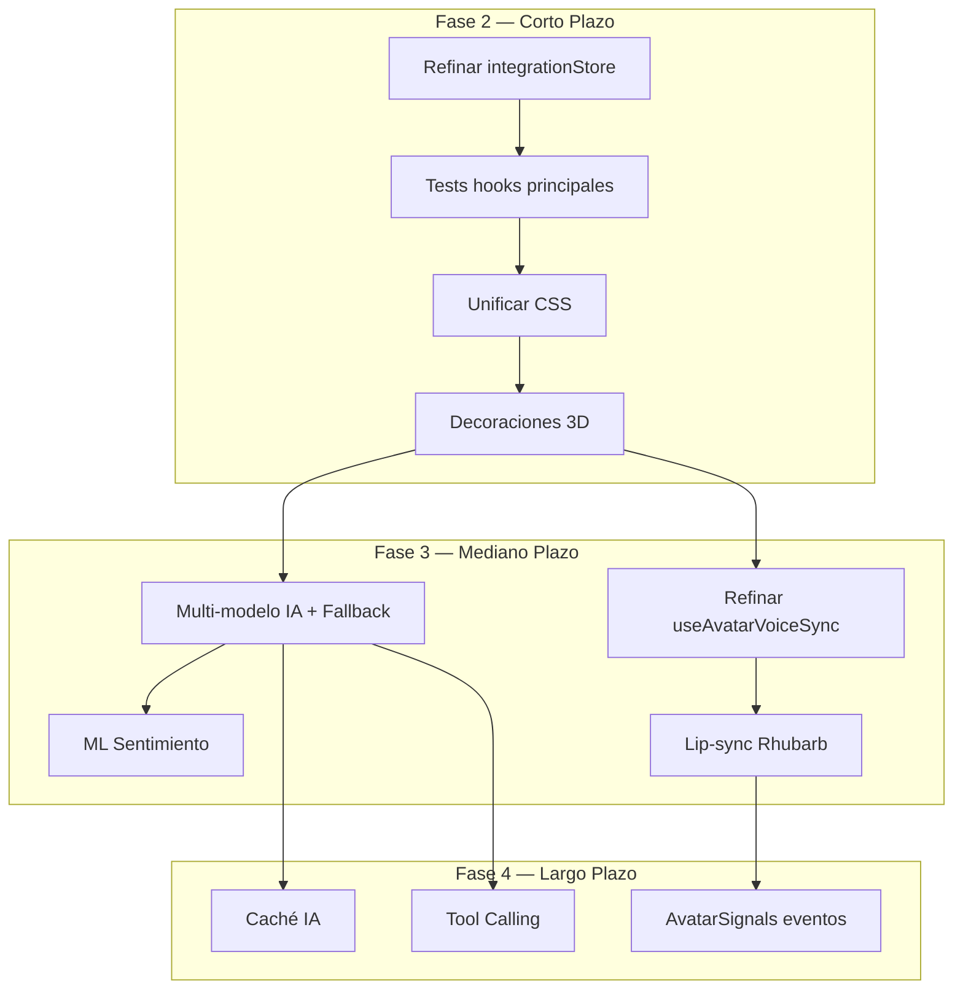

# Plan Maestro de Mejoras — FLU OS4

> **Fecha**: 2026-07-26
> **Versión**: FLU OS4 v0.1.0
> **Propósito**: Plan de acción consolidado y priorizado para mejorar la aplicación FLU OS4

---

## Estado Actual del Proyecto

### ✅ Completado (Fase 1 de Refactorización)
| Tarea | Archivo | Estado |
|-------|---------|--------|
| Extraer `useConfigPersistence` | [`src/hooks/useConfigPersistence.ts`](../src/hooks/useConfigPersistence.ts) | ✅ |
| Extraer `useWorkspaceImage` | [`src/hooks/useWorkspaceImage.ts`](../src/hooks/useWorkspaceImage.ts) | ✅ |
| Extraer `useNavigationCommands` | [`src/hooks/useNavigationCommands.ts`](../src/hooks/useNavigationCommands.ts) | ✅ |
| Extraer `useMinuteHandlers` | [`src/hooks/useMinuteHandlers.ts`](../src/hooks/useMinuteHandlers.ts) | ✅ |
| Extraer `transcriptProcessor` | [`src/lib/transcriptProcessor.ts`](../src/lib/transcriptProcessor.ts) | ✅ |
| Crear `FluBridgeContext` | [`src/context/FluBridgeContext.tsx`](../src/context/FluBridgeContext.tsx) | ✅ |
| Branding global (4 estaciones, 15 festividades) | [`src/core/branding/seasonalCalendar.ts`](../src/core/branding/seasonalCalendar.ts) | ✅ |
| 20+ paletas de colores | [`src/core/branding/seasonalPalettes.ts`](../src/core/branding/seasonalPalettes.ts) | ✅ |
| Control por voz completo | [`src/App.tsx`](../src/App.tsx) + [`src/voice/lib/gemini.js`](../src/voice/lib/gemini.js) | ✅ |
| Personalización de avatar por voz | [`src/avatar/store/bunnyStore.ts`](../src/avatar/store/bunnyStore.ts) + [`src/avatar/components/BunnyViewer.tsx`](../src/avatar/components/BunnyViewer.tsx) | ✅ |
| 800+ tests unitarios pasando | `tests/` | ✅ |
| Tests E2E completos | [`tests/e2e/complete-validation.spec.ts`](../tests/e2e/complete-validation.spec.ts) | ✅ |

---

## Plan de Acción Priorizado

### Fase 2 — Corto Plazo (Prioridad Alta)

#### 2.1 Refinar `integrationStore` — Separar UI State de Domain State
**Archivo**: [`src/store/integrationStore.ts`](../src/store/integrationStore.ts) (723 líneas)

**Problema**: El store mezcla estado de UI (`isMicActive`, `isFluSpeaking`, `pendingEmotionAnims`) con estado de dominio (`conversationHistory`, `config`, `sessionStats`). Esto causa:
- Persistencia innecesaria de estado UI en localStorage
- Re-renders excesivos cuando cambia estado UI
- Dificultad para testear lógica de dominio

**Acciones**:
1. Crear interfaz `UIState` separada de `DomainState`
2. Mover `isMicActive`, `isFluSpeaking`, `pendingEmotionAnims` a un store UI separado (no persistido)
3. Mantener `conversationHistory`, `config`, `sessionStats`, `workspaceArtifact` en el store persistido
4. Actualizar referencias en `App.tsx`, `FluAvatarVoiceBridge.tsx`, `useAvatarVoiceSync.ts`

**Criterio de éxito**: `integrationStore` persiste solo estado de dominio. UI state vive en memoria.

---

#### 2.2 Agregar Tests para Hooks Principales
**Archivos**: `src/hooks/useAvatarVoiceSync.ts`, `src/hooks/useWorkspaceImage.ts`, `src/hooks/useMinuteHandlers.ts`, `src/hooks/useConfigPersistence.ts`

**Problema**: 0 tests unitarios para los hooks principales. Los cambios no tienen red de seguridad.

**Acciones**:
1. Crear `tests/hooks/useAvatarVoiceSync.test.ts`:
   - Testear transiciones de estado: IDLE→LISTENING→THINKING→SPEAKING→IDLE
   - Testear aplicación de emociones: `applyEmotion('feliz')` → `bunnyStore.setExpression` llamado con expresión correcta
   - Testear micro-expresiones idle: timer se dispara, expresión cambia
   - Testear triggers de participante: `triggerParticipantEmotion('granted')` → expresión correcta
   - Mockear `bunnyStore` y `integrationStore`

2. Crear `tests/hooks/useWorkspaceImage.test.ts`:
   - Testear `generateFromContract` → llama a `geminiService.generateImage`
   - Testear `retry` → re-usa último prompt/tipo
   - Testear timeout de 30s → marca como failed
   - Testear cleanup en unmount

3. Crear `tests/hooks/useMinuteHandlers.test.ts`:
   - Testear `handleGenerateMinute` → llama a `geminiService.generateMinute`
   - Testear `handleSaveMinute` → guarda en `minuteKnowledge`
   - Testear `handleSelectMinuteHistory` → carga minuta del historial

4. Crear `tests/hooks/useConfigPersistence.test.ts`:
   - Testear carga inicial desde localStorage
   - Testear `handleTextApiKeyCommit` → persiste en localStorage
   - Testear `setLanguage` → actualiza estado y ref

**Criterio de éxito**: 20+ tests nuevos, todos pasando, cubriendo los 4 hooks principales.

---

#### 2.3 Unificar Sistema de Clases CSS
**Archivos**: `src/App.css`, `src/index.css`, `src/avatar/App.css`, componentes JSX/TSX

**Problema**: Múltiples sistemas de clases CSS conviviendo:
- `voice-bar__button`, `voice-bar__button--ghost` (OS2 legacy)
- `flu-btn`, `flu-btn--primary` (OS3 nuevo)
- `flu-settings-*` (settings panel)
- `.flu-participant-settings__*` (participant settings, sin definir en CSS)

**Acciones**:
1. Mapear todas las clases CSS existentes y su uso
2. Definir sistema de clases unificado en `src/index.css`:
   - `.flu-btn` — botón base
   - `.flu-btn--primary` — botón primario
   - `.flu-btn--ghost` — botón ghost
   - `.flu-btn--danger` — botón de peligro
3. Migrar componentes OS2 a usar las nuevas clases:
   - [`src/voice/components/FluParticipantSettingsPanel.jsx`](../src/voice/components/FluParticipantSettingsPanel.jsx)
   - [`src/voice/components/FluShell.jsx`](../src/voice/components/FluShell.jsx)
   - [`src/voice/components/VoiceAssistantBar.jsx`](../src/voice/components/VoiceAssistantBar.jsx)
4. Eliminar clases CSS huérfanas después de migración

**Criterio de éxito**: Un solo sistema de clases CSS en uso. Sin clases CSS sin definir.

---

#### 2.4 Implementar Decoraciones 3D para Branding Estacional
**Archivos**: `src/avatar/components/BunnyViewer.tsx`, `src/core/branding/SeasonalDecoration.tsx`

**Problema**: Las paletas de temporada existen (20+ paletas) pero las decoraciones del avatar (`decoration: 'santa-hat'`, `'party-hat'`, etc.) NO están implementadas en el modelo 3D. El branding inteligente cambia colores CSS pero no aplica decoraciones visuales al avatar.

**Acciones**:
1. Crear modelos 3D simples para decoraciones (usando geometrías Three.js primitivas):
   - `santa-hat` — cono + esfera (rojo/blanco)
   - `party-hat` — cono con rayas
   - `heart` — geometría de corazón
   - `flower` — pétalos alrededor de centro
   - `clover` — trébol de 4 hojas
   - `leaf` — hoja otoñal
   - `sun` — círculo con rayos
   - `pumpkin` — esfera achatada naranja
   - `snowflake` — copo de nieve
2. Integrar en [`SeasonalDecoration.tsx`](../src/core/branding/SeasonalDecoration.tsx) para que renderice sobre el avatar
3. Conectar con el sistema de branding estacional en [`useSeasonalBranding.ts`](../src/core/branding/useSeasonalBranding.ts)

**Criterio de éxito**: Al cambiar de temporada, el avatar muestra decoraciones 3D correspondientes.

---

### Fase 3 — Mediano Plazo (Prioridad Media)

#### 3.1 Mejorar Servicio de IA con Multi-Modelo y Fallback
**Archivo**: [`src/services/gemini.ts`](../src/services/gemini.ts) (687 líneas)

**Problema**: El servicio de IA solo soporta Gemini. Sin fallback, sin streaming, sin caché.

**Acciones**:
1. Implementar `IAIService` con múltiples proveedores:
   ```typescript
   interface IAIService {
     generateContract(params): Promise<FluContract>;
     generateMinute(params): Promise<AIMinuteResult>;
     generateSummary(params): Promise<AISummaryResult>;
     evaluateParticipant(params): Promise<AIParticipantEvaluation>;
     generateImage(params): Promise<AIWorkspaceImageResult>;
   }
   ```
2. Crear `GeminiProvider` (existente, refinar)
3. Crear `FallbackProvider` que intenta Gemini → OpenAI → local
4. Agregar streaming de respuestas token por token
5. Agregar caché KV para respuestas frecuentes

**Criterio de éxito**: Si Gemini falla, el sistema automáticamente usa OpenAI o fallback local. Streaming funcional.

---

#### 3.2 Migrar Detección de Sentimiento a Modelo ML
**Archivo**: [`src/lib/emotionalState.ts`](../src/lib/emotionalState.ts) (270 líneas)

**Problema**: `detectSentiment()` es keyword-based (SENTIMENT_KEYWORDS), no captura contexto ni matices.

**Acciones**:
1. Integrar modelo pequeño de clasificación (ej: `@huggingface/transformers` ya en devDependencies)
2. Mantener keyword-based como fallback rápido
3. Agregar pipeline: keyword rápido → ML preciso (si hay tiempo)
4. Actualizar `sentimentToEmotion()` para soportar matices (intensidad,混合 emociones)

**Criterio de éxito**: Detección de sentimiento con >80% de precisión en tests con frases complejas.

---

#### 3.3 Refinar `useAvatarVoiceSync` — Separar Responsabilidades
**Archivo**: [`src/hooks/useAvatarVoiceSync.ts`](../src/hooks/useAvatarVoiceSync.ts) (514 líneas)

**Problema**: El hook tiene 5+ responsabilidades: sincronización de estado, emociones, micro-expresiones, reactividad contextual, triggers de participante.

**Acciones**:
1. Extraer lógica de micro-expresiones a `useIdleMicroExpressions.ts`
2. Extraer lógica de triggers de participante a `useParticipantEmotions.ts`
3. Mantener en `useAvatarVoiceSync` solo: sync de estado + aplicación de emociones
4. Los hooks extraídos se comunican vía `bunnyStore` (ya existente)

**Criterio de éxito**: `useAvatarVoiceSync` se reduce a <200 líneas. Los hooks extraídos tienen tests.

---

#### 3.4 Mejorar Lip-Sync con Rhubarb WASM
**Archivo**: `src/avatar/components/BunnyViewer.tsx`

**Problema**: El lip-sync actual usa animaciones predefinidas (`MouthMove`, `Palabra`) sin sincronización fonética real.

**Acciones**:
1. Integrar Rhubarb Lip Sync WASM para sincronización fonética
2. Mapear fonemas a morph targets del modelo 3D
3. Sincronizar con TTS para movimiento de boca en tiempo real

**Criterio de éxito**: El avatar mueve la boca en sincronía con el audio de TTS.

---

### Fase 4 — Largo Plazo (Prioridad Baja)

#### 4.1 Implementar Caché de Respuestas de IA
**Archivo**: `src/services/gemini.ts`

**Acciones**:
1. Implementar KV cache (IndexedDB vía Dexie)
2. Cachear respuestas frecuentes por hash de prompt
3. TTL configurable por tipo de consulta

---

#### 4.2 Agregar Tool Calling Estructurado
**Archivo**: `src/services/gemini.ts`

**Acciones**:
1. Definir tools/functions para Gemini API
2. Parsear respuestas estructuradas
3. Validar contra schemas

---

#### 4.3 Reintroducir AvatarSignals como Sistema de Eventos
**Archivo**: `src/avatar/types/bunny.ts`, `src/avatar/store/bunnyStore.ts`

**Acciones**:
1. Implementar sistema de eventos pub/sub para señales del avatar
2. Separar de `pendingEmotionAnims` (mecanismo frágil actual)

---

## Diagrama de Dependencias



---

## Riesgos y Mitigaciones

| Riesgo | Probabilidad | Impacto | Mitigación |
|--------|-------------|---------|------------|
| Romper compatibilidad con OS2 | Media | Alto | Mantener `as any` casts, tests E2E |
| Perder estado de sesión | Baja | Alto | Mantener claves de localStorage existentes |
| Reactivity engine bloquea animaciones | Media | Alto | Tests de regresión en animaciones |
| Modelo de IA nuevo no sigue formato de contrato | Alta | Medio | Validación estricta del contrato + fallback |
| Decoraciones 3D no cargan | Media | Bajo | Fallback a paleta de colores sin decoración |
| Tests de hooks fallan por mocks incorrectos | Alta | Medio | Usar mocks minimalistas, integrar gradualmente |

---

## Resumen de Archivos Afectados por Fase

### Fase 2
| Archivo | Acción |
|---------|--------|
| [`src/store/integrationStore.ts`](../src/store/integrationStore.ts) | Separar UI/Domain state |
| `tests/hooks/useAvatarVoiceSync.test.ts` | Nuevo — tests |
| `tests/hooks/useWorkspaceImage.test.ts` | Nuevo — tests |
| `tests/hooks/useMinuteHandlers.test.ts` | Nuevo — tests |
| `tests/hooks/useConfigPersistence.test.ts` | Nuevo — tests |
| `src/index.css` | Definir sistema de clases unificado |
| `src/App.css` | Limpiar clases legacy |
| `src/voice/components/FluParticipantSettingsPanel.jsx` | Migrar clases CSS |
| `src/voice/components/FluShell.jsx` | Migrar clases CSS |
| `src/avatar/components/BunnyViewer.tsx` | Agregar decoraciones 3D |
| [`src/core/branding/SeasonalDecoration.tsx`](../src/core/branding/SeasonalDecoration.tsx) | Conectar con modelo 3D |

### Fase 3
| Archivo | Acción |
|---------|--------|
| `src/services/gemini.ts` | Multi-modelo, fallback, streaming |
| `src/core/ai/IAIService.ts` | Refinar interfaz |
| `src/lib/emotionalState.ts` | Migrar a ML |
| `src/hooks/useAvatarVoiceSync.ts` | Separar responsabilidades |
| `src/hooks/useIdleMicroExpressions.ts` | Nuevo — extraído |
| `src/hooks/useParticipantEmotions.ts` | Nuevo — extraído |
| `src/avatar/components/BunnyViewer.tsx` | Rhubarb lip-sync |

### Fase 4
| Archivo | Acción |
|---------|--------|
| `src/services/gemini.ts` | Caché, tool calling |
| `src/avatar/types/bunny.ts` | AvatarSignals eventos |
| `src/avatar/store/bunnyStore.ts` | Sistema pub/sub |

---

## Conclusión

FLU OS4 es una aplicación **sólida y funcional** con:
- ✅ 23 expresiones y 12 animaciones FBX
- ✅ 20+ paletas de branding estacional
- ✅ Integración avatar-voz full-duplex
- ✅ Sistema de participación de usuarios
- ✅ Persistencia de sesión y minutas
- ✅ 800+ tests unitarios y E2E

**Próximos pasos inmediatos** (Fase 2):
1. Separar UI state de domain state en `integrationStore`
2. Agregar tests para los 4 hooks principales
3. Unificar el sistema de clases CSS
4. Implementar decoraciones 3D para branding estacional

**Prioridad**: Fase 2 > Fase 3 > Fase 4
