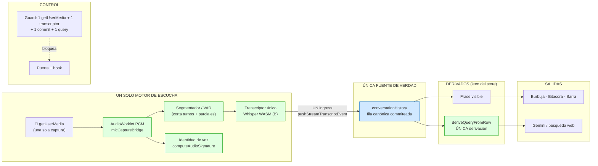
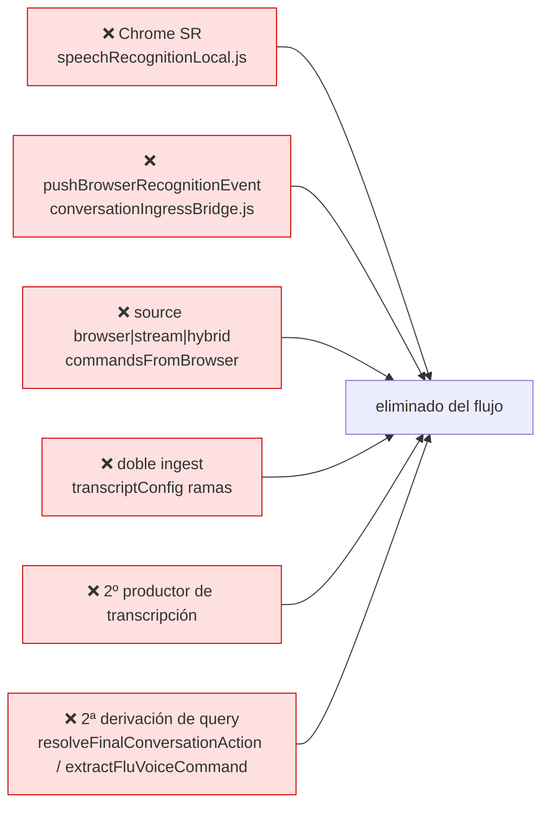

# Plan — Motor único de escucha (flujo operativo)

- **Estado:** PROPUESTO — decisión **B (Whisper WASM)** congelada; no ejecutado.
- **Fecha:** 2026-09-10.
- **Alcance:** flujo operativo (excluye onboarding, que termina y se cierra).
- **Documento hermano de contrato:** `.task/contract.json` (se escribe al iniciar la ejecución).

---

## 1. Objetivo único

En el flujo operativo debe existir **una sola captura de micrófono (PCM)** y **un solo
transcriptor**. Se **elimina** Chrome SpeechRecognition y toda selección dual
(`source`, `commandsFromBrowser`, `conversationFromStream`). El resto del flujo deriva de
**una sola fila canónica** (`conversationHistory`): la frase visible y la query hacia
Gemini / búsqueda web salen de esa fila.

**Regla:** no se apaga con flags — se **borra** el camino viejo. Un solo camino.

---

## 2. Resultado esperado (cómo debe quedar)

---

## 3. Lo que se elimina (no queda nada de esto)

---

## 4. Invariantes y conteo HOY → META

| Invariante | Comando que cuenta | HOY | META |
|---|---|---|---|
| Capturas de micrófono en operación | `rg "getUserMedia\|new SpeechRecognition\|webkitSpeechRecognition" src` | 2 | **1** |
| Productores de transcripción al ingress | `rg "pushBrowserRecognitionEvent\|pushStreamTranscriptEvent" src` | 2 | **1** |
| Chrome SR en el flujo operativo | `rg "speechRecognitionLocal" src` | motor + onboarding | **0** en operativo |
| Derivaciones de query | `rg "resolveFinalConversationAction\|extractFluVoiceCommand" src` | 2 | **1** |
| Query leída de la fila canónica | `rg "deriveQueryFromRow" src` | 0 | **1** |

---

## 5. Contrato §10

- **Guard (nace ROJO):** `tests/voiceSingleEngineGuard.test.ts`
  - falla si `pushBrowserRecognitionEvent` existe en `src`.
  - falla si `useFluVoiceAssistant` importa `speechRecognitionLocal`.
  - falla si hay >1 captura de micrófono.
  - falla si hay >1 productor de transcripción.
  - falla si hay >1 derivación de query.
  - falla si la query no sale de `deriveQueryFromRow`.
- **DoD:** `npm run gate` verde **Y** `npx tsc -b` sin errores **Y** suite con **0 fallos nuevos**.
- **Baseline de fallos preexistentes:** `deterministicArbiter.test.ts` (3) y `hoyPanel.test.tsx` (3). Meta: **0 nuevos**. No se arreglan aquí.
- **Alcance cerrado (`allow`):**
  - `src/voice/hooks/useFluVoiceAssistant.js`
  - `src/voice/lib/speechRecognitionLocal.js` (retirar)
  - `src/voice/lib/conversationIngressBridge.js`
  - `src/voice/lib/transcriptConfig.js`
  - `src/voice/lib/micEventProducer.js`
  - `src/voice/lib/transcriptEventConsumer.js`
  - `src/voice/lib/audioMath.js` y `src/voice/lib/conversationDialogue.js` (solo `deriveQueryFromRow`)
  - `src/voice/lib/fluConfig.js` (bloque `transcript`)
  - `src/voice/hooks/useNavigationCommands.ts` (query de búsqueda desde la fila)
  - `tests/**`
- **Cierre obligatorio:** salida cruda de `node scripts/task-gate.mjs` + `git diff --stat` + conteo ANTES/DESPUÉS por invariante.

---

## 6. Plan por pasos (orden estricto)

1. Escribir el **guard rojo** `tests/voiceSingleEngineGuard.test.ts` (fija el resultado antes de tocar).
2. Implementar el **Segmentador / VAD** sobre el PCM (turnos + parciales), reemplazo de los eventos de Chrome SR.
3. **Inyectar el transcriptor único** Whisper WASM (una sola instancia, vía DI) alimentado por el segmentador.
4. **Eliminar Chrome SR** del motor: `onresult`, `acquireSpeechRecognition`, `pushBrowserRecognitionEvent`, `rebuildRecognition`, `restart` de SR.
5. **Eliminar la selección dual** en `transcriptConfig.js`: `source`, `commandsFromBrowser`, `conversationFromStream`, `shouldIngestBrowserConversation`, `shouldIngestStreamTranscript`.
6. **Un ingress:** solo `pushStreamTranscriptEvent` hacia el consumidor.
7. **`deriveQueryFromRow(fila)`** y commit de la fila **antes** de la query, para Gemini y búsqueda web.
8. Verificar **ANTES/DESPUÉS** en cada paso; si el conteo no baja, revertir ese paso (no avanza).

Cada paso es un hito con su propio conteo. No se agrupan.

---

## 7. Constraints (anti-desvío)

- **Prohibido tocar:** vistas (`App.tsx` render, componentes), onboarding, `gemini.js`, `voiceIdentity` (identidad de voz sigue con el mismo PCM), y todo lo no listado en `allow`.
- **Prohibido apagar con flags/toggles:** se elimina el código viejo; no se desactiva. Sin `source: browser|stream|hybrid`.
- **Prohibido** heurísticas nuevas, parches o afinación — la afinación va **al final**, después de aplicar el cambio.
- **Prohibido** dejar dos productores, dos capturas o dos derivaciones de query "por si acaso".
- **Prohibido** declarar "listo": cierre con salida cruda del gate + `git diff`.
- Si el DoD no se puede cumplir: **STOP** y reportar parcial con `archivo:línea`. No se sustituye por algo más fácil.
- **No commits a `main`/`master`**: rama `feature/*`.

---

## 8. Decisión congelada — Transcriptor único: **B) Whisper WASM**

**Definición del proyecto:** no cambia. B ya está en el stack obligatorio
(AGENTS.md §4: `WebLLM + Orama + Whisper WASM + Piper TTS + Rhubarb WASM`). Es la
opción que respeta el objetivo **offline**.

**Componentes obligatorios que agrega B** (sobre el PCM existente):

- **Segmentador / VAD**: corta turnos. Reemplaza los eventos `interim/final/onend`
  que hoy regalaba Chrome SR (y que se eliminan).
- **Parciales en vivo (interim)**: los emite el segmentador/transcriptor para la
  "frase en vivo"; Whisper no los da solo.
- **Modelo Whisper WASM cacheado** (PWA/service worker) para funcionar offline tras
  la primera descarga; modelo chico (`tiny`/`base`) por presupuesto de CPU/latencia.

**No se pierde:** diarización/identidad de voz (se calcula sobre el PCM, no sobre
el texto) ni la detección de wake word (se hace sobre el texto).

**Precondición de arranque:** elige el modelo (`tiny`/`base`) y confirma que Whisper
WASM transcribe en tu máquina a latencia aceptable. Si no, se evalúa subir el modelo
antes de continuar.

Al confirmar, se escribe `.task/contract.json` con este contrato y el guard rojo.

---

## 9. Estado

- **Cambios aplicados:** ninguno (documento de plan).
- **Validado contra:** —
- **No validado:** todo; el plan no se ejecutó.
