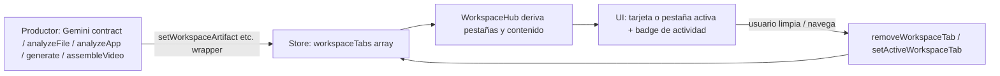

# Diseño: Pizarrón con Objeto Consolidado (Fase 2)

> **Solicitud:** "dame un diseno visual, funcional, implicaciones y la definicion resumida"
> **Alcance:** EXCLUSIVAMENTE el pizarrón con **objetos consolidados** (la Fase 2 de [`plan-unificacion-pizarron.md`](plan-unificacion-pizarron.md:211)). No es el diseño de pestañas (Fase 1, ya implementada en [`WorkspaceHub.tsx`](../src/components/WorkspaceHub.tsx)) ni la corrección de la agenda.
> **Estado:** DISEÑO / PROPUESTA — no se ha aplicado ningún cambio de código.

---

## 0. Definición resumida

> **Pizarrón de objeto consolidado** = un **único modelo de estado** (`workspaceTabs: WorkspaceTabItem[]`) que vive **en el store** y representa, en un solo lugar, **todo lo que FLU produce o recibe**: respuesta de texto, imagen generada, horario, análisis de documento, análisis de app, generación de documento/video y archivos subidos.
>
> Cada "pestaña" deja de ser un estado local independiente y pasa a ser **un ítem de un array** con un `tipo`, un `estado` (idle / cargando / listo / error) y su `payload` tipado. La UI (el `WorkspaceHub`) **deriva** de ese array: qué tarjetas/pestañas existen, cuál está activa, qué badge de actividad mostrar. No hay más "estado repartido entre store y hooks locales".

---

## 1. El problema que resuelve (asimetría de estado)

Hoy el contenido del pizarrón está **repartido** en dos fuentes que no se hablan:

| Contenido | Fuente actual | ¿Persiste? |
|-----------|---------------|-----------|
| Respuesta de FLU (`workspaceArtifact`) | **STORE** | No |
| Horario (`workspaceArtifact.tipo === 'horario'`) | **STORE** | No |
| Análisis de documento (`documentArtifact`) | **STORE** | No |
| Análisis de app (`appAnalysisArtifact`) | **STORE** | No |
| Job de generación (`generationJob`) | **STORE** | No |
| Resultado de generación (`result` / `videoResult`) | **LOCAL** (`useDocumentGeneration`) | No |
| Imagen IA (`imageUrl`, `isLoading`, `isFailed`, `isExpanded`) | **LOCAL** (`useWorkspaceImage`) | No |
| Búsqueda web/imágenes/vídeos | **LOCAL** (`useWorkspaceSearch`) | No |
| Archivo subido (`uploadedImage`) | **LOCAL** (en `App.tsx`) | No |

**Consecuencias de la asimetría:**
1. El `WorkspaceHub` recibe **todo por props** desde `App.tsx` (que instancia 4 hooks + el store) solo para poder renderizar. La lógica de "qué hay en el pizarrón" no está en un solo sitio.
2. El estado local **se pierde** si el hook se desmonta o al recargar (no hay persistencia de artefactos).
3. No existe un **contrato único** que describa "el pizarrón de esta sesión"; cada capacidad define su propio shape.

El **objeto consolidado** elimina esta asimetría: un solo array en el store, un solo set de acciones, una sola fuente de verdad para la UI.

---

## 2. Diseño funcional

### 2.1 Modelo de datos (nuevo, en el store)

```ts
// src/types/workspaceTabs.ts  (NUEVO)

/** Tipos de ítem que puede contener el pizarrón consolidado. */
export type WorkspaceTabTipo =
    | 'respuesta'      // texto de FLU (workspaceArtifact)
    | 'imagen'         // imagen generada por IA
    | 'horario'        // calendario de clases
    | 'documento'      // análisis de documento (F1)
    | 'app'            // análisis de app (F2)
    | 'generacion'     // generación de documento/video (F3/F4)
    | 'archivos';      // hub de subida

/** Estados de ciclo de vida de un ítem. */
export type WorkspaceTabEstado = 'idle' | 'cargando' | 'listo' | 'error';

/** Payload tipado por tipo de ítem (unión discriminada). */
export type WorkspaceTabPayload =
    | { tipo: 'respuesta'; entry: WorkspaceEntry }
    | { tipo: 'imagen'; imageUrl: string | null; promptVisual?: string }
    | { tipo: 'horario'; entry: WorkspaceEntry }
    | { tipo: 'documento'; artifact: DocumentContract }
    | { tipo: 'app'; artifact: AppAnalysisContract }
    | { tipo: 'generacion'; job: GenerationJob | null; result?: GeneratedDocumentResult | null; videoResult?: VideoAssemblyResult | null }
    | { tipo: 'archivos'; uploadedImage?: { dataUrl: string; mimeType: string; fileName: string } | null };

/** Un ítem del pizarrón consolidado. */
export interface WorkspaceTabItem {
    id: string;                 // uuid estable por ítem
    tipo: WorkspaceTabTipo;
    estado: WorkspaceTabEstado;
    error?: string | null;
    payload: WorkspaceTabPayload;
    createdAt: number;
    updatedAt: number;
}
```

### 2.2 Estado y acciones en el store

Se agregan a [`IntegrationState`](../src/store/integrationStore.ts:106) y [`IntegrationActions`](../src/store/integrationStore.ts:161):

```ts
// Estado
workspaceTabs: WorkspaceTabItem[];   // el pizarrón consolidado
activeWorkspaceTabId: string | null; // ítem visible actualmente

// Acciones
upsertWorkspaceTab(item: WorkspaceTabItem): void;   // crea o actualiza por id
setWorkspaceTabState(id: string, estado: WorkspaceTabEstado, error?: string | null): void;
removeWorkspaceTab(id: string): void;
clearWorkspaceTabs(): void;                          // reemplaza a clearWorkspace
setActiveWorkspaceTab(id: string | null): void;
```

> **Compatibilidad:** los setters actuales (`setWorkspaceArtifact`, `setDocumentArtifact`, `setAppAnalysisArtifact`, `setGenerationJob`) se **reimplementan como wrappers** que llaman a `upsertWorkspaceTab`, de modo que los productores existentes (Gemini contract, `analyzeFile`, `analyzeApp`, `generateDocument`, `assembleVideo`) **no cambian**. El objeto consolidado es una **capa de estado** que convive con la API actual durante la migración.

### 2.3 Flujo de datos (cómo se llena el objeto)



- **Los productores no cambian** (Regla de no romper el contrato de IA ni los eventos FLU_EVENTS).
- **El `WorkspaceHub` deja de recibir 4 hooks por props**: lee `workspaceTabs` + `activeWorkspaceTabId` del store y **deriva** `tabsDisponibles`, el contenido activo y los badges.
- Los hooks locales (`useWorkspaceImage`, `useDocumentGeneration`) **dejan de ser dueños del estado persistente**; se convierten en **orquestadores** que escriben en el store vía `upsertWorkspaceTab` y leen de ahí. (Opcional: migrarlos a acciones del store.)

### 2.4 Persistencia (decisión de producto)

- **Recomendado:** persistir `workspaceTabs` en `partialize` **solo como metadatos** (tipo, estado, prompt, timestamp, id) y **NO** las URLs `blob:`/`data:` de imagen ni los blobs de resultado (hinchazón/cuota de `localStorage`). Las URLs se regeneran o se guardan en IndexedDB.
- **Obligatorio:** actualizar **a propósito** [`tests/documentGenerationStore.test.ts`](../tests/documentGenerationStore.test.ts:74) (hoy fija "los slices nuevos NO se persisten").

---

## 3. Diseño visual

### 3.1 Concepto: "un pizarrón, muchas piezas"

El objeto consolidado se **visualiza** de dos formas complementarias (la UI deriva de `workspaceTabs`, no al revés):

**A. Vista de pestañas (mantiene la Fase 1, ahora derivada del store):**
Cada ítem de `workspaceTabs` con contenido → una pestaña en la barra superior. Ítems en `cargando`/`error` → badge de actividad en su pestaña aunque no esté activa.

```
┌──────────────────────────────────────────────────────────────┐
│  [🔍 Buscar] [💬 Respuesta●] [🖼 Imagen] [📅 Horario]        │
│  [📄 Documento] [📱 App] [⚙ Generación●] [📤 Archivos]      │
├──────────────────────────────────────────────────────────────┤
│                                                              │
│   (contenido del ítem activo — un solo panel, sin tarjetas   │
│    vacías apiladas; el badge ● indica actividad en segundo   │
│    plano, p. ej. generación en curso)                        │
│                                                              │
└──────────────────────────────────────────────────────────────┘
```

**B. Vista de "pizarrón único" (opcional, la que el usuario pidió originalmente):**
En lugar de ocultar el contenido tras pestañas, el pizarrón muestra **todas las piezas consolidadas como un único lienzo** con secciones colapsables por ítem, ordenadas por `updatedAt`. Es la lectura más fiel a "un mismo objeto": FLU responde, genera imagen, analiza documento y todo aparece **junto**, como un tablero de trabajo continuo.

```
┌──────────────────────────────────────────────────────────────┐
│  PIZARRÓN  ·  sesión activa                                  │
├──────────────────────────────────────────────────────────────┤
│  💬 Respuesta de FLU                    [limpiar]            │
│  ┌────────────────────────────────────────────────────────┐  │
│  │  texto de la respuesta + puntos_clave                  │  │
│  └────────────────────────────────────────────────────────┘  │
│                                                              │
│  🖼 Imagen generada                          [regenerar]     │
│  ┌────────────────────────────────────────────────────────┐  │
│  │  [imagen]  ·  prompt: "un jardín al atardecer..."      │  │
│  └────────────────────────────────────────────────────────┘  │
│                                                              │
│  📄 Documento analizado: reporte.xlsx          [descargar]   │
│  ┌────────────────────────────────────────────────────────┐  │
│  │  resumen + hojas + errores detectados                  │  │
│  └────────────────────────────────────────────────────────┘  │
└──────────────────────────────────────────────────────────────┘
```

> **Recomendación:** implementar **A** (pestañas derivadas del store) como base porque preserva el espacio vertical y los E2E de la Fase 1, y ofrecer **B** como un toggle de vista "lienzo" que renderiza todos los ítems de `workspaceTabs` en orden. Ambos leen el **mismo objeto**; solo cambia la presentación.

### 3.2 Estados visuales por ítem

| Estado | Visual |
|--------|--------|
| `idle` | pestaña/sección oculta o placeholder |
| `cargando` | badge ● + spinner en la pestaña/sección |
| `listo` | contenido completo + acciones (descargar/regenerar/limpiar) |
| `error` | badge ⚠ + mensaje de error + botón reintentar |

### 3.3 Reglas de UI (sin hardcode)

- Todos los labels salen de `FLU_CONFIG` con `pickLabel()` fallback (Regla #1), igual que hoy en [`WorkspaceHub.tsx`](../src/components/WorkspaceHub.tsx:245).
- El orden de los ítems en la vista lienzo = `updatedAt` descendente.
- La pestaña activa se persiste en `useSessionPersistence` (ya existe `activeWorkspaceTab`).

---

## 4. Implicaciones

### 4.1 Arquitectura / estado
- **Positivo:** una sola fuente de verdad; el `WorkspaceHub` se simplifica (deriva, no recibe props de 4 hooks); se elimina la asimetría documentada en §2.2 del plan previo.
- **Costo:** migrar los hooks locales (`useWorkspaceImage`, `useDocumentGeneration`) de "dueños de estado" a "escritores del store". Requiere tocar su API interna (no su contrato público de acciones).
- **Compatibilidad:** los setters actuales se convierten en wrappers → los productores (Gemini contract, `analyzeFile`, `analyzeApp`, `generateDocument`, `assembleVideo`) y el efecto FLU_EVENTS **no cambian**.

### 4.2 Persistencia
- **Riesgo real:** URLs `blob:`/`data:` de imagen y blobs de resultado **no deben** ir a `localStorage` (cuota/hinchazón). Persistir solo metadatos o usar IndexedDB.
- **Test a cambiar a propósito:** [`tests/documentGenerationStore.test.ts`](../tests/documentGenerationStore.test.ts:74).

### 4.3 Tests / E2E
- **No romper:** selectores de paneles (`.document-analysis__*`, `.generation-panel__*`, `.homework-analysis__*`, `.workspace-search*`), `accept*=".txt"`, eventos `flu:generate-document`/`flu:analyze-document`/`flu:analyze-app`. Los paneles presentacionales se reutilizan sin cambios.
- **Nuevos:** `tests/workspaceTabs.test.ts` (upsert/estado/remover/clear + persistencia de metadatos) y actualizar `tests/workspaceHub.test.ts` para leer del store en vez de props.

### 4.4 UX
- El auto-switch de la Fase 1 se conserva, pero ahora opera sobre `activeWorkspaceTabId` del store.
- La vista lienzo (B) puede crecer mucho si hay muchos ítems → secciones colapsables por defecto y un máximo de ítems visibles con "ver más".

### 4.5 Riesgo de regresión en IA
- **Bajo:** no se altera ninguna llamada a IA, timeout, fallback ni persistencia de config. Solo cambia **dónde** vive el estado del resultado.

---

## 5. Procedimiento por fases

### Fase 2A — Modelo + store (base)
1. Crear [`src/types/workspaceTabs.ts`](../src/types/workspaceTabs.ts) con los tipos de §2.1.
2. Agregar `workspaceTabs` + `activeWorkspaceTabId` y las acciones de §2.2 al store.
3. Reimplementar `setWorkspaceArtifact`/`setDocumentArtifact`/`setAppAnalysisArtifact`/`setGenerationJob` como wrappers de `upsertWorkspaceTab`.
4. Actualizar `partialize` (metadatos) y **a propósito** `tests/documentGenerationStore.test.ts`.
5. Tests: `tests/workspaceTabs.test.ts`.

### Fase 2B — Migrar hooks locales al store
6. `useWorkspaceImage` y `useDocumentGeneration`: escribir resultado en el store (vía `upsertWorkspaceTab`) y leer de ahí; conservar acciones públicas.
7. `useWorkspaceSearch` y `uploadedImage`: representar como ítem `archivos`/búsqueda si aplica (o dejarlos fuera del objeto si son puramente transitorios — decisión de producto).

### Fase 2C — UI derivada del objeto
8. Refactorizar `WorkspaceHub` para derivar `tabsDisponibles`/contenido de `workspaceTabs` (deja de recibir los 4 hooks por props).
9. (Opcional) Toggle de vista "lienzo" (B) que renderiza todos los ítems en orden.
10. Actualizar `tests/workspaceHub.test.ts`.

### Validación (por CLAUDE.md)
- `npx tsc --noEmit`
- `npx vitest run tests/workspaceTabs.test.ts tests/workspaceHub.test.ts tests/documentGenerationStore.test.ts`
- E2E dirigido: `tests/e2e/generacion-documentos.spec.ts`, `tests/e2e/horario-pizarron.spec.ts`
- Verificación visual programática estilo [`os3-visual-audit.spec.ts`](../tests/e2e/os3-visual-audit.spec.ts).

---

## 6. Archivos a crear / modificar / no tocar

| Tipo | Archivo | Detalle |
|------|---------|---------|
| Crear | [`src/types/workspaceTabs.ts`](../src/types/workspaceTabs.ts) | tipos del objeto consolidado |
| Crear | `tests/workspaceTabs.test.ts` | upsert/estado/remover/clear/persistencia |
| Modificar | [`src/store/integrationStore.ts`](../src/store/integrationStore.ts) | estado + acciones + wrappers + partialize |
| Modificar | [`src/hooks/useWorkspaceImage.ts`](../src/hooks/useWorkspaceImage.ts) | escribir/leer del store |
| Modificar | [`src/hooks/useDocumentGeneration.ts`](../src/hooks/useDocumentGeneration.ts) | escribir/leer del store |
| Modificar | [`src/components/WorkspaceHub.tsx`](../src/components/WorkspaceHub.tsx) | derivar de `workspaceTabs` |
| Modificar | [`src/App.tsx`](../src/App.tsx) | pasar menos props; orquestación intacta |
| Modificar | `tests/documentGenerationStore.test.ts` | **a propósito** (persistencia de metadatos) |
| Modificar | `tests/workspaceHub.test.ts` | leer del store |
| No tocar | `DocumentResultPanel`, `AppAnalysisPanel`, `GenerationProgressPanel`, `WorkspaceSearch`, `HorarioPizarron` | presentacionales reutilizables |
| No tocar | Efecto FLU_EVENTS, refs de inputs, `processAnyFile`, llamadas de IA | contrato intacto |

---

## 7. Decisiones abiertas para el usuario

1. **Vista:** ¿solo pestañas derivadas (A), o también el toggle de "lienzo único" (B) que muestra todas las piezas juntas (la lectura más fiel a "un mismo objeto")?
2. **Persistencia:** ¿los artefactos deben sobrevivir al recargar? (Recomendado: sí, como metadatos; las URLs de imagen/blob NO en `localStorage`).
3. **Búsqueda y archivo subido:** ¿entran al objeto consolidado como ítems, o se quedan como estado transitorio fuera del pizarrón?
4. **Migración:** ¿migrar los hooks locales al store en esta iteración (2B), o solo crear el modelo y los wrappers (2A) y dejar la UI derivada para después?
