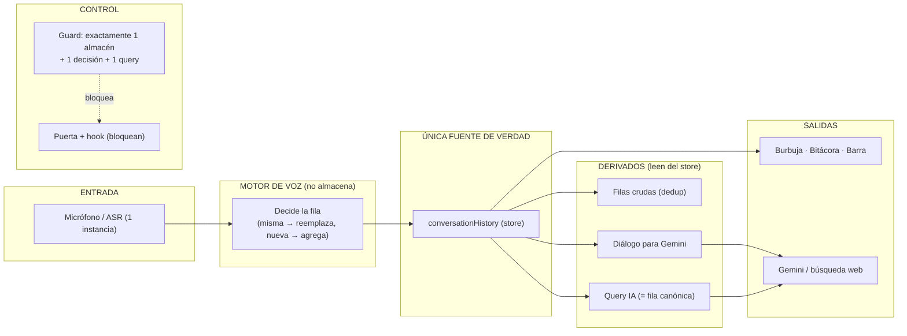

# Plan: Fuente Única de Verdad de la Conversación por Voz — §9 Piedra Inamovible (v2)

> Reemplaza el borrador v1 (2026-09-09). Se re-diagnostica con evidencia `archivo:línea`
> sobre el estado real del árbol de trabajo (HEAD `eb18766`, rama
> `feature/fase-conversacional-acciones`, con cambios sin commitear).
>
> Objetivo: **una frase hablada = UNA fila canónica en `conversationHistory`**. Esa fila es
> la ÚNICA fuente de verdad. Bitácora, última frase/burbuja y barra de búsqueda la LEEN; la
> query a la IA se deriva de ESA MISMA fila. Nada más almacena, normaliza ni decide
> transcripción.

---

## 0. Contrato de tarea (§10)

**Objetivo único**
Toda la conversación por voz (captura → fila visible → query IA) pasa por UNA sola fuente de
verdad: `integrationStore.conversationHistory`. El motor de voz es el único que DECIDE la fila
(misma emisión → reemplaza; turno nuevo → agrega) y el único que DERIVA la query; las vistas
solo leen.

**DoD (comando, no descripción)**

| Comando | Hoy (baseline) | Meta |
|---|---|---|
| `rg -n "resolveDisplayPhrase\(" src/components src/App.tsx` | 3 | 0 (o 1 selector único fuera de componentes) |
| `rg -c "replaceLastRawLog" src/App.tsx` | 6 | 0 decisiones de commit en App |
| `rg -n "createSpeechRecognition\(|createRecognition\(" src -g "*.{js,ts,tsx}"` | 2 productores | 1 productor activo |
| `rg -n "lastVoiceCommand" src -g "*.{js,jsx,ts,tsx}"` | store + 1 componente | 0 (barra lee la fila canónica) |
| `rg -n "derivedDialogueRef\.current\s*=" src` | 6 asignaciones | 0 (fachada read-only real) |
| `npx vitest run tests/voiceSingleSourceGuard.test.ts` | verde (guard ciego) | verde con guard reforzado que HOY nace ROJO |
| `npx tsc -b` | 0 errores | 0 errores |

**Alcance**
- Permitidos: `src/voice/**`, `src/App.tsx`, `src/store/integrationStore.ts`,
  `src/components/{FluAvatarVoiceBridge,FluConversationTabView,WorkspaceHub,WorkspaceSearch}.tsx`,
  `src/hooks/useOnboardingVoiceCapture.ts`, `tests/voiceSingleSourceGuard.test.ts`.
- Prohibido: paneles de recordatorios/alarmas/horario, motor de documentos/vídeo/juegos,
  CSS global. Todo hallazgo fuera de alcance se ANOTA al final y no se toca.

**Guard (nace ROJO, §10.2)**
`tests/voiceSingleSourceGuard.test.ts` debe reescribirse para contar por COMPORTAMIENTO, no
por nombres fijos (ver §4). El guard actual (`:33-36`) pasa en falso porque vigila
`dialogueHistoryRef`, `logRowsTextRef`, `logRowSpeakersRef`, símbolos que YA NO EXISTEN.

**Baseline de fallos (§10.3)**
Antes de tocar código: `npm run test:full` y registrar la lista de tests que YA fallan. Deuda
conocida documentada: 3 tests del bloque DIARIO en `hoyPanel.test.tsx` y
`architecture.test.ts:132` (ver `plans/estado-sesion-2026-09-09.md:59`). Puerta de cierre =
**0 fallos NUEVOS**, no "0 fallos".

---

## 1. Estado actual por regla §9 (evidencia)

| # | Regla | Estado | Evidencia |
|---|-------|--------|-----------|
| 1 | Escucha centralizada (1 instancia) | ✗ 2 productores | `useFluVoiceAssistant.js:341,2424,2617` (motor) y `useOnboardingVoiceCapture.ts:175` (onboarding crea su propio reconocimiento). `speechRecognitionLocal.js:87-103` aborta el otro, pero no elimina el productor. |
| 2 | Nadie más trata la escucha/transcripción | ✗ tratamiento en onboarding y en vistas | `useOnboardingVoiceCapture.ts:184-210` define su propio `onResult`/`setInterim`/`onFinal`; `setLastTranscript`/`setLiveTranscript` aparecen **27 veces** en `useFluVoiceAssistant.js`; `resolveDisplayPhrase` se re-invoca en 3 componentes. |
| 3 | Última frase = transcripción zona FLU | ✗ 4 entradas distintas | `FluAvatarVoiceBridge.tsx:164-169`, `FluConversationTabView.tsx:77-82`, `WorkspaceHub.tsx:577-582`, `App.tsx:4200`. Cada uno pasa un set distinto (`fallback`, `lastHeardText`, `lastUserText`, `currentTranscript`). |
| 4 | Wake word solo de config | ~ 1 literal | Fuente correcta en `fluConfig.js`. Pero `audioMath.js:1625` hardcodea `'okay flu'` dentro de `NAME_INVALID_PHRASES`. |
| 5 | Barra = transcripción sin wake, solo comandos | ✗ almacén paralelo | `WorkspaceSearch.tsx:103-104,134,139,156` usa `integrationStore.lastVoiceCommand` como segundo almacén y lo pinta aunque no haya captura (`effectiveLive = live || lastCommand`). |
| 6 | Lo que FLU oye = transcripción | ✗ limpieza en otra ruta | `processConversationFluQuery` limpia de nuevo: `cleanForSpeech(fullTranscript || question)` (`useFluVoiceAssistant.js:3157`) y `transcript: cleanForSpeech(question) || cleanForSpeech(fullTranscript)` (`:3240`), mientras la fila se commitea con `cleanForSpeech(turnCapture)` en `emitConversationLog` (`:1660`). Dos pipelines de limpieza. |
| 7 | (mapeo §9.5 = barra) | — | ver regla 5. |

---

## 2. Defectos raíz

**D1 — La "fuente única" es una fachada con setters no-op (autoengaño).**
`derivedDialogueRef` (`useFluVoiceAssistant.js:446-456`) y `committedRowsTextRef` /
`committedRowsSpeakersRef` (`:488-515`) son `useMemo` con getter sobre el store y setter
vacío. El código cree escribirles y el setter lo descarta: `derivedDialogueRef.current =`
6 veces (`:1760, 1794, 3215, 3372, 3967, 4153`), `committedRowsTextRef.current = []` en
`:924, 2739`. Los resets del motor no resetean nada; el diálogo de Gemini no es el que el
motor construye, sino el que se re-deriva del store en cada lectura. Cualquier cambio futuro
sobre esas refs es silenciosamente ignorado.

**D2 — El guard de fuente única está ciego.**
`tests/voiceSingleSourceGuard.test.ts:28-37` enumera nombres muertos. `CONVERSATION_STORES`
busca `dialogueHistoryRef`/`logRowsTextRef`/`logRowSpeakersRef` (0 ocurrencias reales), por eso
`N=1` pasa trivialmente mientras existen `derivedDialogueRef`, `committedRowsTextRef`,
`committedRowsSpeakersRef`, `liveTranscript`, `lastTranscript`, `currentTranscript`,
`lastVoiceCommand`. Un guard que no puede fallar no es barrera (§8.6).

**D3 — La frase visible no sale de una única fuente.**
`resolveDisplayPhrase` centraliza el ORDEN (`live → lastTranscript → lastUserText →
currentTranscript`, `audioMath.js:128-135`), pero NO la ENTRADA: cada vista arma su propia
tupla. Peor: `live` (interino) tiene prioridad sobre `lastTranscript` (commit), así que la
burbuja/bitácora muestran un fragmento ASR que aún no es la fila canónica. Regla §9.3
incumplida por construcción.

**D4 — Escucha con dos productores y tratamiento propio.**
Onboarding crea reconocimiento e interpreta `onResult` por su cuenta. Aunque
`speechRecognitionLocal.js` aborta la otra instancia, sigue habiendo un segundo lugar que
normaliza y "entrega" transcripción (regla §9.1 y §9.2).

**D5 — Barra con almacén paralelo.**
`lastVoiceCommand` (`integrationStore.ts:118,319,418`) es un segundo estado de "último
comando" que la barra pinta (`WorkspaceSearch.tsx:134`) al margen de la fila canónica. La
barra debe leer la última fila del store y solo quitar la wake word (config) para presentación.

**D6 — Query con pipeline de limpieza distinto al de la fila.**
La fila se commitea con `capture = cleanForSpeech(turnCapture)` (`:1660`) y la query se
re-limpia en `processConversationFluQuery` (`:3157,:3240`). Puede divergir.

**D7 — Wake word hardcodeada residual.**
`audioMath.js:1625` `'okay flu'` dentro de `NAME_INVALID_PHRASES`. Debe derivarse de
`FLU_CONFIG.voiceCommands.wakeWords`.

---

## 3. Diseño objetivo (flujo del usuario)

**Regla de oro:** separar por responsabilidad, no por ubicación física del código.

- **Escribe (Motor):** solo `B` *Decide la fila* muta el store (único escritor). El interino deja
  de ser un estado React paralelo y pasa a ser una fila **provisional** en el store que el motor
  reemplaza en sitio hasta el commit final.
- **Leen (Derivados):** `D` filas crudas, `E` diálogo para Gemini y `Q` query IA son derivaciones
  de SOLO LECTURA del store. `Q` NO va junto a `B` (aunque `processConversationFluQuery` hoy viva
  dentro del hook de voz): si se deriva "en paralelo" desde el motor, se re-limpia por su cuenta y
  puede diferir de la fila visible (defecto D6). Alimentarla de `S` fuerza `question === fila
  canónica` (reglas §9.6/§9.7).
- Las vistas no reciben `liveTranscript`, `lastTranscript`, `currentTranscript` ni
  `lastVoiceCommand`: leen `conversationHistory`.

**Decisión de diseño abierta (recomendada, a confirmar con el usuario):** las filas
provisionales (`provisional: true`) NO se persisten en IndexedDB. La persistencia
(`useConversationPersistence`) ignora las filas provisionales; al commitearse, la misma fila
pasa a `provisional: false` y se persiste. Esto evita ensuciar el historial tras un reload.

---

## 4. Invariantes numéricas y guards (§8)

| INV | Invariante | Baseline GUARD-DRIVEN (rojo hoy) | Meta | Guard |
|-----|-----------|----------------------------------|------|-------|
| INV-1 | 1 sola fuente de display | G5 = 3 cascadas (`FluAvatarVoiceBridge:163`, `FluConversationTabView:76`, `WorkspaceHub:576`) | 0 | G5 |
| INV-2 | 1 sola decisión de commit | G2 = 2 (`App.tsx:153,1648`) | 0 | G2 |
| INV-3 | 1 sola derivación de query | G3 = 3 (`audioMath.js:951`, `voiceCommands.js:102`, `wakeTurnCommit.js:66`) | 1 | G3 |
| INV-4 | 1 solo productor de escucha | G4 = 2 (`useFluVoiceAssistant.js`, `useOnboardingVoiceCapture.ts`) | 1 | G4 |
| INV-5 | 0 wake word fuera de config | G6 = 3 (`VoiceCommandHelp.tsx:32`, `appConfig.ts:736`, `audioMath.js:1609`) | 0 | G6 |
| INV-6 | 0 almacenes propios del motor | G1 = 3 (`dialogueHistoryRef:443`, `logRowsTextRef:473`, `logRowSpeakersRef:474`) | 0 | G1 |
| INV-7 | fila visible == query | sin guard aún | verde | `tests/voiceCanonicalPhrase.test.ts` |

**Guard implementado** (`tests/voiceSingleSourceGuard.test.ts`, rojo 6/6 al 2026-09-10). Cuenta
por comportamiento, no por nombres fijos, y lista `archivo:línea:contenido`:
- G1: detecta todo `useRef([])` con nombre de conversación/log en `src` (almacén propio del
  motor) y toda fachada con setter no-op (`set current(_…)`). Hoy 3 almacenes.
- G2: detecta `spokenUtteranceRevision` en `src/App.tsx` (App re-decide). Hoy 2.
- G3: cuenta call sites de `resolveFinalConversationAction(` excluyendo su declaración. Hoy 3.
- G4: cuenta archivos que invocan `createSpeechRecognition(`/`createRecognition(`, excluyendo
  la fábrica. Hoy 2.
- G5: detecta la cascada `liveTranscript || … lastTranscript` en `src/components` y `App.tsx`.
  Hoy 3.
- G6: detecta literales de wake word (de `FLU_CONFIG.voiceCommands.wakeWords`) fuera de
  `fluConfig.js`, ignorando comentarios `//`, `*` y `/*`. Hoy 3.

---

## 5. Hitos (un contrato por turno, §10.6)

Cada hito: `tsc -b` + guard acotado + `git diff` real + conteo ANTES/DESPUÉS. Si el conteo no
baja, el hito se revierte (§8.5).

### H0 — Guard rojo primero ✅ EJECUTADO (2026-09-10)
`tests/voiceSingleSourceGuard.test.ts` escrito con G1–G6 y **rojo 6/6** (baseline en §4). DoD
cumplido: el guard lista los `archivo:línea` reales. Es el baseline guard-driven que faltaba.

### H1 — El motor deja de almacenar; deriva del store (D1)
**Cambio:** eliminar `dialogueHistoryRef`, `logRowsTextRef` y `logRowSpeakersRef` de
`useFluVoiceAssistant.js:443,473,474` y leer SIEMPRE del store `conversationHistory` (rol
'user' para filas; rol 'flu' para diálogo). NO reintroducir la fachada con setter no-op: las
escrituras se reemplazan por las acciones reales del store (App/commit) o se eliminan.
**Invariante:** INV-6 (G1) = 0. **Riesgo:** que el diálogo de Gemini dependa de un exchange que
aún no está en el store; verificar que la `question` se pasa aparte y que la respuesta FLU se
persiste con `addFluMessage` antes del turno siguiente.

### H1 — ✅ EJECUTADO (2026-09-10): el motor no almacena (G1)
Eliminados `dialogueHistoryRef`, `logRowsTextRef`, `logRowSpeakersRef` y TODAS sus escrituras;
vistas de solo lectura `dialogueView`/`userRowsTextView`/`userSpeakersView` derivadas del store
(+ `deriveDialogueHistory`/`deriveUserRowTexts`/`deriveUserRowSpeakers`). G1 ✓. Validado en vivo
(1 fila por frase, query = fila sin wake, contexto Gemini desde el store).

### H2 — ✅ EJECUTADO: frase visible única (G5)
`selectVisiblePhrase` (único selector) en `conversationDialogue.js`; las 3 vistas y la barra lo
consumen. Sin cascadas `live||last` en `src/components` ni `App.tsx`. G5 ✓.

### H3 — ✅ EJECUTADO: un solo punto de creación de escucha (G4)
Nueva puerta `acquireSpeechRecognition` en `speechRecognitionLocal.js`; motor y onboarding
dejan de invocar la fábrica de Web Speech API directamente. G4 ✓ (0 fábricas fuera del módulo).

### H4 — ✅ EJECUTADO: barra pura (G7)
Eliminado `lastVoiceCommand` (store + `WorkspaceSearch`); la barra es pura y recibe la frase
canónica por `livePhrase`, derivando solo la wake word. G7 ✓ (`useIntegrationStore` = 0 en la barra).

### H5 — ✅ EJECUTADO: query única (G3)
`voiceCommands.resolveVoiceConversationAction` y `wakeTurnCommit` delegan en
`planConversationDispatch().action`; 1 solo call site de `resolveFinalConversationAction`
(`audioMath`). G3 ✓.

### H6 — ✅ EJECUTADO: wake word solo de config (G6)
`audioMath` (deny-list dinámica sobre `FLU_CONFIG`), `appConfig` (`INTERRUPTION_KEYWORDS` sin
wake words; `userEmotionDetector` las toma de config) y `VoiceCommandHelp` (frase derivada). G6 ✓.

---

## 6. Baseline de fallos preexistentes (§10.3)

Capturado con `npm run test:full` (2026-09-10, HEAD `eb18766`, base revertida ya validada en
pantalla por el usuario): `Test Files 3 failed | 148 passed (151)` ·
`Tests 12 failed | 2721 passed (2733)`.

Fallos = 12:
- `tests/voiceSingleSourceGuard.test.ts` — **6 (G1–G6, rojo esperado por diseño)**; meta al cierre = 0.
- `tests/deterministicArbiter.test.ts` — 3 (diario `diary.addEntry`; **preexistente**, NO tocar).
- `tests/hoyPanel.test.tsx` — 3 (bloque DIARIO; **preexistente**, NO tocar).

`tests/architecture.test.ts:132` (deuda vieja mencionada en `estado-sesion`) YA NO falla: no
está en el baseline actual.

Puerta de cierre: **0 fallos NUEVOS** respecto a este baseline; los 6 del guard deben pasar a
verde por los hitos H1–H6.

**Estado final (2026-09-10)**: guard `voiceSingleSourceGuard` **7/7 verde** (G1–G7); `tsc -b` 0
errores; `npm test` (changed) `2728 passed | 6 failed` = **los 6 del baseline**, 0 nuevos.

---

## 7. Riesgos

| Riesgo | Mitigación |
|--------|-----------|
| Al quitar estados de vista se pierde el interino en vivo | Fila provisional en el store (reemplazo en sitio); validación en vivo antes de declarar cierre |
| Persistir filas provisionales ensucia IndexedDB | `useConversationPersistence` ignora `provisional: true`; se persiste al commit |
| El guard nuevo toca archivos fuera de alcance | El guard solo LEE `src`; no modifica runtime |
| Cambios de query rompen parsers | INV-7 + tests de `voiceFlowIntegration.test.ts` ya existentes |
| Regresión de lo validado (fila única 32ea9e3) | Hitos cortos + guard + `npm run test:full` una vez en el cierre |

---

## 8. Archivos y orden de trabajo

1. `tests/voiceSingleSourceGuard.test.ts` (H0, guard rojo)
2. `src/voice/hooks/useFluVoiceAssistant.js` (H1, H5)
3. `src/voice/lib/conversationDialogue.js` / `src/store/integrationStore.ts` (H1)
4. `src/components/{FluAvatarVoiceBridge,FluConversationTabView,WorkspaceHub}.tsx` + `src/App.tsx` (H2)
5. `src/hooks/useOnboardingVoiceCapture.ts` (H3)
6. `src/components/WorkspaceSearch.tsx` + `src/store/integrationStore.ts` (H4)
7. `src/voice/lib/audioMath.js` (H6)
8. `tests/voiceCanonicalPhrase.test.ts` (INV-7)

**Cierre obligatorio (§10):** `git diff --stat` · comando DoD ANTES y DESPUÉS · salida del
guard · baseline de fallos + confirmación de 0 nuevos. La validación visual final la hace el
USUARIO en su pantalla (una frase hablada → 1 fila en bitácora + misma frase en burbuja/barra
+ misma query a la IA).
