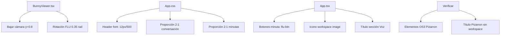

# Plan de Correcciones UI/UX — FLU OS4 (v2)

## Resumen de Cambios

Basado en la retroalimentación del usuario, se requieren los siguientes ajustes adicionales a los 8 cambios ya implementados.

---

## 1. Cámara — Bajar más (sigue viendo de arriba)

**Archivo**: [`src/avatar/components/BunnyViewer.tsx:889`](../src/avatar/components/BunnyViewer.tsx:889)

**Estado actual**: `camera={{ position: [0, 1.2, 3.5], fov: 35 }}`

**Cambio**: 
- `y: 1.2` → `y: 0.8` (bajar la cámara a la altura del pecho)
- `fov: 35` → `fov: 40` (un poco más de campo visual para compensar)

**Resultado**: `camera={{ position: [0, 0.8, 3.5], fov: 40 }}`

---

## 2. Rotación de FLU — Girar más hacia el pizarron

**Archivo**: [`src/avatar/components/BunnyViewer.tsx:725`](../src/avatar/components/BunnyViewer.tsx:725)

**Estado actual**: `rotation={[0, 0.2, 0]}` (~11.5°)

**Cambio**: `rotation={[0, 0.35, 0]}` (~20°) — FLU mira más claramente hacia el panel derecho

---

## 3. Letra de headers — Reducir grosor y tamaño

**Archivo**: [`src/App.css:346-355`](../src/App.css:346)

**Estado actual**:
```css
.panel-frame__header {
  font-size: 13px;
  font-weight: 600;
}
```

**Cambio**:
```css
.panel-frame__header {
  font-size: 12px;
  font-weight: 500;
}
```

Esto aplica a TODOS los panel-frames: workspace, bitácora, participantes, minuta, historial.

---

## 4. Proporción Conversación — Bitácora más ancha que Participantes

**Archivo**: [`src/App.css:226-231`](../src/App.css:226)

**Estado actual**: Ambos `.panel-frame` tienen `flex: 1` (mismo ancho)

**Cambio**: Agregar selectores específicos para dar proporción 2:1
```css
.flu-tab-panel--conversation .panel-frame--log {
  flex: 2;
}
.flu-tab-panel--conversation .panel-frame--participants {
  flex: 1;
}
```

---

## 5. Título del Pizarron — Quitar "workspace"

**Archivo**: [`src/App.tsx:1997-2000`](../src/App.tsx:1997)

**Estado actual**: `title={FLU_CONFIG.ui?.workspace?.title || 'Pizarron'}`

**Verificar**: El título se resuelve desde `FLU_CONFIG.ui.workspace.title`. Si la config está correcta, muestra "Pizarron". Si no, cae a 'Pizarron'. No debería mostrar "workspace" en ningún caso. **Solo verificar, no cambiar código.**

---

## 6. Botones de Minuta — Dar apariencia de botón

**Archivo**: [`src/App.tsx:2170-2186`](../src/App.tsx:2170)

**Estado actual**: Usan `voice-bar__button voice-bar__button--ghost panel-frame__header-button`
- La clase `--ghost` los hace invisibles (transparentes, sin borde)

**Cambio**: 
- "Generar Minuta": `voice-bar__button` → `flu-btn flu-btn--primary` (fondo cyan visible)
- "Guardar Minuta": `voice-bar__button voice-bar__button--ghost` → `flu-btn` (borde visible)

---

## 7. Proporción Minutas — Minuta más ancha que Historial

**Archivo**: [`src/App.css:247-252`](../src/App.css:247)

**Estado actual**: Ambos `.panel-frame` tienen `flex: 1` (mismo ancho)

**Cambio**: Misma proporción 2:1 que conversación
```css
.flu-tab-panel--minutes .panel-frame--minute {
  flex: 2;
}
.flu-tab-panel--minutes .panel-frame--history {
  flex: 1;
}
```

---

## 8. Botón de maximizar imagen del workspace — Usar icono

**Archivo**: [`src/App.tsx:2048`](../src/App.tsx:2048)

**Estado actual**: 
```tsx
<button ...>{FLU_CONFIG.ui?.panel?.maximize || 'Maximizar'}</button>
```

**Cambio**: Reemplazar el texto con el mismo icono que usan los PanelFrame:
```tsx
<button ...>⤢</button>
```

---

## 9. Configurador de Voz — Dar diseño unificado

**Archivo**: [`src/App.tsx:2506-2523`](../src/App.tsx:2506)

**Estado actual**: El slider de velocidad de voz está dentro de un `flu-settings-section` pero sin título de sección ni estructura visual clara. Es solo un slider suelto.

**Cambio**: Agregar un título de sección y estructura completa:
```tsx
<div className="flu-settings-section">
  <div className="flu-settings-section__title">🔊 Voz</div>
  <div className="flu-settings-section__body">
    <label className="flu-settings-image-config__field flu-settings-image-config__field--slider">
      <span className="flu-settings-slider-label">Velocidad de la voz</span>
      <input type="range" ... />
      <span className="flu-settings-slider-value">...</span>
    </label>
  </div>
</div>
```

---

## 10. Verificar elementos OS3 en Pizarron

**Archivo**: [`src/App.tsx:1997-2108`](../src/App.tsx:1997)

**Verificar que existan todos estos elementos** (solo revisión, no cambios):
- [x] Transcripción en vivo (`liveTranscript` / `currentTranscript`)
- [x] Respuesta de FLU (`latestResponse`)
- [x] Contenido del workspace (`workspaceArtifact.contenido`)
- [x] Puntos clave (`workspaceArtifact.puntos_clave`)
- [x] Imagen del workspace con botón de expandir
- [x] Estados de carga (`workspaceImageLoading`)
- [x] Estados de error (`workspaceImageFailed`) con botón "Reintentar"

---

## Diagrama de Flujo de Cambios



---

## Orden de Implementación

| # | Archivo | Cambio | Riesgo |
|---|---------|--------|--------|
| 1 | `BunnyViewer.tsx:889` | Bajar cámara | Bajo |
| 2 | `BunnyViewer.tsx:725` | Aumentar rotación | Bajo |
| 3 | `App.css:346` | Header font-size/weight | Medio (afecta todos los paneles) |
| 4 | `App.css:226` | Proporción conversación | Bajo |
| 5 | `App.css:247` | Proporción minutas | Bajo |
| 6 | `App.tsx:2170` | Botones minuta | Bajo |
| 7 | `App.tsx:2048` | Icono workspace img | Bajo |
| 8 | `App.tsx:2506` | Título sección Voz | Bajo |
| 9 | `App.tsx:1997` | Verificar elementos OS3 | Solo revisión |
