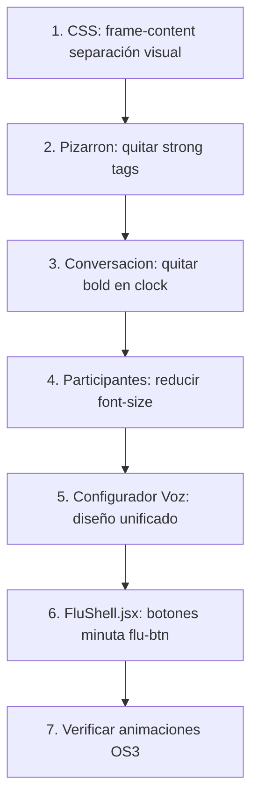

# Plan de Correcciones UI/UX — v3

## Análisis de Problemas

### 1. Pizarron — Letra demasiado gruesa y campos sin separación visual
**Archivos:** [`src/App.tsx:2008-2028`](src/App.tsx:2008), [`src/App.css`](src/App.css)
- **Problema:** El contenido del Pizarron usa `<strong>` tags en el transcript en vivo (line 2011) y en la respuesta de FLU (line 2016), lo que hace el texto muy bold. Además, las secciones (transcript, respuesta, contenido, puntos clave, imagen) no tienen separación visual entre sí.
- **Solución:**
  - Reemplazar `<strong>` por `<span>` en el transcript en vivo y la respuesta de FLU dentro del Pizarron
  - Agregar CSS `.frame-content--workspace > * + *` con `margin-top` y `border-top` para separar visualmente las secciones
  - Estandarizar font-size a 13px para contenido, 12px para metadatos

### 2. Conversación — Letra muy gruesa (bold en clock y speaker)
**Archivos:** [`src/voice/components/ConversationLog.jsx:56`](src/voice/components/ConversationLog.jsx:56)
- **Problema:** El `<strong>` en `entry.clock` (line 56) hace que el timestamp se vea muy bold. El texto del mensaje no tiene bold, pero el clock sí.
- **Solución:**
  - Reemplazar `<strong>{entry.clock}</strong>` por `<span className="audit-item__clock">{entry.clock}</span>`
  - Agregar CSS `.audit-item__clock` con `font-weight: 500` y `font-size: 11px`
  - El speaker (`.audit-item__speaker`) ya existe, verificar su font-size

### 3. Participantes (Hablantes) — Letra gigante
**Archivos:** [`src/voice/components/VoiceProfilesPanel.jsx:68`](src/voice/components/VoiceProfilesPanel.jsx:68), [`src/index.css:84`](src/index.css:84)
- **Problema:** `.voice-profiles__name` no tiene font-size definido explícitamente, hereda el base de 14px. Los botones "Renombrar"/"Eliminar" también heredan tamaño grande.
- **Solución:**
  - Agregar CSS `.voice-profiles__name` con `font-size: 13px`, `font-weight: 400`
  - Agregar CSS `.voice-profiles__button` con `font-size: 11px`
  - Unificar con el tamaño de letra de la conversación (13px)

### 4. Pizarron — Quitar palabra "workspace" del título
**Archivos:** [`src/App.tsx:2000`](src/App.tsx:2000)
- **Problema:** El título usa `FLU_CONFIG.ui?.workspace?.title || 'Pizarron'`. Ya resuelve a 'Pizarron' desde config, pero verificar que no haya "workspace" en ningún lado.
- **Solución:** Verificar que `FLU_CONFIG.ui.workspace.title` en [`fluConfig.js`](src/voice/lib/fluConfig.js) sea 'Pizarron' y no contenga "workspace". Es solo verificación.

### 5. Animaciones/Expresiones OS3 — Revisar mapeo
**Archivos:** [`src/avatar/components/BunnyViewer.tsx`](src/avatar/components/BunnyViewer.tsx), [`src/avatar/store/bunnyStore.ts`](src/avatar/store/bunnyStore.ts)
- **Problema:** El store tiene `currentExpression`, `blendQueue`, `blendSlots` pero BunnyViewer no los usa. Las animaciones se disparan por `currentAnimation` del store, pero las expresiones faciales (Emo_blink, Emo_mouth_open, Emo_neutral) no se mapean automáticamente desde el estado de conversación.
- **Solución:** Esto requiere un análisis más profundo del puente entre el estado de conversación (integrationStore) y el avatar (bunnyStore). Es un tema delicado que necesita revisión del código en [`FluAvatarVoiceBridge.tsx`](src/components/FluAvatarVoiceBridge.tsx) y [`useAvatarVoiceSync.ts`](src/hooks/useAvatarVoiceSync.ts). **Marcar como tarea de investigación.**

### 6. Configurador de Voz (FluParticipantSettingsPanel) — Sin diseño unificado
**Archivos:** [`src/voice/components/FluParticipantSettingsPanel.jsx`](src/voice/components/FluParticipantSettingsPanel.jsx)
- **Problema:** El panel usa clases CSS propias (`.flu-participant-settings`, `.flu-participant-settings__field`, `.flu-participant-settings__grid`, `.flu-participant-settings__actions`) que no están definidas en ningún CSS. Los botones usan `.voice-bar__button` y `.voice-bar__button--ghost` en lugar de `.flu-btn`. El selector de voz y el botón "Probar" usan clases que no existen (`.flu-settings-image-config__voice-row`, `.flu-settings-image-config__test-btn`, `.flu-settings-image-config__slider-label`).
- **Solución:**
  - Envolver todo el panel en `<div className="flu-settings-section">` con título "Configurador de voz"
  - Reemplazar clases inexistentes por las unificadas:
    - `.flu-participant-settings__field` → `.flu-settings-image-config__field`
    - `.flu-participant-settings__field--checkbox` → `.flu-settings-image-config__field--checkbox`
    - `.flu-participant-settings__hint` → `.flu-settings-hint`
    - `.voice-bar__button` → `.flu-btn`
    - `.voice-bar__button--ghost` → `.flu-btn` (sin modifier, es el default)
  - El selector de voz y botón "Probar" deben usar `.flu-settings-row` y `.flu-btn`
  - Los inputs numéricos deben usar las clases de input unificadas

### 7. Botones de minuta en App.tsx vs FluShell.jsx
**Archivos:** [`src/App.tsx:2169-2186`](src/App.tsx:2169), [`src/voice/components/FluShell.jsx:1390-1406`](src/voice/components/FluShell.jsx:1390)
- **Problema:** En App.tsx ya se cambiaron a `flu-btn`/`flu-btn--primary`, pero en FluShell.jsx (el shell alternativo) todavía usan `voice-bar__button` y `voice-bar__button--ghost`.
- **Solución:** Actualizar FluShell.jsx para que use las mismas clases `flu-btn`/`flu-btn--primary`.

---

## Orden de Implementación



## Detalle de Cambios

### Tarea 1: Separación visual en Pizarron + quitar bold
**Archivo:** [`src/App.css`](src/App.css)
Agregar al final:
```css
/* --- Workspace (Pizarron) content sections --- */
.frame-content--workspace {
  display: flex;
  flex-direction: column;
  gap: 0;
}

.frame-content--workspace > * + * {
  margin-top: 8px;
  padding-top: 8px;
  border-top: 1px solid rgba(255, 255, 255, 0.06);
}

.frame-content--workspace .frame-content__response {
  font-size: 13px;
  line-height: 1.5;
  color: var(--text-primary);
}

.frame-content--workspace .frame-content__response-scroll {
  max-height: 80px;
  overflow-y: auto;
}

.frame-content--workspace p {
  font-size: 13px;
  line-height: 1.5;
  color: var(--text-secondary);
}

.frame-content--workspace .frame-content__list {
  margin: 0;
  padding-left: 16px;
  font-size: 13px;
  line-height: 1.5;
  color: var(--text-secondary);
}

.frame-content--workspace .frame-content__list li {
  margin-bottom: 4px;
}

.frame-content--workspace .frame-content__empty {
  font-size: 12px;
  color: var(--text-muted);
  font-style: italic;
}
```

### Tarea 2: Quitar `<strong>` del Pizarron
**Archivo:** [`src/App.tsx`](src/App.tsx)
- Line 2011: `<strong>{liveTranscript...</strong>` → `<span>{liveTranscript...</span>`
- Line 2016: `<strong>{latestResponse...</strong>` → `<span>{latestResponse...</span>`

### Tarea 3: Quitar bold del clock en ConversationLog
**Archivo:** [`src/voice/components/ConversationLog.jsx`](src/voice/components/ConversationLog.jsx)
- Line 56: `<strong>{entry.clock}</strong>` → `<span className="audit-item__clock">{entry.clock}</span>`

**Archivo:** [`src/App.css`](src/App.css)
Agregar:
```css
.audit-item__clock {
  font-size: 11px;
  font-weight: 500;
  color: var(--text-muted);
  font-family: var(--font-mono);
}
```

### Tarea 4: Reducir font-size de participantes
**Archivo:** [`src/index.css`](src/index.css)
Modificar `.voice-profiles__name`:
```css
.voice-profiles__name {
  width: 100%;
  padding-bottom: 2px;
  border-bottom: 1px solid rgba(148, 163, 184, 0.08);
  font-size: 13px;
  font-weight: 400;
}
```

Agregar:
```css
.voice-profiles__button {
  font-size: 11px;
  padding: 2px 8px;
}
```

### Tarea 5: Diseño unificado del Configurador de Voz
**Archivo:** [`src/voice/components/FluParticipantSettingsPanel.jsx`](src/voice/components/FluParticipantSettingsPanel.jsx)

Reemplazar la estructura completa:
- Envolver en `<div className="flu-settings-section">`
- Título: `<div className="flu-settings-section__title">🔊 Configurador de voz</div>`
- Cuerpo: `<div className="flu-settings-section__body">`
- Voice row: usar `<div className="flu-settings-row">` con `<select>` y `<button className="flu-btn">▶ Probar</button>`
- Grid de campos: cada field como `<label className="flu-settings-image-config__field">`
- Checkbox fields: `<label className="flu-settings-image-config__field--checkbox">`
- Hints: `<span className="flu-settings-hint">`
- Botones de acción: `flu-btn` y `flu-btn--primary`
- Inputs numéricos: usar las clases de input estándar

### Tarea 6: FluShell.jsx — botones minuta con flu-btn
**Archivo:** [`src/voice/components/FluShell.jsx`](src/voice/components/FluShell.jsx)
- Line 1392: `voice-bar__button voice-bar__button--ghost panel-frame__header-button` → `flu-btn flu-btn--primary panel-frame__header-button`
- Line 1402: `voice-bar__button panel-frame__header-button` → `flu-btn panel-frame__header-button`

### Tarea 7: Investigar animaciones OS3
**Archivos a revisar:**
- [`src/components/FluAvatarVoiceBridge.tsx`](src/components/FluAvatarVoiceBridge.tsx) — cómo conecta el estado de conversación con el avatar
- [`src/hooks/useAvatarVoiceSync.ts`](src/hooks/useAvatarVoiceSync.ts) — sincronización voz/avatar
- [`src/avatar/store/bunnyStore.ts`](src/avatar/store/bunnyStore.ts) — `setExpression`, `blendAnimation`
- [`src/avatar/components/BunnyViewer.tsx`](src/avatar/components/BunnyViewer.tsx) — cómo se consumen las animaciones

**Objetivo:** Verificar que:
1. Las expresiones faciales (Emo_blink, Emo_mouth_open, Emo_neutral) se disparen correctamente según el estado de conversación (IDLE → LISTENING → THINKING → SPEAKING)
2. El mouth-open se active cuando FLU está hablando (SPEAKING state)
3. El blink ocurra periódicamente en estado IDLE
4. Las animaciones de idle (Idle_1, Idle_2, Idle_3) se reproduzcan en bucle cuando no hay otra animación activa

---

## Resumen de Archivos a Modificar

| Archivo | Cambios |
|---------|---------|
| [`src/App.css`](src/App.css) | Agregar CSS para frame-content sections, audit-item__clock |
| [`src/App.tsx`](src/App.tsx) | Quitar `<strong>` en Pizarron (lines 2011, 2016) |
| [`src/voice/components/ConversationLog.jsx`](src/voice/components/ConversationLog.jsx) | Cambiar `<strong>` por `<span>` en clock (line 56) |
| [`src/index.css`](src/index.css) | Reducir font-size de voice-profiles__name y voice-profiles__button |
| [`src/voice/components/FluParticipantSettingsPanel.jsx`](src/voice/components/FluParticipantSettingsPanel.jsx) | Rediseñar con clases unificadas flu-settings-* |
| [`src/voice/components/FluShell.jsx`](src/voice/components/FluShell.jsx) | Cambiar clases de botones minuta a flu-btn |
| Varios (investigación) | Revisar animaciones/expresiones OS3 |
