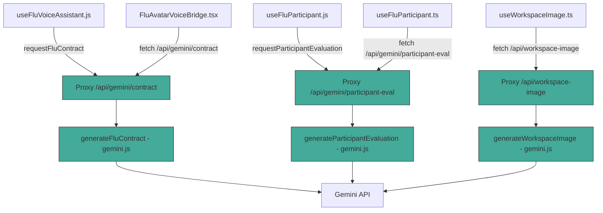

# Plan: Unificación del Proxy Gemini — Ruta Única a la API

## Problema Detectado

Existen **DOS caminos** para llamar a la API de Gemini, lo que viola el principio de "una sola fuente de verdad" y hace que el sistema no esté unificado:

### Path A: Frontend → Proxy (JS, vía `gemini.js`)
```
useFluVoiceAssistant.js → requestFluContract() → POST /api/gemini/contract
                                                      ↓
                                              geminiProxy.ts → handleContract()
                                                      ↓
                                              generateFluContract() (gemini.js:983)
                                                      ↓
                                              Gemini API (direct fetch)
```

**Usado por:**
- [`useFluVoiceAssistant.js`](src/voice/hooks/useFluVoiceAssistant.js:953) — flujo principal de conversación (STT → Gemini → TTS)
- [`useFluParticipant.js`](src/voice/hooks/useFluParticipant.js:209) — evaluación de participación vía `requestParticipantEvaluation()`

### Path B: TypeScript Service (Directo, vía `gemini.ts`)
```
FluAvatarVoiceBridge.tsx → geminiService.generateFluContract()
                                    ↓
                           GeminiService.generateFluContract() (gemini.ts:613)
                                    ↓
                           callGeminiStructured() (gemini.ts:188)
                                    ↓
                           Gemini API (direct fetch)
```

**Usado por:**
- [`FluAvatarVoiceBridge.tsx`](src/components/FluAvatarVoiceBridge.tsx:330) — Push-to-Talk (habla directa con FLU)
- [`useFluParticipant.ts`](src/hooks/useFluParticipant.ts:163) — evaluación de participación vía `geminiService.generateParticipantEvaluation()`
- [`useWorkspaceImage.ts`](src/hooks/useWorkspaceImage.ts:114) — generación de imagen de workspace

### Path B también existe para workspace image:
```
useWorkspaceImage.ts → geminiService.generateWorkspaceImage()
                                ↓
                       GeminiService.generateWorkspaceImage() (gemini.ts:851)
                                ↓
                       buildPollinationsUrl() → Pollinations API
```

Mientras que el proxy también tiene:
```
geminiProxy.ts → handleWorkspaceImage() → generateWorkspaceImage() (gemini.js:222)
                                                    ↓
                                           requestImageGeneration() → Gemini API
                                           OR buildPollinationsUrl() → Pollinations API
```

## Impacto

1. **Código duplicado**: `generateFluContract` existe en [`gemini.js:983`](src/voice/lib/gemini.js:983) (JS) y [`gemini.ts:613`](src/services/gemini.ts:613) (TS) — lógica similar pero no idéntica
2. **Configuración dividida**: El proxy usa `fluConfig.js` + `resolveGeminiModel()`, el service TS usa `appConfig.ts` + `GEMINI_CONFIG`
3. **Sin trazabilidad unificada**: El proxy logea con `[FLU-DEBUG-PROXY]`, el service TS logea con `[Gemini]`
4. **Sin caché compartida**: El service TS tiene response cache (30s TTL), el proxy no
5. **Sin manejo de errores consistente**: Cada path maneja errores de forma diferente
6. **Futura migración a WebLLM imposible**: Con dos caminos, migrar a IA local requeriría modificar ambos

## Solución Propuesta: Proxy como Única Puerta de Entrada

### Principio
**TODO el tráfico a Gemini DEBE pasar por el proxy.** El `GeminiService` (TS) debe delegar al proxy en lugar de llamar a Gemini directamente.

### Diagrama de Arquitectura Post-Unificación



### Cambios Específicos

#### 1. `GeminiService.generateFluContract()` → Delegar al Proxy

**Archivo**: [`src/services/gemini.ts`](src/services/gemini.ts:613)

Actualmente llama a `callGeminiStructured()` directamente. Debe cambiar a:

```typescript
async generateFluContract(options: AIRequestOptions, transcript: string, history: AIHistoryEntry[]): Promise<FluContract> {
    const response = await fetch('/api/gemini/contract', {
        method: 'POST',
        headers: { 'Content-Type': 'application/json' },
        body: JSON.stringify({
            apiKey: options.apiKey,
            transcript,
            language: options.language,
            role: options.role,
            theme: options.theme,
            history: history.map(e => ({
                role: e.role === 'assistant' ? 'model' : 'user',
                text: e.text,
                speakerName: e.speakerName,
            })),
            personality: {
                traits: options.traits || [],
                tone: options.tone || 'friendly',
            },
        }),
    });
    const data = await response.json();
    if (!response.ok) throw new Error(data.error || 'Proxy error');
    return data.contract || data;
}
```

#### 2. `GeminiService.generateParticipantEvaluation()` → Delegar al Proxy

**Archivo**: [`src/services/gemini.ts`](src/services/gemini.ts:520)

Actualmente llama a `callGeminiStructured()` directamente. Debe cambiar a:

```typescript
async generateParticipantEvaluation(options: AIRequestOptions, conversationLog: string, maxDraftChars?: number): Promise<AIParticipantEvaluation> {
    const response = await fetch('/api/gemini/participant-eval', {
        method: 'POST',
        headers: { 'Content-Type': 'application/json' },
        body: JSON.stringify({
            apiKey: options.apiKey,
            conversationLog,
            language: options.language,
            role: options.role,
            theme: options.theme,
            maxDraftChars,
        }),
    });
    const data = await response.json();
    if (!response.ok) throw new Error(data.error || 'Proxy error');
    return data as AIParticipantEvaluation;
}
```

#### 3. `GeminiService.generateWorkspaceImage()` → Delegar al Proxy

**Archivo**: [`src/services/gemini.ts`](src/services/gemini.ts:851)

Actualmente llama a `buildPollinationsUrl()` directamente. Debe cambiar a:

```typescript
async generateWorkspaceImage(prompt: string, tipo: string | null | undefined, language?: string): Promise<AIWorkspaceImageResult> {
    const response = await fetch('/api/workspace-image', {
        method: 'POST',
        headers: { 'Content-Type': 'application/json' },
        body: JSON.stringify({
            prompt,
            tipo,
            language: language || 'es',
        }),
    });
    const data = await response.json();
    if (!response.ok) throw new Error(data.error || 'Proxy error');
    return data as AIWorkspaceImageResult;
}
```

#### 4. `GeminiService.generateConversationSummary()` → Delegar al Proxy

**Archivo**: [`src/services/gemini.ts`](src/services/gemini.ts:563)

Actualmente llama a `callGeminiStructured()` directamente. Debe cambiar a:

```typescript
async generateConversationSummary(options: AIRequestOptions, history: AIHistoryEntry[]): Promise<AISummaryResult> {
    const response = await fetch('/api/gemini/summary', {
        method: 'POST',
        headers: { 'Content-Type': 'application/json' },
        body: JSON.stringify({
            apiKey: options.apiKey,
            language: options.language,
            role: options.role,
            theme: options.theme,
            history: history.map(e => ({
                role: e.role === 'assistant' ? 'model' : 'user',
                text: e.text,
                speakerName: e.speakerName,
            })),
        }),
    });
    const data = await response.json();
    if (!response.ok) throw new Error(data.error || 'Proxy error');
    return data as AISummaryResult;
}
```

#### 5. `GeminiService.generateMinute()` → Delegar al Proxy

**Archivo**: [`src/services/gemini.ts`](src/services/gemini.ts:325)

Actualmente llama a `callGeminiStructured()` directamente. Debe cambiar a:

```typescript
async generateMinute(options: AIRequestOptions, history: AIHistoryEntry[], emotionalState: string): Promise<AIMinuteResult> {
    const response = await fetch('/api/gemini/summary', {
        method: 'POST',
        headers: { 'Content-Type': 'application/json' },
        body: JSON.stringify({
            apiKey: options.apiKey,
            language: options.language,
            role: options.role,
            theme: options.theme,
            history: history.map(e => ({
                role: e.role === 'assistant' ? 'model' : 'user',
                text: e.text,
                speakerName: e.speakerName,
            })),
            emotionalState,
            mode: 'minute',
        }),
    });
    const data = await response.json();
    if (!response.ok) throw new Error(data.error || 'Proxy error');
    return data as AIMinuteResult;
}
```

#### 6. `GeminiService.generateResponse()` → Delegar al Proxy

**Archivo**: [`src/services/gemini.ts`](src/services/gemini.ts:474)

Actualmente llama a `callGemini()` directamente. Debe cambiar a:

```typescript
async generateResponse(options: AIRequestOptions, userText: string, botName: string, history: AIHistoryEntry[]): Promise<string> {
    const response = await fetch('/api/gemini/contract', {
        method: 'POST',
        headers: { 'Content-Type': 'application/json' },
        body: JSON.stringify({
            apiKey: options.apiKey,
            transcript: userText,
            language: options.language,
            role: options.role,
            theme: options.theme,
            history: history.map(e => ({
                role: e.role === 'assistant' ? 'model' : 'user',
                text: e.text,
                speakerName: e.speakerName,
            })),
            personality: {
                traits: options.traits || [],
                tone: options.tone || 'friendly',
            },
            mode: 'response',
        }),
    });
    const data = await response.json();
    if (!response.ok) throw new Error(data.error || 'Proxy error');
    return data.respuesta_voz || data.text || '';
}
```

### 7. Proxy debe soportar nuevos modos

**Archivo**: [`src/server/geminiProxy.ts`](src/server/geminiProxy.ts:50)

El proxy actualmente tiene `handleContract` que llama a `generateFluContract()`. Necesita:

- **`mode: 'minute'`** → llamar a `generateConversationSummary()` con perfil de minuta
- **`mode: 'response'`** → llamar a `generateFluContract()` pero solo devolver `respuesta_voz`
- **`emotionalState`** → pasar al system prompt para minutas

### 8. Limpiar código muerto en `gemini.ts`

Después de la migración, las siguientes funciones en [`src/services/gemini.ts`](src/services/gemini.ts) ya NO serán necesarias y deben eliminarse:

- `callGemini()` (línea 129)
- `callGeminiStructured()` (línea 188)
- `resolveCreativityTemperature()` (línea 262)
- `getCachedResponse()` / `setCachedResponse()` (líneas 286-303)
- `buildCacheKey()` (línea 305)
- `resolveGeminiApiKey()` (línea 57) — duplicada de `gemini.js:892`
- `extractJson()` (línea 82) — duplicada de `gemini.js:285`

**NO eliminar** la clase `GeminiService` ni la interfaz `IAIService` — solo refactorizar sus métodos para que deleguen al proxy.

### 9. Response Cache en el Proxy

El service TS tenía un response cache con 30s TTL. Para no perder rendimiento, añadir caché similar en el proxy:

**Archivo**: [`src/server/geminiProxy.ts`](src/server/geminiProxy.ts)

```typescript
const responseCache = new Map<string, { data: any; timestamp: number }>();
const CACHE_TTL = 30_000; // 30s

function getCachedResponse(key: string): any | null {
    const entry = responseCache.get(key);
    if (entry && Date.now() - entry.timestamp < CACHE_TTL) return entry.data;
    responseCache.delete(key);
    return null;
}

function setCachedResponse(key: string, data: any): void {
    if (responseCache.size > 50) {
        const oldest = responseCache.entries().next().value;
        if (oldest) responseCache.delete(oldest[0]);
    }
    responseCache.set(key, { data, timestamp: Date.now() });
}
```

### 10. `useFluParticipant.ts` (TS) debe usar `requestParticipantEvaluation` del JS

**Archivo**: [`src/hooks/useFluParticipant.ts`](src/hooks/useFluParticipant.ts:163)

Actualmente llama a `geminiService.generateParticipantEvaluation()`. Después de la unificación, esto delegará al proxy automáticamente (porque `GeminiService.generateParticipantEvaluation()` llamará al proxy).

**NO requiere cambios** — solo asegurar que `GeminiService` delega correctamente.

## Resumen de Archivos a Modificar

| Archivo | Cambio |
|---------|--------|
| [`src/services/gemini.ts`](src/services/gemini.ts) | Refactorizar 6 métodos para delegar al proxy en lugar de llamar a Gemini directamente |
| [`src/server/geminiProxy.ts`](src/server/geminiProxy.ts) | Añadir response cache, soporte para `mode: 'minute'` y `mode: 'response'` |
| [`src/voice/lib/gemini.js`](src/voice/lib/gemini.js) | **Sin cambios** — es la implementación canónica que el proxy ya usa |

## Archivos a NO Modificar

| Archivo | Razón |
|---------|-------|
| [`src/voice/hooks/useFluVoiceAssistant.js`](src/voice/hooks/useFluVoiceAssistant.js) | Ya usa el proxy correctamente vía `requestFluContract()` |
| [`src/voice/hooks/useFluParticipant.js`](src/voice/hooks/useFluParticipant.js) | Ya usa el proxy correctamente vía `requestParticipantEvaluation()` |
| [`src/hooks/useFluParticipant.ts`](src/hooks/useFluParticipant.ts) | Se beneficiará automáticamente cuando `GeminiService` delegue al proxy |
| [`src/components/FluAvatarVoiceBridge.tsx`](src/components/FluAvatarVoiceBridge.tsx) | Se beneficiará automáticamente cuando `GeminiService` delegue al proxy |
| [`src/hooks/useWorkspaceImage.ts`](src/hooks/useWorkspaceImage.ts) | Se beneficiará automáticamente cuando `GeminiService` delegue al proxy |
| [`src/core/ai/IAIService.ts`](src/core/ai/IAIService.ts) | Interfaz no cambia — solo cambia la implementación |

## Orden de Implementación

1. **Refactorizar `GeminiService.generateFluContract()`** — el más usado (Push-to-Talk)
2. **Refactorizar `GeminiService.generateParticipantEvaluation()`** — usado por `useFluParticipant.ts`
3. **Refactorizar `GeminiService.generateWorkspaceImage()`** — usado por `useWorkspaceImage.ts`
4. **Refactorizar `GeminiService.generateConversationSummary()`** — usado para resúmenes
5. **Refactorizar `GeminiService.generateMinute()`** — usado para minutas
6. **Refactorizar `GeminiService.generateResponse()`** — usado para respuestas locales
7. **Añadir response cache al proxy** — mantener rendimiento
8. **Añadir soporte `mode: 'minute'` y `mode: 'response'` al proxy**
9. **Limpiar funciones muertas en `gemini.ts`** (`callGemini`, `callGeminiStructured`, etc.)
10. **`npx tsc --noEmit`** — verificar que compila sin errores
11. **Prueba e2e** — verificar que Push-to-Talk, participación FLU, y workspace image siguen funcionando

## Riesgos y Mitigaciones

| Riesgo | Mitigación |
|--------|------------|
| El proxy no soporta `mode: 'minute'` → minutas rotas | Añadir el modo ANTES de refactorizar `generateMinute()` |
| Response cache eliminado → más latencia | Añadir caché en el proxy (misma lógica, mismo TTL) |
| `GeminiService` usado en tests unitarios → tests rotos | Los tests que mockean `IAIService` no se afectan (solo cambia implementación) |
| Breaking change si el proxy devuelve formato diferente | El proxy ya normaliza al mismo formato que esperan los callers |
