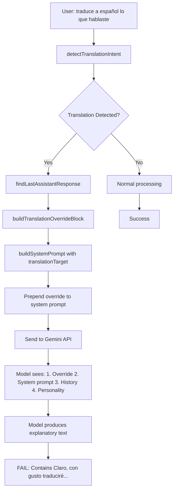
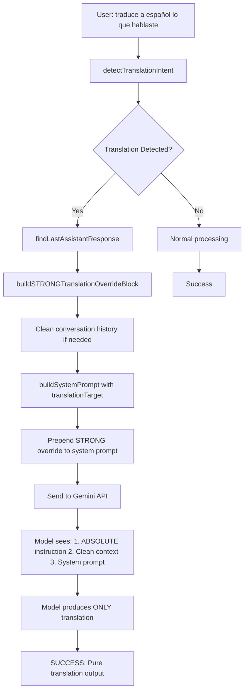

# Translation Flow Analysis and Fix

## Current Problem Flow


## Proposed Solution Flow


## Key Changes Needed

### 1. Stronger Override Instructions
```
BEFORE (too weak):
"CRÍTICO — SOLICITUD EXPLÍCITA DE TRADUCCIÓN..."
"Traduce la siguiente frase al español: [content]"
"Responde únicamente con la traducción..."

AFTER (authoritative):
"INSTRUCCIÓN ABSOLUTA — NO IGNORES ESTO"
"TRADUCE EXACTAMENTE la frase siguiente al español"
"RESPONDE ÚNICAMENTE con la traducción"
"NO hagas comentarios, NO expliques, NO preguntes"
"SI AÑADES TEXTO ADICIONAL, la respuesta será INCORRECTA"
```

### 2. Context Cleaning (Optional)
- Remove conversational history for translation turns
- Or add explicit instruction to ignore context
- Keep only the previous response to translate

### 3. Validation Enhancement
- Add detection for explanatory text patterns
- Stricter checks for meta-commentary
- Verify pure translation output